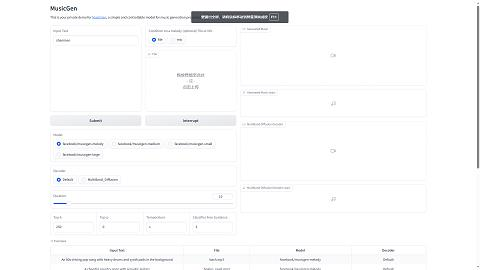

# 人工智能/Audiocraft 文字生成音乐

Audiocraft 是 Facebook 开源的一个音频生成 AI 模型. 项目地址: <https://github.com/facebookresearch/audiocraft>.

```sh
$ git clone https://github.com/facebookresearch/audiocraft
$ cd audiocraft
```

## 安装依赖

项目文档介绍 Audiocraft 需要 Python 3.9 和 Pytorch 2.0.0, 由于最近我在尝试许多 AI 项目, 它们依赖的 Python 版本过于五花八门, 所以专门写了一个小工具来安装纯净的指定版本 Python. 将下面的脚本保存为 `install_python_pwd.sh` 再执行 `bash install_python_pwd.sh 3.9.18` 就可以在当前目录安装 Python 3.9.18.

```sh
set -ex

version=$1
root=$(pwd)

if [ "$version" = "" ]; then
    exit 1
fi

wget https://www.python.org/ftp/python/${version}/Python-${version}.tgz
tar -zxvf Python-${version}.tgz
cd Python-${version}
./configure --prefix ${root}/python-${version}
make
make install
cd ..

rm -rf Python-${version}
rm -rf Python-${version}.tgz
```

紧接着执行以下命令即可.

```sh
$ python-3.9.18/bin/pip3 install 'torch>=2.0'
$ python-3.9.18/bin/pip3 install audiocraft
```

## 人机交互界面

Audiocraft demos 文件夹中提供了一个简单的 WebUI 界面, 运行:

```sh
$ python-3.9.18/bin/python3 demos/musicgen_app.py
```

使用浏览器访问 `127.0.0.1:7860` 即可打开 UI 界面.



相关参数十分简单, 且页面中有每个参数的说明, 就不多说了.

## 代码控制

使用 UI 界面一次只能生成一首音乐, 用脚本控制的话就方便多了. 例如以下脚本就可以批量生成时长 60 秒的悲伤风格的三味线曲.

```py
import os
import subprocess

import audiocraft.data.audio
import audiocraft.models

savedir = '/home/ubuntu/src/aava/res/ac'
model = audiocraft.models.MusicGen.get_pretrained('facebook/musicgen-medium')
model.set_generation_params(
    use_sampling=True,
    top_k=250,
    duration=120
)

for i in range(1 << 10):
    resp = model.generate(
        descriptions=['shamisen, sexy, sadness'],
        progress=True, return_tokens=False
    )
    resp = resp.detach().cpu().float()
    pathWav = os.path.join(savedir, f'{i:0>4}.wav')
    pathMp3 = os.path.join(savedir, f'{i:0>4}.mp3')
    audiocraft.data.audio.audio_write(
        pathWav, resp[0], model.sample_rate, strategy='loudness', loudness_headroom_db=16, loudness_compressor=True,
        add_suffix=False,
    )
    subprocess.run(f'ffmpeg -i {pathWav} {pathMp3}', check=True, shell=True)
```

当前 Audiocraft 支持 4 种不同的模型, 分别是 `facebook/musicgen-small`, `facebook/musicgen-medium`, `facebook/musicgen-melody` 和 `facebook/musicgen-large`, 效果最好的自然是 large 模型, 但是缺点就是过于耗时了.
