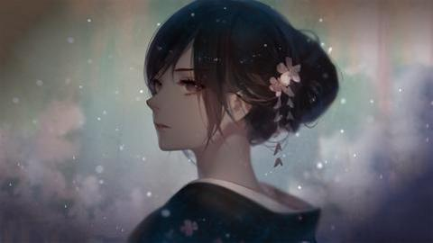
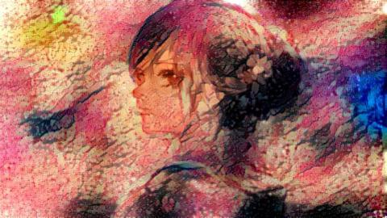
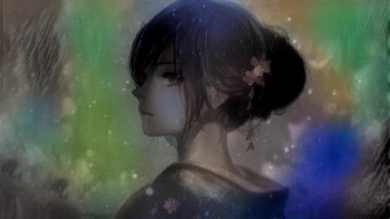

# 人工智能/Neural Style Transfer

Neural Style Transfer 是让机器模仿已有画作的绘画风格来把一张图片重新绘制的算法. 艺术家可能需要用毕生的心血才能创造出惊人的艺术作品, 而通过机器学习便可以用很短的时间将普通图片创造出富有大师风格的画作.








风格转移算法可生成一张具有原图"内容"与另一张图片"风格"的新的图片. 比如, 可以很容易将梵高的"星月夜"的绘画风格转移到自己的图片上. 这里, 我们使用 keras 深度学习框架与 VGG-16 模型来完成这个功能.

VGG-16: VGG-16 又称为 OxfordNet，是由牛津视觉几何组(Visual Geometry Group)开发的卷积神经网络结构. 该网络赢得了 ILSVR(ImageNet)2014 的冠军. 时至今日, VGG 仍然被认为是一个杰出的视觉模型--尽管它的性能实际上已经被后来的 Inception 和 ResNet 超过了.

## 使用方式

图像风格转移算法已经被包含在 keras 的[示例](https://github.com/fchollet/keras/blob/master/examples/neural_style_transfer.py)中. 为了使用如上的代码, 首先需要安装 keras:

```sh
$ pip install keras
```

如果安装出现了问题, 建议前往[keras 中文文档-安装](https://keras-cn.readthedocs.io/en/latest/#_2)寻找答案.

现在, 准备两张图片, 一张"内容", 一张"风格", 运行如下命令:

```sh
$ python neural_style_transfer.py path_to_your_base_image.jpg path_to_your_reference.jpg prefix_for_results
```

在寡人的 GTX 1070 GPU 上, 这只需要花费 80 秒左右的时间, 而在 xeon CPU 上, 可能需要花费整整一天的时间. 运行正常的话, 默认 10 次迭代后将得到总共 10 张从"风格"不断接近"内容"的图片.

如果安装有 ffmpeg 工具, 可以将生成的 10 张图片打包成一张 gif 动态图:

```sh
$ ffmpeg -r 8 -i prefix_for_results_%d.jpg out.gif
```

这样就能得到本站主页上那张炫酷的 gif 图片了.
