# 人工智能/Stable Diffusion 镜头控制

在 AI 绘图的上下文中, "控制镜头"可能不是一个直接的概念, 因为 Stable Diffusion 在创作画面的时候并没有实际的物理镜头. 但是, 可以使用一些类似于电影拍摄中的概念来描述要生成的图像. 镜头有两个方面组成, 分别是镜头距离和镜头角度.

- 镜头距离: 确定你的绘图中的主体位置. 是特写, 还是远景?
- 镜头角度: 考虑以哪种视角呈现场景, 这可以改变观众对画面的感知. 例如, 俯视, 仰视, 还是其他角度?

在本文中, 我们使用 [meinamix_meinav10.safetensors](https://civitai.com/models/7240?modelVersionId=80511) 模型来演示如何控制镜头. 我们采用的基准 prompt 如下. 后续的示例只在此基础 prompt 增加一个新的用以描述镜头的单词.

```text
prompt: realistic, 1girl, pink hair, purple eyes, miko, nontraditional miko, light particles, light rays, wallpaper
negate: worst quality, low quality, zombie, sketch, interlocked, fingers, comic
```

## 镜头距离

**extreme close-up**

大特写镜头并不难发现. 这种镜头通常会把很小的东西(或人物脸上的小特征)放得很大. 这种类型的镜头通常用于引起观众对特定物体或动作的注意. 这些镜头背后没有隐藏的暗示, 导演基本上只是在告诉观众往哪看.

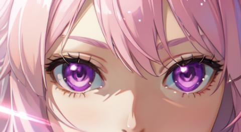

**close-up**

特写镜头是最适合用来表现充满情绪和戏剧张力场景的镜头, 能将人物的想法传达给观众. 视景框应贴近头部和脸部, 头顶应碰到视景框上方. 你可以使用任何焦距为50mm或更长的镜头来拍摄特写镜头. 焦距更短的镜头可能造成一些镜头压缩, 使得影像稍微扭曲.

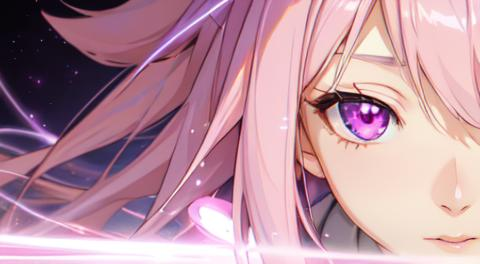

**medium close-up**

中景镜头是从腰部以上拍摄, 而特写镜头是贴近人物的脸, 近景镜头则是从身体以上拍摄. 这种镜头非常适合用来捕捉反应. 把它想像成将人物和观众的情绪带到高潮的一种镜头. 这种取景方式是一种感受贴近人物和主体的好方法, 有限的移动空间有助于让观众更入戏.

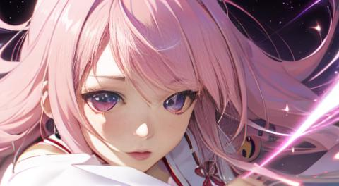

**medium shot**

中景是标准的对话性镜头, 从人物腰部以上取景. 这是拍摄演员时最常用到的镜头. 此镜头以观众的视角作为对话的取镜距离. 在拍摄采访或对话场景时, 一定要使用中景镜头.

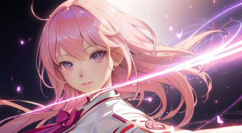

与之类似的提示词是 upper body.

**long shot**

远景镜头非常适合各种动作场景. 拍摄远景镜头的目的是为了尽可能捕捉细节, 将人物的世界呈现给观众. 你可以透过远景镜头来增加制片价值和景深并充分地展现场景和地点.

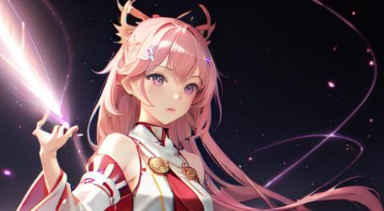

这张图的绘制结果其实不太符合我的预期效果, 正常来讲 long shot 是要绘制出全身照的, 也就是 full body.

**extreme long shot**

将远景镜头放大 10 倍拍摄就是大远景. 大远景镜头的用意在于让观众惊艳, 让视觉效果令人印象深刻. 大远景可以是空拍, 也可以是推轨镜头, 在拍摄时人物必须是镜头中最小的一部分. 拍摄手法完全取决于故事中事件的规模和范围. 无人机是最适合用来捕捉最令人印象深刻, 极大远景镜头的工具.


这张图的绘制结果其实不太符合我的预期效果.

## 镜头角度

**front view 正面**

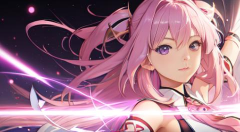

**bilaterally symmetrical 左右对称**

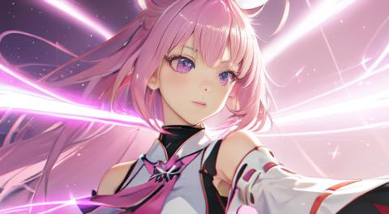

我尝试生成不少图片, 暂时看不出来它和 front view 的区别.

**side view 侧面**

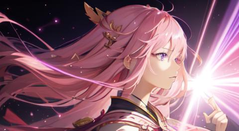

**back view 后面**


**from above 从上拍摄**


**from below 从下拍摄**

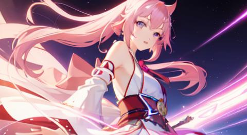

**from behind 后拍**


效果和 back view 很接近.

**wide angle view 广角镜**


**fisheyes view 鱼眼镜**


**macro view 微距**


效果不明.

**overhead shot 俯视**


**top down 由上向下**

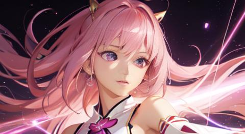

**bird's eye view 鸟瞰**

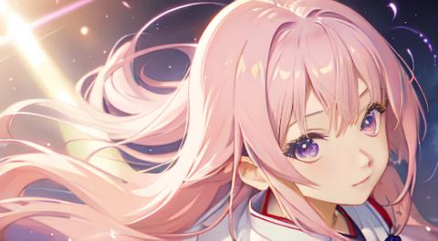

**high angle 高角度**


**slightly above 微高角度**

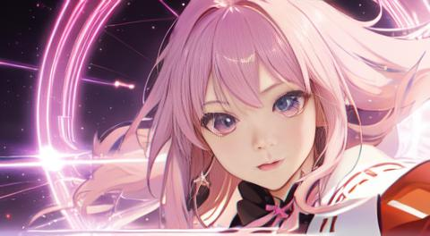

**straight on 水平拍摄**


**hero view 英雄视角**


**low view 低视角**


**worm's eye view 仰视**

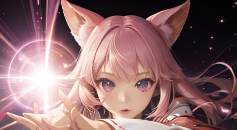

**selfie 自拍**

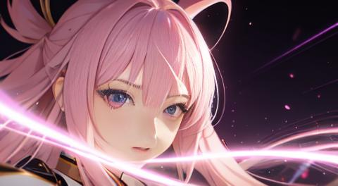

## 参考

- [0] [EDMOND YIP, Stable Diffusion 用 prompt 控制鏡頭距離及角度](https://blog.256pages.com/stable-diffusion-prompt-distance/)
