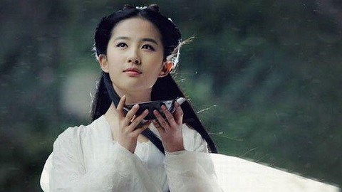
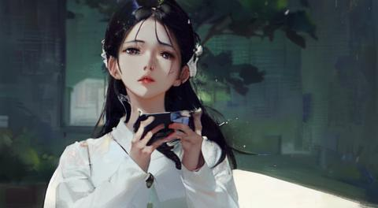
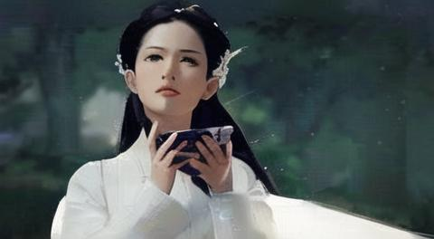

# 人工智能/Stable Diffusion 真人照片转动漫风格

## 设置

使用 Stable Diffusion 来将真人照片转换为动漫风格图像的步骤是非常简单的, 本文会给出详细步骤和方法. 示例图片使用我的神仙姐姐.

0. 打开 Stable Diffusion WebUI, 切换到 img2img 页面.
0. 选择模型. 我测试了两个模型, 分别是 `anything-v3-fp16-pruned.safetensors [d1facd9a2b]` 和 `meinamix_meinaV10.safetensors [d967bcae4a]`, 建议选择后者.
0. 上传图片.
0. 点击 Interrogate CLIP 反推提示词. 我这边反推出的提示词是 a woman in a white dress holding a cell phone in her hand and looking at the camera with a serious look on her face, dau-al-set, movie still, Chen Yifei, a character portrait.
0. 输入反向提示词 `(worst quality:2), (low quality:2), (normal quality:2), lowres, ((monochrome)), ((grayscale)), skin spots, acnes, skin blemishes, age spot, glans,extra fingers,fewer fingers,strange fingers,bad hand (low quality, worst quality:1.4), (bad_prompt:0.8), (monochrome), bad anatomy,DeepNegative,(fat:1.2), looking away,tilted head, {Multiple people},bad anatomy,bad hands, text, error, missing fingers,extra digit, fewer digits, cropped,jpeg artifacts,signature, watermark, username,blurry,bad feet,cropped,poorly drawn hands,poorly drawn face,mutation,deformed,extra limbs,extra arms,extra legs,malformed limbs,fused fingers,too many fingers,long neck,cross-eyed,mutated hands,polar lowres,bad body,bad proportions,gross proportions,error,missing arms,missing legs, extra leg, extra foot`
0. 将重绘幅度 Denoising strength 从 0.75 下降到 0.35, 如此生成的结果会与原图相似度更高.
0. 点击 Generate 按钮.

## 结果

我测试了两个模型, 结果如下. 怎么说呢, meinamix 模型有一种离与谱的美.

**meinamix_meinaV10.safetensors [d967bcae4a]**

**anything-v3-fp16-pruned.safetensors [d1facd9a2b]**

## 参考

- [0] [AI画师大阳, 3种方法实现真人照片转动漫风格，免费将人物照片转卡通漫画图片](https://zhuanlan.zhihu.com/p/635787451)
