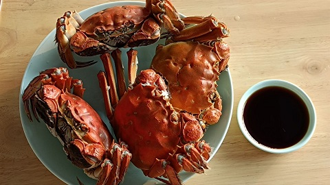

# 中华一番/清蒸大闸蟹配酱油醋

螃蟹, 螃蟹, 你有两个大钳子~

左边一个钳子~

右边也是一个钳子~

0. 准备一碟温州酱油醋. 温州的酱油醋不是一般意义上所说的酱油, 醋这两种独立的调味料, 也不是指简单地将酱油与醋调和在一起, 而是把酱油与醋按照一定比例调制起来, 并加上适量的绵糖, 葱姜蒜等等材料泡制起来, 这里用的醋是温州特有的花椒米醋, 别的地方买来的醋, 调不出温州酱油醋的问道. 可以网购成品温州酱油醋.
0. 大闸蟹清水浸泡 20 分钟, 可以适当撒入盐和白醋让大闸蟹吐出脏东西. 浸泡结束后, 使用刷子刷干净表面.
0. 清蒸 15 分钟, 开吃啦!
