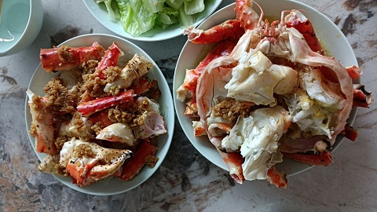

# 中华一番/蒜蓉帝王蟹

这道料理的主角是帝王蟹. 我们直接在超市挑选一只帝王蟹, 然后让超市大叔给我们拆蟹, 并清洗处理干净, 得到蟹腿, 蟹钳和蟹肉备用. 帝王蟹的蟹壳非常柔软, 出乎我的意料.

之后最重要的步骤是制造蒜蓉. 超市的成品蒜蓉味道很一般, 千万不要贪图方便结果把尊贵的帝王蟹大人给糟蹋了. 一刻也不要为蟹蟹悲伤, 立即准备好大蒜, 剥开蒜蒜, 将蒜蒜剁成蒜蓉. 接着开始炒蒜蓉, 在锅中倒入适量的油, 油热后放入蒜蓉, 用中火炒香. 炒至蒜蓉呈金黄色时, 加入适量的白糖和盐, 继续翻炒均匀后关火. 得到蒜蓉备用.

将处理好的帝王蟹放入盘中, 将炒好的蒜蓉均匀地铺在帝王蟹上. 使用蒸箱将帝王蟹蒸熟, 蒸 18 分钟即可.

蟹蟹很大, 一餐通常吃不完, 可以分成两餐享用.
