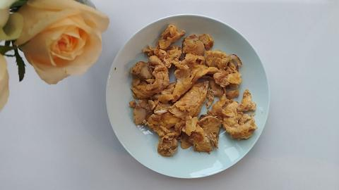
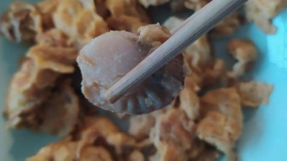

# 中华一番/扇贝炒鸡蛋

扇贝炒鸡蛋是一道简单又不失精彩的料理.

首先, 我们需要准备一些新鲜的扇贝和鸡蛋. 你可以去海鲜市场或者超市寻找这些珍宝, 记得挑选那些色泽鲜艳, 洁白无瑕的扇贝, 它们会是你的美食之旅的完美起点(注: 冷冻扇贝肉亦可)!

准备工作做得差不多了吧? 那就让我们进入主菜的制作环节. 首先, 我们需要将扇贝洗净, 控干水分. 记住要把那些闭得紧紧的壳剔除掉, 我们只需要美味的肉质.

然后将扇贝在热水中焯三分钟, 到上一些料酒, 要让扇贝醉醉的以去掉腥味! 将扇贝肉从热水中取出, 让它稍微冷静一下!

接下来, 让我们把鸡蛋打入一个碗里, 轻轻搅拌均匀, 并将扇贝和鸡蛋充分融合. 这是一道扇贝炒鸡蛋, 所以鸡蛋是我们的舞台.

现在, 取出一个平底锅, 加入适量的油, 烧热. 当你听到咕嘟咕嘟的声音时, 那就是锅告诉你它准备好了!

我们把搅拌均匀的扇贝鸡蛋缓缓倒入锅中, 听着油的翻滚声, 感受它们与锅的亲密接触. 翻炒几下, 要让它们散发出迷人的香气和口感. 你可以随意加入一些调味料, 比如盐, 胡椒粉, 葱花等等, 让它们增添一些额外的风味.

当鸡蛋完全熟透, 扇贝变得鲜嫩多汁时, 恭喜你! 你的扇贝炒鸡蛋大功告成了! 关掉火, 让它们在锅中稍稍休息一下.

现在, 让我们把这道香喷喷的扇贝炒鸡蛋端上餐桌, 享受一顿美味的盛宴吧! 每一口咬下去, 你都会感受到扇贝的鲜美和鸡蛋的绵软, 它们在口中跳跃舞动, 给你带来无限的快乐.

哇, 真是令人垂涎三尺啊!

