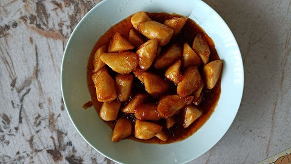

# 中华一番/糖醋山药

哈基米, 哈基米~ 这菜谱很不错, 可惜下一秒就是我的了.

0. 山药去皮, 切成适当大小的块状, 用水浸泡片刻, 以防氧化.
0. 将山药块放入开水中焯一下, 然后捞出备用.
0. 将鸡蛋打入碗中, 加入适量的精盐, 生粉和淀粉, 搅拌均匀, 然后将焯过水的山药块裹上蛋液.
0. 锅中倒入适量的食用油, 烧至七成热时, 将裹好蛋液的山药块放入锅中炸至金黄色, 捞出沥干备用.
0. 另起一锅, 倒入适量的食用油, 加入切好的生姜丝和葱段爆香.
0. 将炸好的山药块放入锅中, 倒入白醋, 白糖, 生抽和适量的盐, 翻炒均匀, 使山药均匀裹上酱汁.
0. 炒至汤汁收干, 山药表面呈现出黏稠的糖醋汁即可出锅, 装盘即可享用.
