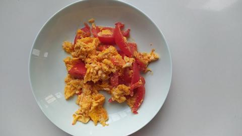

# 中华一番/西红柿炒鸡蛋

我爱吃西红柿 ~

西红柿爱我吃 ~

番茄我也爱吃 ~

真好吃真好吃 ~

西红柿炒鸡蛋是一道具有传统风味的中式菜肴, 其制作过程简单而美味.

- 首先, 准备 1 个新鲜的西红柿和 3 个鸡蛋. 将西红柿洗净后切成均匀的小块.
- 取一个平底锅, 加热并加入适量的植物油(如色拉油或花生油). 待油热后, 将切好的西红柿块放入锅中.
- 用中小火翻炒西红柿, 直到它们开始变软释放出香味. 这通常需要约 2-3 分钟.
- 在西红柿炒熟的同时, 打入鸡蛋, 轻轻搅拌使蛋清和蛋黄充分混合.
- 当西红柿完全炒熟时, 将锅中的西红柿均匀撒开, 然后将蛋液缓缓倒入锅中.
- 用铲子轻轻搅拌鸡蛋, 使其与西红柿均匀混合在一起. 继续翻炒, 直到鸡蛋凝固熟透.
- 根据个人口味, 可以适量加入盐和胡椒粉进行调味. 同时, 根据喜好, 还可以加入葱花或香菜等配料增添风味.
- 当鸡蛋完全熟透时, 关火, 将西红柿炒鸡蛋装盘, 即可享用.

这是一种基本的西红柿炒鸡蛋做法, 可以根据个人喜好进行调整和创新. 烹饪时间和火候的掌握将影响菜肴的口感和味道, 因此需要根据实际情况进行调整.
