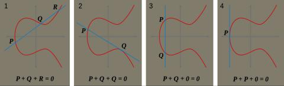
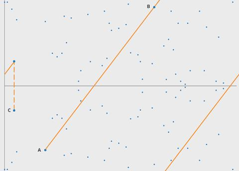

# Cryptography/椭圆曲线

椭圆曲线密码学(Elliptic Curve Cryptography, ECC) 是一种基于椭圆曲线数学的公开密钥加密算法. 针对密码学应用上的椭圆曲线通常是在有限域平面上的曲线. 椭圆曲线最出名的应用是比特币系统, 比特币使用一条名为 secp256k1 的椭圆曲线用于生成公钥/私钥和进行交易签名和验签工作.

## 有限域

我们首先简要介绍有限域(Finite field). 有限域是包含有限个元素的域. 与其他域一样, 有限域是进行加减乘除运算都有定义并且满足特定规则的集合. 有限域最常见的例子是当 p 为素数时, 整数对 p 取模形成的集合. 有限域的元素个数称为它的阶. 这种类型的有限域通常使用 Fp 表示. 有限域中包含三种计算, 分别是 addition, multiplication 和 inversion.

例: 有有限域 F₂₃, 求其阶.

答: F₂₃ = {0, 1, 2, ..., 22}, 因此其阶为 23.

Fp 的三种计算操作定义如下(a, b 为 Fp 中的元素):

```text
a + b:  (a + b) % p
a * b:  (a * b) % p
a.inv:  a * a.inv = 1 where a != 0
```

由三种基本计算扩展出 subtraction 和 division:

```text
a - b:  (a - b) % p
a / b:  (a * b^(p-2)) % p
```

除法是一个特殊情况, 我们实际上需要求的是 b⁻¹. 根据费马小定理(Fermat's little theorem), b<sup>p-1</sup> = 1 (mod p), 因此有 b \* b<sup>p-2</sup> = 1 (mod p), 因此 b⁻¹ = b<sup>p-2</sup>.

例: 有有限域 F₂₃, 求:

0. 12 + 20
0. 8 * 9
0. 8⁻¹

答:

0. 12 + 20 = (12 + 20) % 23 = 9
0. 8 * 9 = (8 * 9) % 23 = 3
0. 8⁻¹ = 8 ^ (23 - 2) % 23 = 3

## 椭圆曲线

椭圆曲线定义如下:

```text
y² = x³ + ax + b
```

描述一个特定的椭圆曲线需明确六个参数: T = (P, A, B, G, N, H). 对于比特币公钥算法 secp256k1 而言:

```py
# 有限域的素数 2**256 - 2**32 - 2**9 - 2**8 - 2**7 - 2**6 - 2**4 - 1
P = 0xfffffffffffffffffffffffffffffffffffffffffffffffffffffffefffffc2f

# 椭圆曲线方程参数, 即 y² = x³ + 7
A = 0
B = 7

# 基点(Generator Point), secp256k1 上的每一个点都是比特币的一个公钥. 当用户希望使用其私钥生成公钥时,
# 他们需要将其私钥乘以 G. 有限域上的每一个点都可以通过 G 生成.
G = (0x79be667ef9dcbbac55a06295ce870b07029bfcdb2dce28d959f2815b16f81798,
     0x483ada7726a3c4655da4fbfc0e1108a8fd17b448a68554199c47d08ffb10d4b8)

# 椭圆曲线的阶(order), 等价于该椭圆曲线上的点的个数. 椭圆曲线上的任意点 P 与 n 的乘积都是无穷远点.
# 这是因为有限域椭圆曲线是一个循环群, (n - 1) * P = -P, 因此 n * P = -P + P = 0.
# 私钥的取值范围小于 n.
N = 0xfffffffffffffffffffffffffffffffebaaedce6af48a03bbfd25e8cd0364141

# 余因数(cofactor), 控制选取点的密度.
H = 1
```

椭圆曲线加密体系的基础源于椭圆曲线离散对数问题: 给定 P, Q ∈ E(Fp), 找到 k ∈ Z 使得 kP = Q 是困难的. 这里 k 就是所谓的离散对数, 而这里的困难是指目前还不存在低于指数级别的算法. 基于椭圆曲线离散对数问题, 通常, 用户随机生成一个整数 s 作为私钥. 然后, 对于一个公共的生成元 G, 用户将 s * G 作为公钥并公开. 由于破解椭圆曲线离散对数是困难的, 对手(adversary)无法通过公钥计算出私钥的值.

## The Standards for Efficient Cryptography (SEC)

secp256k1 在 x 轴上是对称的, 对于每一个 x 的值, y 都有两个可选值. 由于 secp256k1 的性质, 其中一个 y 值是奇数, 另一个 y 值是偶数. 因此在存储和表示比特币公钥时, 既可以使用完整坐标也可以只使用 x 坐标加 y 的奇偶标志. 非压缩格式 SEC 以 0x04 开头, 后跟 x 和 y 的值; 压缩格式 SEC 以 0x02(偶) 或 0x03(奇) 开头, 后仅跟 x. 以下是两种基点的表示方法.

```py
0479be667ef9dcbbac55a06295ce870b07029bfcdb2dce28d959f2815b16f81798483ada7726a3c4655da4fbfc0e1108a8fd17b448a68554199c47d08ffb10d4b8

0279be667ef9dcbbac55a06295ce870b07029bfcdb2dce28d959f2815b16f81798
```

非压缩格式占用 65 个 Byte, 压缩格式占用 33 个字节.

## 椭圆曲线上的数学运算

**实数域**



- Point at infinity: 定义一个无穷远点 O 表示群的单位元. O 与任意点 P 相加都等于点 P.
- Point negation: 具有相同 x 坐标的另一个点, 有 `P + (-P) = O`. 对于椭圆曲线上的点 `(x, y)`, 可以写为 `-(x, y)` 或 `(x, -y)`.
- Point addition: P + Q 等于经过 P 与 Q 的直线与椭圆曲线相交的第三点的关于 x 轴的对称.
- Point doubling: 等于 P + P.
- Point multiplication: 等价于重复进行 N 次 point addition, 此处 N 为整数而非有限域元素.

**有限域**

文章 <https://www.cs.miami.edu/home/burt/learning/Csc609.142/ecdsa-cert.pdf> 4.1 章节有详细的介绍, 此处只摘录重要结论.

- Point addition

当 P != ±Q 时, P(x₁, y₁) + Q(x₂, y₂) = (x₃, y₃), 其中

```py
x₃ = ((y₂ - y₁) / (x₂ - x₁))² - x₁ - x₂
y₃ = ((y₂ - y₁) / (x₂ - x₁)) * (x₁ - x₃) - y₁
```



- Point doubling

当 P != -P 时, 2 * P = (x₃, y₃), 其中

```py
x₃ = ((3 * x₁² + a) / (2 * y₁))² - x * x₁
y₃ = ((3 * x₁² + a) / (2 * y₁)) * (x₁ - x₃) - y₁
```

- Point multiplication: 等价于重复进行 N 次 point addition, 此处 N 为整数而非有限域元素.

例: 有有限域 F₂₃ 和椭圆曲线 y² = x³ + x + 4, P = (4, 7), Q = (13, 11), 求 P + Q

答: P + Q = (15, 16)

## Double and add

椭圆曲线上的乘法可以分解为一系列的 double 和 add 操作. 例如, 我们要运算 `151 * P`, 直观上我们会认为要进行 150 次点相加运算, 但可以进行优化. 151 可以表示为二进制格式 10010111:

```text
151 = 1 * 2⁷ + 0 * 2⁶ + 0 * 2⁵ + 1 * 2⁴ + 0 * 2³ + 1 * 2² + 1 * 2¹ + 1 * 2⁰
```

我们从 10010111 的最低比特位开始, 如果为 1, 则结果加 P; 如果为 0, 令 P = 2P. 相关 Python 代码如下所示:

```py
def bits(n):
    """
    Generates the binary digits of n, starting
    from the least significant bit.

    bits(151) -> 1, 1, 1, 0, 1, 0, 0, 1
    """
    while n:
        yield n & 1
        n >>= 1

def double_and_add(n, x):
    """
    Returns the result of n * x, computed using
    the double and add algorithm.
    """
    result = 0
    addend = x

    for bit in bits(n):
        if bit == 1:
            result += addend
        addend *= 2

    return result
```

## 代码实现

例: 已知比特币私钥为 `0x5f6717883bef25f45a129c11fcac1567d74bda5a9ad4cbffc8203c0da2a1473c`, 求公钥.

答:

```py
P = 0xfffffffffffffffffffffffffffffffffffffffffffffffffffffffefffffc2f
N = 0xfffffffffffffffffffffffffffffffebaaedce6af48a03bbfd25e8cd0364141
G_X = 0x79be667ef9dcbbac55a06295ce870b07029bfcdb2dce28d959f2815b16f81798
G_Y = 0x483ada7726a3c4655da4fbfc0e1108a8fd17b448a68554199c47d08ffb10d4b8
A = 0
B = 7
assert(A < P)
assert(B < P)
assert((4 * A**3 + 27 * B**2) % P != 0)


class Fp:
    def __init__(self, x):
        assert(0 <= x < P)
        self.x = x

    def __repr__(self):
        return f'Fp(0x{self.x:064x})'

    def __eq__(self, other):
        return self.x == other.x

    def __add__(self, other):
        return Fp((self.x + other.x) % P)

    def __sub__(self, other):
        return Fp((self.x - other.x) % P)

    def __mul__(self, other):
        return Fp((self.x * other.x) % P)

    def __div__(self, other):
        return self * other ** -1

    def __pos__(self) -> typing.Self:
        return self

    def __pow__(self, other):
        return Fp(pow(self.x, other, P))

    def __neg__(self):
        return Fp(P - self.x if self.x != 0 else 0)


Fp.__truediv__ = Fp.__div__


class Ec:
    def __init__(self, x, y):
        if x != Fp(0) and y != Fp(0):
            assert(y ** 2 == x ** 3 + Fp(A) * x + Fp(B))
        self.x = x
        self.y = y

    def __repr__(self):
        return f'Ec({self.x}, {self.y})'

    def __eq__(self, other):
        return self.x == other.x and self.y == other.y

    def __add__(self, other):
        if self == I:
            return other
        if other == I:
            return self
        if self.x == other.x and self.y == -other.y:
            return I
        x1, x2 = self.x, other.x
        y1, y2 = self.y, other.y
        if self.x == other.x and self.y == +other.y:
            s = (Fp(3) * x1 * x1 + Fp(A)) / (Fp(2) * y1)
        else:
            s = (y2 - y1) / (x2 - x1)
        x3 = s ** 2 - x1 - x2
        y3 = s * (x1 - x3) - y1
        return Ec(x3, y3)

    def __mul__(self, n):
        result = I
        addend = self
        while n:
            b = n & 1
            if b == 1:
                result += addend
            addend = addend + addend
            n = n >> 1
        return result


# Identity element
I = Ec(Fp(0x0), Fp(0x0))
# Generator point
G = Ec(Fp(G_X), Fp(G_Y))
assert(G * N == I)
```

```py
import secp256k1

prikey = 0x5f6717883bef25f45a129c11fcac1567d74bda5a9ad4cbffc8203c0da2a1473c
assert(prikey < secp256k1.N)
pubkey = secp256k1.G * prikey
assert(pubkey.x.x == 0xfb95541bf75e809625f860758a1bc38ac3c1cf120d899096194b94a5e700e891)
assert(pubkey.y.x == 0xc7b6277d32c52266ab94af215556316e31a9acde79a8b39643c6887544fdf58c)
```

使用第三方库验证以上计算过程是否正确, 验证代码如下:

```py
import ecdsa

prikey = ecdsa.SigningKey.from_secret_exponent(
    0x5f6717883bef25f45a129c11fcac1567d74bda5a9ad4cbffc8203c0da2a1473c,
    curve=ecdsa.SECP256k1)
pubkey = prikey.get_verifying_key()
pubkey = pubkey.to_string(encoding='raw')
print(pubkey[0x00:0x20].hex())
print(pubkey[0x20:0x40].hex())
```

完整代码: <https://github.com/mohanson/cryptography-python>

## 参考

- [1] [Wiki. Elliptic curve point multiplication.](https://en.wikipedia.org/wiki/Elliptic_curve_point_multiplication)
- [2] [River. SEC Format.](https://river.com/learn/terms/s/sec-format/)
- [3] [ANDREA CORBELLINI. Elliptic Curve Cryptography: a gentle introduction.](https://andrea.corbellini.name/2015/05/17/elliptic-curve-cryptography-a-gentle-introduction/)
- [4] [Onyb. Point Addition in Python.](https://onyb.gitbook.io/secp256k1-python/point-addition-in-python)
- [5] [Onyb. Scalar Multiplication in Python.](https://onyb.gitbook.io/secp256k1-python/scalar-multiplication-in-python)
- [6] [Don Johnson, Alfred Menezes and Scott Vanstone. The Elliptic Curve Digital Signature Algorithm (ECDSA).](https://www.cs.miami.edu/home/burt/learning/Csc609.142/ecdsa-cert.pdf)
