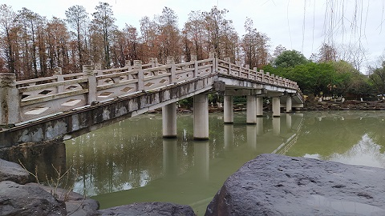
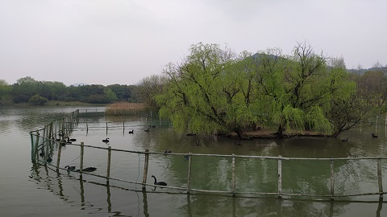
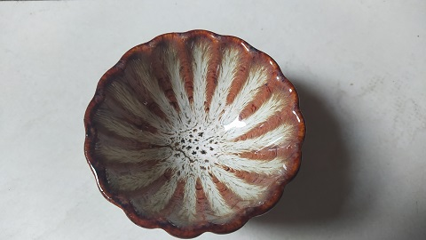
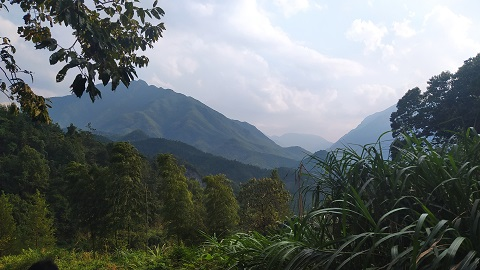
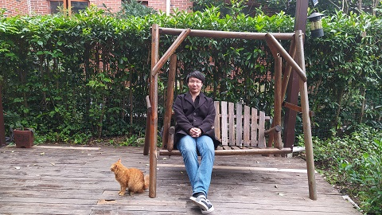

**01 月 03 日**

收到慕课网送的养生杯, 感动, 抓紧时间给录课去了...

**01 月 05 日**

体检结果出来了, 准备年后去门诊多做些检查.

**01 月 12 日**

近几周都在实现 alt_bn128 算法, 感觉要秃了呢.

**01 月 14 日**

全天工作总结会议, 可以安心划水了, 真是太棒了.

**01 月 17 日**

开始看 SEO 的书籍, 希望能获得更多来自搜索引擎的流量. 同时今日在本站主页加上了站内链接, 并做了 404 页面跳转, 应该有帮助吧?

**01 月 29 日**

在蒙哥马利空间下实现了 alt_bn128, 很不容易!

**02 月 01 日**

Rust 视频课程已经在慕课上了, [https://www.imooc.com/learn/1301](https://www.imooc.com/learn/1301), 前后经历 2 个月时间吧, 录视频倒是快, 准备内容很杀时间.

**02 月 14 日**

**03 月 03 日**

近一月全身心投入策略交易的学习, 期间思考出一种等市值+黄金分割的策略, 做了该策略的数学证明, 历史数据的回测和模拟盘运行, 今天是实盘第三天, 如果这个策略确实能带来收益, 那么我会继续更新状态的...

**03 月 05 日**

今日币市整体震荡下跌, 因此账面浮亏不少. 总体来说目前币市处于高位, 但是我应该不会离场, 会全程参与这次由牛转熊过程, 目前总投入也就几千刀, 是拿来测试策略面对下跌行情很不错的一次实战机会. 但是币市有一个问题就是大部分币种与整个行情的相关性都太高.

**03 月 06 日**

早上醒来, 市场仍然是高位震荡并伴随成交量急速下跌, 说明意志不坚定的多方和空方都已经被清洗出场, 震荡应该会很快结束. 这种窄幅震荡对我的模型很不友好就是啦, 快快结束吧.

**03 月 07 日**

主流币有一波不错的小涨.

**03 月 08 日**

瀑布啦, 快跑啊~

**03 月 09 日**

挂了一张 EOS 的空单, 利润设定到 3R. 昨夜看《通向财务自由之路》一书, 书中提到如果一笔交易的潜在利润不到 3R, 那么就不要做这笔交易, 看完感触良多, 因为我以前每次都是看到自己小赚, 就会为了固定利润而马上退出, 久而久之, 虽然胜率持平, 但一笔交易赚的总比亏的少.

**03 月 10 日**

3 月 20 日之前不要开新的仓.

**03 月 11 日**

ETH 和 EOS 对我来说不是一个好的资产, 它们的波动水平太低, 我会写一个脚本去获得所有交易对的波动率, 挑一只好的准备建仓.

**03 月 13 日**

我计算波动率的公式是过去 200 次采样, 每次采样高点减去低点与低点的比值的和, 大于 2 说明是个好资产. 目前全部交易对中最高的一个是 8, 但这玩意看 K 线图看着就害怕, 处于归零的薛定谔状态. 最后把手里的 ETH 换成了等市值的 NBS, 虽然是个空气币, 但我又不是价值投资, 不慌.

**03 月 15 日**

今天是星期一.

**03 月 21 日**

湘湖游玩.

**03 月 22 日**

在使用量化交易的这三个星期, 收割了 250 刀的利润加 1000 刀的浮盈.

**03 月 23 日**

今日币市大跌, 十分后悔昨天的收割行为. 日后当在大跌时收割利润, 谨记!

**03 月 27 日**

前天币市跌了十几个点, 正巧在大跌之前过于乐观的调整了仓位, 导致在这次大跌中我的后备资金池直接腰斩, 如果当时继续下跌十九个点的话我就将直接爆仓. 吸取了教训, 我要求自己以后的交易行为头寸单位只能是仓位的百分之二.

**03 月 29 日**

我对币市目前状态的看法是 BTC, ETH 等主流币均无法高位突破, 而上寨币却开始补涨, 这是十分明显的牛市尾巴的征兆. 但我不确定的是这次牛尾能持续多长时间. 如果按照 17 年的经验的话, 这次狂欢应当在三月份结束, 但事实和我预期的相差很大. 同时我在思考自己的交易策略, 目前的交易策略过于保守了.

**04 月 01 日**

交易系统已经运行了正好一个月, 对这个系统充满了希望, 加油!

**04 月 04 日**

仁王2通关留念. 总体而言带来的体验不错, 只是此游戏的 Boss 战体验太差, 经常会被 Boss 一套连击带走, 犯了和怪物猎人冰原一样的错误. 想把一款游戏做的很难非常简单: 无非就是 Boss 我的回合, 我的回合, 还是我的回合, 但是这种设计方式永远也无法并肩黑魂的高度.

**04 月 08 日**

今日 CKB 交易对呈现无量拉升, 继续观望.

**04 月 12 日**

一些人认为币市是"风险"很大的事情, 但事实上正相反, 它的风险远远小于银行理财. 从长远上来看(将时间拉长到 50 年), 由于通胀的存在, 将现金投资银行定期存款或是保本理财其购买力归零的概率是 100%, 即风险无穷大. 而通过参与市场, 1% 的几率财富自由, 9% 的几率跑赢通胀, 90% 的几率归零--从风险收益比上来说没有比这更划算的投资了.

**04 月 13 日**

我的交易系统从 4 月 1 日起就在很艰难的活着, 投资的几个较高仓位的币种都在下跌, 而我的交易系统却一直在空手接白刃. 我认为我的机器人更接近"做市商"的概念. 总之在目前这种行情下, 活着才是最重要的, 这一点上来说机器人表现不错.

**04 月 17 日**

与一个学霸妹子相亲.

**04 月 18 日**

今日启程飞往海南, 项目组封闭开发活动.

**04 月 19 日**

三亚的第一日, 还不错喔.

**04 月 21 日**

**04 月 24 日**

在连续工作 5 日后迎来休息日, 项目组同事们去了亚特兰蒂斯水族馆, 免税店和鹿回头景区. 下面是漂亮的蓝月水母哦!

**04 月 26 日**

如珠露滴落, 如珠露消散, 这便是我的人生? 宛如一场梦中之梦.

**04 月 29 日**

量化交易系统完整的跑完两个月, 中间经历两周时间暴跌 60% 这种极端行情(其实在币圈很平常), 但从结果上来说还算是小赚的. 另外今天回杭州了.

**05 月 02 日**

印钞机疯狂印钱的年代, 越来越相信一个事实, 那就是国家主权货币是毫无节操可言的.

**05 月 07 日**

爱因斯坦说: 任何事情都应该使其尽可能地简单, 直到无法再简单为止. 我认为交易系统也是如此.

**05 月 08 日**

修改了交易系统处理利润部分资产的规则, 现在它会更加谨慎的去将这部分利润进行再投资, 数学计算的结果表明该规则下预期年化收益是 45% 到 330% 之间(当然这建立在币圈不会崩溃的前提下). 我缺少的只是时间, 只有真实的时间才能验证我的交易系统.

**05 月 09 日**

柴犬币上线火币交易所, 热度异常的高, 在凌晨 00:32:20 时刻柴犬币被瞬间砸盘 30% 以上, 交易系统因为挂单价格瞬间出了交易所的挂单价格上下限崩溃了. 早上醒来看到日志后第一时间修复了 Bug, 但 8% 左右的收益已经损失掉了. 之后看到在拉盘又入了几百刀, 结果山顶站岗, 爱了爱了.

**05 月 11 日**

吃饭的时候和老板聊到我的交易系统, 成功从老板手里拉到 8000 刀的资金.

**05 月 12 日**

我不想否认比特币是一个庞氏骗局, 事实上在我清楚的了解并告诫所有找我来咨询数字货币的人这件事. 但是请仔细想想, 这个世界上有什么经济系统不是庞氏骗局? 养老金, 股市, 房价... 它们与比特币的共同点就是当你加入时, 更早进场的人获利; 之后你开始期待这个系统稳定运行并有源源不断的人加入, 好让你也获利. 统治者称后面的骗局为"投资"或者"保险", 好让它们显得文明一些.

**05 月 13 日**

呜呜呜, 我不炒币了, 把钱还我.

**05 月 18 日**

交易系统基本上能稳健运行下去了.

**05 月 19 日**

暴跌.

**05 月 22 日**

今天终于把杭州的房子和车位都搞定了, 以后杭州房价涨跌和我不再有任何关系, 因此可以更加自由的使用资金.

**05 月 24 日**

早起的虫虫被鸟吃.

**06 月 02 日**

股债均衡.

**06 月 05 日**

6 月 3 日至 6 月 5 日, 公司组织莫干山 5 周年纪念日活动.

**06 月 10 日**

知行合一.

**06 月 14 日**

仍然坚持理想主义, 因为我的交易系统现在还活着.

**06 月 24 日**

前往上海交通大学参加 RISC-V Summit.

**07 月 19 日**

下次再也不给机构录制课程了, 太麻烦又没什么意思.

**07 月 26 日**

开始将交易系统代码部分用 Golang 重写, 用 Python 写这种管理真金白银的代码真的像在走钢丝, 因为根本不知道写完的代码有没有错误. 编译型语言对我来说最大的优势就是只要编译成功就表示我的代码除了逻辑错误外基本不会有太大的问题. Nice!

**07 月 30 日**

《圣杯》系列连载开始, 反思与回顾我的交易过程犯的错误与收获.

**07 月 31 日**

使用 Golang 重写的交易系统上线运行了, 此次升级没有出现生产事故, 一切安好.

**08 月 05 日**

"袁大人, 刚才站台上演奏的什么曲子啊"

"这曲子就是洋人的春江花月夜"

**08 月 08 日**

与朋友前往绍兴, 游览了镜湖与鲁迅故里, 回来时带了一个漂亮的碗来喝茶.

**08 月 10 日**

资本主义现在面临一个问题: 这个世界上已经没有合格合法的廉价劳动力可供压榨了.

**08 月 23 日**

今年炒币做了两件错误的事和一件正确的事, 这两件错误的事是分别在 4 月和 5 月山顶加仓, 正确的事则是在比特币 30000 到 40000 刀的时候梭哈抄底. 纪念比特币重回 50000 刀.

**08 月 28 日**

近几日在看大明王朝, 此剧真是不错.

**09 月 07 日**

恐惧消失的地方将一无所有, 只有我会留下.

**09 月 08 日**

牛回, 速归.

**09 月 09 日**

傍晚雷雨.

**09 月 12 日**

互联网的出现让信息自由流通, 比特币的出现让价值自由流通.

**09 月 19 日**

安吉.

**09 月 28 日**

十部委发文全面打击虚拟货币.

**09 月 29 日**

炒币使我快乐.

**09 月 30 日**

打了科兴的新冠疫苗.

**10 月 07 日**

Everything will be priced in BTC, even regret.

**10 月 08 日**

在深圳的第 1 天.

**10 月 09 日**

在深圳的第 4 天, 豆豆的生日!

**10 月 13 日**

在深圳的第 8 天, 台风.

**10 月 16 日**

离开深圳, 回杭.

**10 月 17 日**

做了一个谷歌两步验证算法的小工具.

**10 月 18 日**

前往上海参加封闭开发. 上海就是浦东, 浦东就是上海.

**10 月 19 日**

我与大橘.

**10 月 22 日**

加入秘猿三周年纪念日.

**10 月 26 日**

结束封闭开发, 回杭.

**10 月 27 日**

参与社区 1024 活动, 赢了一盒《漫威: 绝密档案》, 据说是一个解谜游戏, 还未拆开.

**10 月 28 日**

在封闭开发期间开始摸索做合约, 目前的方式是看准多空方向, 然后小资金把杠杆拉满做一个合约网格, 到今天为止赚小几百美元, 还是蛮开心的.

**11 月 09 日**

临安, 指南村, 落日.

**11 月 13 日**

写了个马丁格尔策略, 50 倍杠杆拉满, 看能不能活到明天.

**11 月 25 日**

我思非我知.

**12 月 03 日**

在你说出 "我同意", "我不同意", 或 "我暂缓评论" 之前, 你一定要能肯定地说: "我了解了."

同意对方说法, 与不同意对方说法都一样要花心力来作判断的. 同意或不同意都有可能对, 也有可能不对. 毫无理解便同意只是愚蠢, 还不清楚便不同意也是无礼.

**12 月 16 日**

感觉走错路了, 统计套利才是康庄大道.
