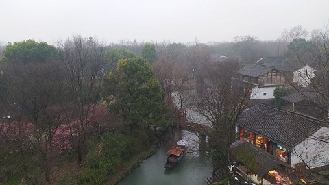
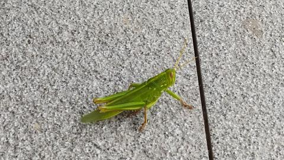
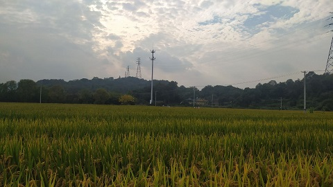

**01 月 04 日**

晴.

**01 月 19 日**

好消息, 涨薪水了, 哦耶!

**01 月 26 日**

新年回家, 吃上了久违的灯盏糕.

**02 月 13 日**

**02 月 14 日**

今天提前还贷一万人民币, 感觉还不错哦, 以后每个月都提前还一点.

**02 月 22 日**

年后住房公积金贷和商业贷利率都下调了, 每个月能少还一点点钱.

**02 月 23 日**

车位暂时用不到, 300 块一个月租了出去.

**03 月 11 日**

灵隐寺背后的山.

**03 月 14 日**

下单一辆自行车, 很好看哦.

**03 月 28 日**

Midjourney 真是太棒啦! Prompt: a logo using word "daze", hyper detailed, pixiv, futuristic fashion, white background --ar 16:9

**04 月 01 日**

风筝放飞, 湘湖日落.

**05 月 04 日**

叔叔我脱单啦!

**05 月 09 日**

这两天和女朋友冷战次数有点多了.

**05 月 21 日**

灵隐寺游玩, 购入 6 串十八籽.

**06 月 05 日**

感谢 v2ex 的 sivacohan 老铁再次赞助的 101 铃钱!

**06 月 12 日**

啦啦啦, 我是新杭州人了.

**06 月 13 日**

今日上线微信小游戏: 像素推箱!

**06 月 23 日**

端午节, 前往采摘杨梅.

**07 月 02 日**

绍兴自驾游.

**07 月 07 日**

钱塘江夜游.

**07 月 19 日**

像素推箱通过了 Steam 的审核. 商店页面: <https://store.steampowered.com/app/2511610/_/>.

**08 月 11 日**

小区遇到一只蚂蚱.

**08 月 26 日**

少读黄巢咏菊花, 不知为何起兵甲.

**10 月 10 日**

最近在构思我的下一款游戏作品.

**10 月 14 日**

临浦.

**11 月 14 日**

我在网易云音乐上架了我的第一张专辑: [别景色](https://music.163.com/#/album?id=178829929), 快来听哦!

**11 月 25 日**

前往绍兴镜湖游玩. 阳光很好.

**12 月 01 日**

Molecule 序列化格式是真滴垮.

**12 月 29 日**

今天是 2023 年最后一个工作日. 珍惜还有工作的日子家人们!
