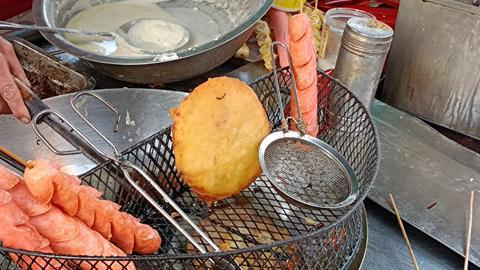
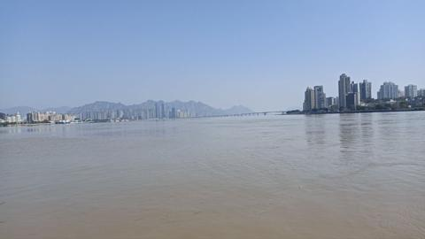
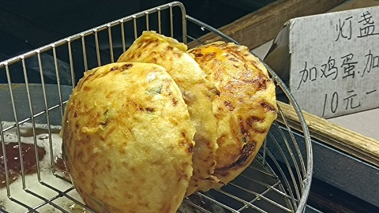

**01 月 04 日**

新年愿景: 上月球!

**01 月 06 日**

今日生日, 菜市场购入 4 只大闸蟹, 清蒸. 下午制作蛋糕.

**01 月 17 日**

因为 Omiga 铭文协议上线, CKB 主网交易量暴增.

**01 月 18 日**

新冠再次感染, 今日是第 8 天, 还有咳嗽.

**02 月 10 日**

今日乃年初一, 步行 3 公里终于又买到了灯盏糕. 小爷我就好这一口~

**02 月 11 日**

瓯江--摄于江心屿. 下午与好友去看了电影飞驰人生 2, 当年第一部也是和其一起看的, 已经是 5 年前的事情了.

**02 月 13 日**

决定明天回杭, 再见了灯盏糕.

**02 月 28 日**

四年一牛, 真准时捏~

**02 月 29 日**

比特币不再辜负任何人. 历史上曾买入比特币并持有至今的投资者全部解套并盈利.

**03 月 05 日**

波龙大龙虾, 味道好西好.

**03 月 13 日**

最近一直在刷 lavanet 的空投, 分数刷到前 1000 了...

**03 月 30 日**

钱塘江旁露营.

**04 月 28 日**

灵溪山.

**05 月 13 日**

通货紧缩的货币.

固定且递减的货币发行最重要且备受争议的后果是货币往往具有固有的通货紧缩性. 通货紧缩是由于供需不平衡导致货币价值上升(和汇率上升)的现象. 价格通货紧缩是通货膨胀的反面, 意味着货币随时间具有更多的购买力.

许多经济学家认为通货紧缩的经济是一场灾难, 应该尽一切努力避免. 这是因为在通货紧缩迅速的时期, 人们往往会囤积货币而不是花费它, 希望价格会下跌. 这种现象在日本的"失落的十年"期间出现过, 当时需求完全崩溃, 推动该货币陷入通货紧缩螺旋.

比特币专家认为, 通货紧缩本身并不是坏事. 相反, 通货紧缩与需求崩溃相关, 因为这是我们研究通货紧缩的最明显的例子. 在可能无限印刷货币的法定货币中, 要进入通货紧缩螺旋是非常困难的, 除非需求完全崩溃且不愿意印刷货币. 比特币中的通货紧缩不是由于需求崩溃引起的, 而是由于可预测的供应受限造成的. 当然, 通货紧缩的积极方面是它是通货膨胀的反面. 通货膨胀会导致货币逐渐贬值, 从而导致一种形式的隐性税收, 惩罚储户以援助债务人(包括最大的债务人, 即政府本身). 受政府控制的货币存在易于发行债务的道德风险, 这些债务后来可以通过贬值以牺牲储户的利益而被抹去.

尚待观察的是, 当通货紧缩不是由经济迅速收缩驱动时, 货币的通货紧缩特征是否是一个问题, 还是一个优势, 因为对通货膨胀和贬值的保护超过了通货紧缩的风险.

**05 月 25 日**

千岛湖.

**05 月 26 日**

大理, 洱海, 傍晚.

**05 月 27 日**

大理, 洱海, 清晨.

**05 月 30 日**

在喜洲古镇体验了一下扎染.

**06 月 08 日**

前往傅墩采摘杨梅. 今年去的时间稍早一两天, 杨梅还是红彤彤的.
