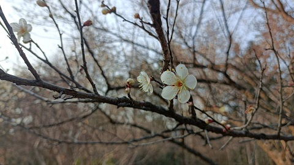
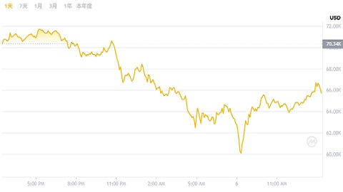

**01 月 01 日**

Happy New Year!

**01 月 06 日**

Today is my birthday. I am so happy to be able to eat cake and seafood.

I ate ice cream cake, it was so cold!

**01 月 09 日**

假设回到 10 年以前, 你发现有一个叫做李笑来的人, 他在推广比特币, 你会怎么做?

- 第一层: 防御嘲讽. 约 90% 的人停留在此. 本能的防御机制启动, 第一反应是质疑人的动机, 而非研究事物本身. 在信息到达大脑之前, 就已经被拒之门外.
- 第二层: 逻辑质疑. 约 9% 的人停留在此. "不就是一串数字吗", "没有国家信用背书", "是不是传销". 他们开始思考, 但依旧被困于旧的认知框架里, 用传统金融去理解新事物, 注定得出否定的结论.
- 第三层: 聚焦事物. 约 1% 的人停留在此. 他们忽略李笑来这个人, 而是开始阅读比特币的科普性文章. 从**质疑人转到研究事**, 是决定性的分水岭.
- 第四层: 深度研究. 约 0.1% 的人停留在此. 他们开始阅读白皮书, 研究底层技术, 思考其经济模型和社会影响.
- 第五层: 亲身试错. 约 0.05% 的人停留在此. 他们开始购买比特币, 使用比特币钱包, 亲身体验其运作机制. **在 10 年前, 进行这一步最多不过花十元钱以及一些时间成本**.
- 第六层: 最终赢家. 约 0.01% 的人到达此处. 长期持有.

<https://www.youtube.com/watch?v=ggzw_6EBHBY>

此视频之于我之感悟. 去年市场上其实有一些不错的机会, 不过我基本没有参与, 甚为可惜. 因为市场热点变化太快, NFT, 元宇宙, 铭文 ... 这些热点来的快去的也快, 所以去年那时候看到新的事物我本能就拒绝了: 莫不是又来割我的韭菜? 其实不然, 包括 polymarket 在内的很多项目, 都是有潜力的创新. 只是我没有耐心去研究. 今年我希望能改正这个缺点, 多尝试一些新的事物, 不要总是停留在质疑的阶段.

**01 月 16 日**

It looks like today and tomorrow will be the last two sunny days.

**01 月 21 日**

Safepal's USDT credit card looks great.

**01 月 22 日**

Tonight, I finished my last class at the Solana Bootcamp. It has been a great experience.

**01 月 24 日**

杭州植物园建立在山上, 比起园更像是一个小型的森林公园. 自然景观偏多, 人工造景较少, 和我想象中的植物园有些不同. 以前去过合肥的植物园, 那里更像是一个大型的花园, 展出各种各样的植物, 但杭州植物园根本就是围了一片山头...

目前正是白梅初开的季节, 大多数还是花苞, 只有少数开放.

**01 月 28 日**

今天去车管所换车牌, 选到一个浙 A 好牌!

**02 月 05 日**

What a terrible day, the cryptocurrency market is crashing! Bitcoin dropped to $71,000, which I didn't expect.

**02 月 06 日**

What happened today? Bitcoin dropped to $60,000. I thought the market would stabilize after yesterday's crash, but it seems like it's still going down.

To be honest, I think this is a good thing. Bitcoin shouldn't become a tool for institutions to make money.
