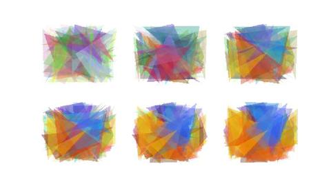

# 遗传算法/生物进化模拟

这是个真实的故事.

从前在海岸边有一群扇贝在悠哉游哉地生活繁衍着. 它们自然是衣食不愁, 连房子也有了着落. 它们担忧的只有一件事: 每隔一段时间, 总有一个人来挖走它们之中的一部分. 当然啦, 挖回去干什么这大家都知道. 但扇贝们不知道的是, 这人的家族图腾是 Firefox 的图标, 所以他总是选择那些贝壳花纹长得比较不像 Firefox 图标的扇贝.

这种状况持续了好几十万代. 大家应该也猜到扇贝们身上发生什么事情了: 它们的贝壳上都印着很像 Firefox 图标的图案.



## 解析

上述故事是一个遗传算法的一部分. 下面, 就来实现这个遗传算法. 假设每个扇贝均由 100 个半透明且颜色随机的三角形组成:

- 决策变量: 100 个半透明三角形, 每个三角形的属性包括: 三个顶点的坐标, 透明度(0 - 0.45), 颜色.
- 个体评价方法: 100 个半透明三角形组合成而成的图案与 Firefox 图标进行逐像素比对, 并用一个较大的数减去逐像素向量距离的和作为个体适应度
- 选择算子: 轮盘选择 + 最优保留策略
- 交叉算子: 单点交叉
- 变异算子: 等位变异
- 运行参数: 迭代 3000 次, 种群大小 80, 交叉概率 0.6, 变异概率 0.008

## 代码实现

下面用 Python 实现上述故事.

```py
import copy
import numpy as np
import os
import os.path
import random
import skimage.draw
import skimage.io
import skimage.transform
import typing

img_path = '/tmp/firefox_logo_57_512w.png'
save_dir = '/tmp/img'

img = skimage.io.imread(img_path)
if img.shape[2] == 4:
    img = skimage.color.rgba2rgb(img)
    img = (255 * img).astype(np.uint8)
img = skimage.transform.resize(img, (128, 128), mode='reflect', preserve_range=True).astype(np.uint8)


class Base:
    def __init__(self, r: typing.List[int], c: typing.List[int], color: typing.List[int], alpha: float) -> None:
        self.r = r
        self.c = c
        self.color = color
        self.alpha = alpha


class Gene:
    def __init__(self, base: typing.List[Base]) -> None:
        self.base = base

    def copy(self) -> typing.Self:
        return copy.deepcopy(self)


class Ga:
    def __init__(self):
        self.pop_size = 80
        self.dna_size = 100
        self.max_iter = 3000
        self.pc = 0.6
        self.pm = 0.008

    def random_base(self) -> Base:
        return Base(
            [random.randint(0, img.shape[0] - 1) for _ in range(3)],
            [random.randint(0, img.shape[1] - 1) for _ in range(3)],
            [random.randint(0, 255) for _ in range(3)],
            random.random() * 0.45,
        )

    def random_gene(self) -> Gene:
        return Gene([self.random_base() for _ in range(self.dna_size)])

    def decode(self, geno: Gene) -> np.ndarray:
        ind = np.ones(img.shape, dtype=np.uint8) * 255
        for e in geno.base:
            rr, cc = skimage.draw.polygon(e.r, e.c)
            skimage.draw.set_color(ind, (rr, cc), e.color, e.alpha)
        return ind

    def assess(self, feno: np.ndarray) -> float:
        # 三维矩阵的欧式距离
        d = np.linalg.norm(np.where(img > feno, img - feno, feno - img))
        # 使用一个较大的数减去欧式距离
        # 此处该数为 (img.size * ((3 * 255 ** 2) ** 0.5) ** 2) ** 0.5
        return (img.size * 195075) ** 0.5 - d

    def select(self, pop: typing.List[Gene], fit: typing.List[float]) -> typing.List[Gene]:
        fit_min = min(fit)
        fit_max = max(fit)
        fit = [(e - fit_min) + fit_max / 2 + 0.001 for e in fit]
        return [e.copy() for e in random.choices(pop, fit, k=self.pop_size)]

    def crossover(self, pop: typing.List[Gene]) -> typing.List[Gene]:
        ret = [e.copy() for e in pop]
        for i in range(0, self.pop_size, 2):
            j = i + 1
            if random.random() < self.pc:
                p = random.randint(1, self.dna_size-1)
                ret[i].base[p:] = pop[j].base[p:]
                ret[j].base[p:] = pop[i].base[p:]
        return ret

    def mutate(self, pop: typing.List[Gene]) -> typing.List[Gene]:
        ret = [e.copy() for e in pop]
        for i in range(self.pop_size):
            e = ret[i]
            for j in range(self.dna_size):
                if random.random() < self.pm:
                    e.base[j] = self.random_base()
        return ret

    def evolve(self):
        pop = [self.random_gene() for _ in range(self.pop_size)]
        per = [self.decode(e) for e in pop]
        fit = [self.assess(e) for e in per]
        old_top_idx = max(range(len(fit)), key=lambda i: fit[i])
        old_top = pop[old_top_idx]
        old_top_per = per[old_top_idx]
        old_top_fit = fit[old_top_idx]
        yield list(zip(pop, per, fit))
        for _ in range(self.max_iter - 1):
            pop = self.select(pop, fit)
            pop = self.crossover(pop)
            pop = self.mutate(pop)
            per = [self.decode(e) for e in pop]
            fit = [self.assess(e) for e in per]
            new_bad_idx = min(range(len(fit)), key=lambda i: fit[i])
            new_top_idx = max(range(len(fit)), key=lambda i: fit[i])
            new_top = pop[new_top_idx]
            new_top_per = per[new_top_idx]
            new_top_fit = fit[new_top_idx]
            if new_top_fit < old_top_fit:
                pop[new_bad_idx] = old_top
                per[new_bad_idx] = old_top_per
                fit[new_bad_idx] = old_top_fit
            if new_top_fit > old_top_fit:
                old_top = new_top
                old_top_per = new_top_per
                old_top_fit = new_top_fit
            yield list(zip(pop, per, fit))


ga = Ga()
for i, e in enumerate(ga.evolve()):
    per = [f[1] for f in e]
    fit = [f[2] for f in e]
    idx = max(range(len(fit)), key=lambda i: fit[i])
    print(f'{i:0>4} {fit[idx]}')
    skimage.io.imsave(os.path.join(save_dir, f'{i:0>4}.jpg'), per[idx])
```

执行上述代码, 记得修改 `img_path` 与 `save_dir` 为可用地址. 不用一会, 就能在 `save_dir` 中见到每一代最优个体了. 当然, 跑完 3000 代还是需要一点时间的(大约半天~).

## 后记

实际上, 在生活和生产中, 很多时候并不需要得到一个完美的答案; 而很多问题如果要得到完美的答案的话, 需要很大量的计算. 所以, 因为**遗传算法能在相对较短的时间内给出一个足够好能凑合的答案**, 它从问世伊始就越来越受到大家的重视, 对它的研究也是方兴未艾. 当然, 它也有缺点, 比如说早期的优势基因可能会很快通过交换基因的途径散播到整个种群中, 这样有可能导致早熟(premature), 也就是说整个种群的基因过早同一化, 得不到足够好的结果. 这个问题是难以完全避免的.

其实, 通过微调参数和繁衍、变异、淘汰、终止的代码, 我们有可能得到更有效的算法. 遗传算法只是一个框架, 里边具体内容可以根据实际问题进行调整, 这也是它能在许多问题上派上用场的一个原因. 像这样可以适应很多问题的算法还有模拟退火算法, 粒子群算法, 蚁群算法, 禁忌搜索等等, 统称为元启发式算法.

另外, 基于自然演化过程的算法除了在这里说到的遗传算法以外, 还有更广泛的群体遗传算法和遗传编程等, 它们能解决很多棘手的问题. 这也从一个侧面说明, 我们不一定需要一个智能才能得到一个构造精巧的系统.

## 参考

- [1] [方弦. 遗传算法: 内存中的进化](http://songshuhui.net/archives/10462)
