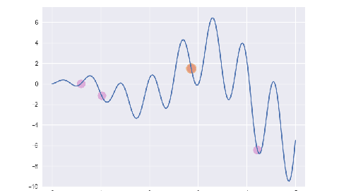

# 遗传算法/最优保留策略

最优保留策略指将群体中最优的一部分个体不经过选择, 交叉和变异操作, 直接进入下一代, 以避免优秀个体损失. 我们希望适应度最好的个体总是能保留到下一代群体中, 以避免优秀的基因因为偶然原因而被淘汰(例如由于过量饮用伏特加而在俄罗斯轮盘赌中失利).

最优保留策略的执行过程如下:

0. 找出当前群体中适应度最高和最低的个体.
0. 若当前群体中最优个体比历史最优个体适应度还高, 则以当前群体最优个体作为历史最优个体
0. 用历史最优个体替换掉当前群体中的最差个体.
3. 执行后续遗传算子: 选择, 交叉和变异等.

最有保留策略同时也会带来一些负面问题, 它虽然可以保证优秀个体得到遗传, 但同时也容易让一个局部最优个体快速扩散到整个种群而使得算法的全局搜索能力下降, 因此你可以选择配合略微升高的交叉概率和变异概率一起使用.

## 代码实现

- 复制首节例子代码, 修改 evolve 函数, 增加一段保留最优个体的代码逻辑.
- 为了方便观察, 调整种群大小为 4, 变异概率为 0.5.

```py
import math
import matplotlib.pyplot as plt
import numpy as np
import random
import typing


class Ga:

    def __init__(self) -> None:
        self.pop_size = 4
        self.max_iter = 20
        self.pc = 0.6
        self.pm = 0.5
        self.dna_size = 10
        self.x_bound = [0, 5]

    def f(self, x: float) -> float:
        return math.sin(10 * x) * x + math.cos(2 * x) * x

    def encode(self, feno: float) -> typing.List[int]:
        a = feno / (self.x_bound[1] - self.x_bound[0]) * (2 ** self.dna_size - 1)
        a = int(a)
        s = bin(a)[2:]
        s = '0' * (self.dna_size - len(s)) + s
        return [int(e) for e in s]

    def decode(self, geno: typing.List[int]) -> float:
        s = ''.join([str(e) for e in geno])
        return int(s, 2) / (2**self.dna_size - 1) * self.x_bound[1]

    def assess(self, pop: typing.List[typing.List[int]]) -> typing.List[float]:
        x = [self.decode(e) for e in pop]
        r = [self.f(x) for x in x]
        return r

    def select(self, pop: typing.List[typing.List[int]], fit: typing.List[float]) -> typing.List[typing.List[int]]:
        fit_min = min(fit)
        fit_max = max(fit)
        fit = [(e - fit_min) + fit_max / 2 + 0.001 for e in fit]
        return random.choices(pop, fit, k=self.pop_size)

    def crossover(self, pop: typing.List[typing.List[int]]) -> typing.List[typing.List[int]]:
        ret = pop.copy()
        for i in range(0, self.pop_size, 2):
            j = i + 1
            if random.random() < self.pc:
                a = pop[i]
                b = pop[j]
                p = random.randint(1, self.dna_size)
                ret[i] = a[:p] + b[p:]
                ret[j] = b[:p] + a[p:]
        return ret

    def mutate(self, pop: typing.List[typing.List[int]]) -> typing.List[typing.List[int]]:
        ret = [None for _ in range(self.pop_size)]
        for i in range(self.pop_size):
            e = pop[i].copy()
            for j in range(self.dna_size):
                if random.random() < self.pm:
                    e[j] = 1 - e[j]
            ret[i] = e
        return ret

    def evolve(self) -> typing.Iterable[typing.List[typing.List[int]]]:
        pop = [[random.randint(0, 1) for _ in range(self.dna_size)] for _ in range(self.pop_size)]
        fit = self.assess(pop)
        idx = max(range(len(fit)), key=lambda i: fit[i])
        top_ind = pop[idx]
        top_fit = fit[idx]
        yield pop
        for _ in range(self.max_iter - 1):
            pop = self.select(pop, fit)
            pop = self.crossover(pop)
            pop = self.mutate(pop)
            fit = self.assess(pop)
            idx = max(range(len(fit)), key=lambda i: fit[i])
            if fit[idx] > top_fit:
                top_ind = pop[idx]
                top_fit = fit[idx]
            if fit[idx] < top_fit:
                idx = min(range(len(fit)), key=lambda i: fit[i])
                pop[idx] = top_ind
                fit[idx] = top_fit
            yield pop


ga = Ga()

plt.style.use('seaborn-v0_8-darkgrid')
plt.figure(figsize=(4.8, 2.7))
ga = Ga()
for i, e in enumerate(ga.evolve()):
    p = plt.subplot()
    p.set_xlim(-0.2, 5.2)
    p.set_ylim(-10, 7.5)
    x = np.linspace(*ga.x_bound, 200)
    y = [ga.f(e) for e in x]
    p.plot(x, y)
    x = [ga.decode(e) for e in e]
    y = [ga.f(e) for e in x]
    p.scatter(x, y, s=50, c='#CF6FC1', alpha=0.5)
    plt.savefig(f'/tmp/img/{i+1:0>2}.png')
    p.clear()
```


