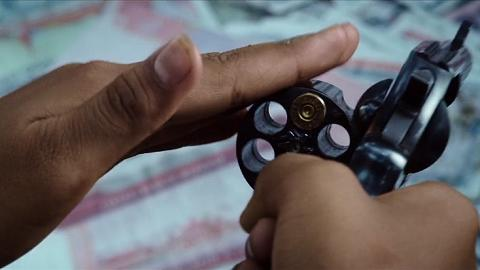

# 遗传算法/俄罗斯轮盘赌

为了确定哪些幸运儿的基因可以被复制到下一代, 我们希望有这样一种随机采样方法: 各个个体被选中的概率与其适应度大小成正比. 这种选择方式实际上是一种退还随机选择, 因其原理与赌盘操作颇为相似, 也叫做赌盘算法(Roulette whell)或者俄罗斯轮盘赌(Russian roulette).

俄罗斯轮盘赌是一种自杀式的玩命赌博游戏, 相传源于俄罗斯. 参与者会将一颗子弹塞入左轮手枪弹巢的六个膛室中的一个, 然后关上弹巢将其快速旋转. 在旋转停止后, 参与者需轮流将把枪口对准自己的脑袋按下扳机, 直至有人中枪或不敢按下扳机为止.

电影《湄公河行动》俄罗斯轮盘赌画面:

> 俄罗斯轮盘赌是一个危险的游戏, 为了安全起见, 我不建议在现实生活中进行这种娱乐活动.

从纯数学概率的角度来看, 因为枪中只有一颗子弹, 膛室有 6 个, 所以第一枪子弹被击发的概率是 1/6, 若第一枪未被激发, 第二枪的激发概率则增加至 1/5, 依次类推. 玩家的先后顺序不会影响玩家的中弹概率, 先开枪的玩家和后开枪的玩家的中弹概率是相同的. 这是因为每一次游戏开始前, 弹道位置都会重新随机选择, 这使得每个玩家的机会公平地分布. 每个玩家都有相等的概率在自己的射击时刻遇到子弹.

在遗传算法中, 可以仿照此方式实现比例选择算法. 考虑有 N 个个体, 它们的适应度分别为 F₀, F₁, ..., Fₙ, 可以执行如下的计算过程:

0. 先计算所有个体的适应度总和 F = F₀ + F₁ + ... + Fₙ.
0. 在 0 到 F 之间生成一个随机数.
0. 该随机数落入哪个"膛室", 则选择其对应个体.

不过由于其选择过程是完全随机的, 因此可能会出现适应度很高的个体却无法遗传至下一代的情况, 但也正是这一随机性保证了群体演化的多样性.
