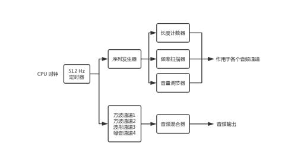
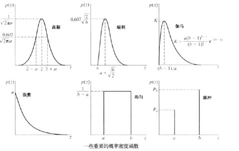

# GB/音频/音频系统概念简介

在 Game Boy 仿真器的实现过程中, 音频是最不容易理解且难度最高的一部分. Game Boy 的音频系统复杂且层层嵌套, 但如果仔细的将其抽丝剥茧, 其核心本质便可展露无遗: 要想播放声音, 只要在特定的时间点向特定的寄存器写入特定的值. Game Boy 的整个音频系统都服务于这个目标.

Game Boy 有四个音频通道, 分别是

1. 具有扫频和包络功能的方波(Square1)
2. 具有包络功能的方波(Square2)
3. 可编程的波形(Wave)
4. 具有包络功能的白噪声(Noise)

系统可以分别控制这四个音频通道(开启/关闭, 调整音量等), 然后将每个输出端的音频输出进行混合(Mixer), 最后经过一个全局控制模块(全局音量大小, 全局静音等)后输入到硬件设备. 对音频通道的参数修改不需要暂停当前的音频播放.

音频模块的工作流程大致如下:



音频系统直接接收 CPU 时钟信号的是一个 512 Hz 的定时器, 该定时器管理三个特殊功能模块的运作: 分别是长度计数器, 扫频器和音量包络. 这些控制器顾名思义控制着音频通道的一些参数, 后文将进行详细讲述. 然后该 512 Hz 的定时器还跟着 4 个音频通道, 以每秒 512 次的频率触发这些通道进行状态转换: 从当前已有的状态转换按照固定规则转变为下一步状态.

## 方波

方波是一种非正弦曲线的波形, 通常在数字电路中出现. 理想方波只有 "高" 和 "低" 这两个值, 表现为电路的 "开" 与 "关". 不过实际应用中很少真的使用电路通电与否制造方波, 而是使用多个正弦波进行合成. 在 Game Boy 中, 方波有从高到低 16 个阶梯变化(振幅), 用于表示音量大小. 此部分由专用硬件音量调节器控制. 值得一提的是, 在音乐学科中, 方波被视为一种空洞的声音.

## 可编程波形

通常, 声波带有周期性. 以经典的正弦波举例的话, 只要知道该波的频率和振幅, 就能求出任意时间点的波形状态. Game Boy 的前两个方波通道就用于产生此种规则的声波数据. 但同时 Game Boy 也为游戏开发者提供了更大的可能, 那就是可编程波形. 可编程波形通道从内存中的一段名为 Wave 的区域获取音频数据, 开发者可以向此内存区域写入任何数据, 比如自定义的锯齿波, 甚至是一段随机数.

## 白噪声

白噪声(white noise)在通信领域中指的是一种功率谱函数是常数的噪声. 最常见的白噪声类型是加性高斯白噪声(Additive white Gaussian noise，AWGN), 因为该噪声的幅度服从高斯分布, 其次还有均匀噪声, 瑞丽噪声等噪声类型.

常见噪声及其概率密度函数:



Game Boy 的噪声通道产生的是均匀噪声.

## 混合器

Game Boy 最终播放出的声音是 4 个音频通道的输出的叠加. 每个音频通道都有一个定时器, 为波形发生器计时. 在最终送入混频器之前, 4 个音频通道的波形的振幅将通过一个音量调节器进行调节. 混频器将每个通道的波形转换为电信号, 并将其输出到 Game Boy 的左/右声道. 最后, 主音量包络将调节左右声道的输出音量. 从总体上来看, 4 个音频通道具有以下从左到右连接的单元:

```text
Square 1: Sweep -> Timer -> Duty -> Length Counter -> Envelope -> Mixer
Square 2:          Timer -> Duty -> Length Counter -> Envelope -> Mixer
Wave:              Timer -> Wave -> Length Counter -> Volume   -> Mixer
Noise:             Timer -> LFSR -> Length Counter -> Envelope -> Mixer
```

通常, 每个通道中的所有单元始终在运行, 例如, 即使某个音频通道是静音的, 该通道仍然会执行全部的计算任务, 只是最终不会被送入混频器中. 这样的设计使设备从静音恢复时, 播放器可以立即且准确无误的播放当前应该播放的声音.

## 定时器

定时器(Timer)每 N 个输入时钟产生一个输出时钟, 其中 N 是定时器的周期(Period). 如果以定时器的频率作为标准频率给出, 则其周期为 4194304/频率, 单位为 Hz. 注意 4194304 是 CPU 的频率, 你可以理解为每 N 个 CPU 周期对应一个定时器周期. 每个定时器内部有一个计数器, 在每个周期中递减. 当计数器变为零时, 计数器将重新赋值位定时器的周期(Peroid), 并持续生成输出时钟. 定时器被广泛应用于音频模块的多个硬件组成部分中, 甚至有的定时的输入是另一个定时器的输出.

定时器的实现非常简单, 它接收 N 个输入, 并产生 M 个输出. 其中 M 可以为 0.

```rs
struct Timer {
    period: u32,
    n: u32,
}

impl Timer {
    fn power_up(period: u32) -> Self {
        Self { period, n: 0x0 }
    }

    fn next(&mut self, cycles: u32) -> u32 {
        self.n += cycles;
        let rs = self.n / self.period;
        self.n = self.n % self.period;
        rs
    }
}
```
