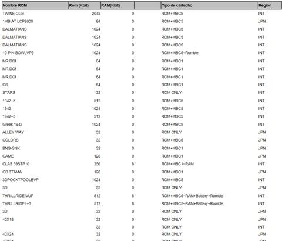

# GB/游戏卡带/完整代码

在这一节, 主要为 Cartridge 模块做一个收尾工作. 从工程角度来说, Game Boy 仿真器并不关心具体的 MBC 类型, 因此它会期望 Cartridge 模块提供一个如下的公开函数:

```rs
pub fn power_up(path: impl AsRef<Path>) -> Box<dyn Cartridge>;
```

此函数可以解析指定目录下的 ROM 文件, 并根据 Cartridge Header 中的信息自动选择合适的 MBC 实现来包装 ROM 数据, 最后返回一个 Cartridge trait object. Cartridge trait 定义如下:

```rs
pub trait Cartridge: Memory + Stable + Send {
    fn title(&self) -> String {
        let mut buf = String::new();
        let ic = 0x0134;
        let oc = if self.get(0x0143) == 0x80 { 0x013e } else { 0x0143 };
        for i in ic..oc {
            match self.get(i) {
                0 => break,
                v => buf.push(v as char),
            }
        }
        buf
    }
}
```

当读取到 ROM 的数据时, 正如本章节开头所讲的, Game Boy 会验证数据的合法性, 如果数据非法则不会启动游戏. 有两步验证过程, 分别是任天堂的 LOGO 验证和标题校验和验证, 代码实现如下.

```rs
const NINTENDO_LOGO: [u8; 48] = [
    0xCE, 0xED, 0x66, 0x66, 0xCC, 0x0D, 0x00, 0x0B, 0x03, 0x73, 0x00, 0x83,
    0x00, 0x0C, 0x00, 0x0D, 0x00, 0x08, 0x11, 0x1F, 0x88, 0x89, 0x00, 0x0E,
    0xDC, 0xCC, 0x6E, 0xE6, 0xDD, 0xDD, 0xD9, 0x99, 0xBB, 0xBB, 0x67, 0x63,
    0x6E, 0x0E, 0xEC, 0xCC, 0xDD, 0xDC, 0x99, 0x9F, 0xBB, 0xB9, 0x33, 0x3E,
];

fn ensure_logo(cart: &dyn Cartridge) {
    for i in 0..48 {
        if cart.get(0x0104 + i as u16) != NINTENDO_LOGO[i as usize] {
            panic!("Nintendo logo is incorrect")
        }
    }
}

fn ensure_header_checksum(cart: &dyn Cartridge) {
    let mut v: u8 = 0;
    for i in 0x0134..0x014d {
        v = v.wrapping_sub(cart.get(i)).wrapping_sub(1);
    }
    if cart.get(0x014d) != v {
        panic!("Cartridge's header checksum is incorrect")
    }
}
```

同时为了给 ROM 和 RAM 预分配空间, 需要从 Cartridge Header 中获取 ROM Size 和 RAM Size. 它们在 Header 中均只占用一个字节, 具体映射关系如代码展示.

```rs
// Specifies the ROM Size of the cartridge. Typically calculated as "32KB shl N".
fn rom_size(b: u8) -> usize {
    let bank = 16384;
    match b {
        0x00 => bank * 2,
        0x01 => bank * 4,
        0x02 => bank * 8,
        0x03 => bank * 16,
        0x04 => bank * 32,
        0x05 => bank * 64,
        0x06 => bank * 128,
        0x07 => bank * 256,
        0x08 => bank * 512,
        0x52 => bank * 72,
        0x53 => bank * 80,
        0x54 => bank * 96,
        n => panic!("Unsupported rom size: 0x{:02x}", n),
    }
}

// Specifies the size of the external RAM in the cartridge (if any).
fn ram_size(b: u8) -> usize {
    match b {
        0x00 => 0,
        0x01 => 1024 * 2,
        0x02 => 1024 * 8,
        0x03 => 1024 * 32,
        0x04 => 1024 * 128,
        0x05 => 1024 * 64,
        n => panic!("Unsupported ram size: 0x{:02x}", n),
    }
}
```

最终, 完善 power_up 函数如下所示.

```rs
pub fn power_up(path: impl AsRef<Path>) -> Box<dyn Cartridge> {
    let mut f = File::open(path.as_ref()).unwrap();
    let mut rom = Vec::new();
    f.read_to_end(&mut rom).unwrap();
    if rom.len() < 0x150 {
        panic!("Missing required information area which located at 0100-014F")
    }
    let rom_max = rom_size(rom[0x0148]);
    if rom.len() > rom_max {
        panic!("Rom size more than {}", rom_max);
    }
    let cart: Box<dyn Cartridge> = match rom[0x0147] {
        0x00 => Box::new(RomOnly::power_up(rom)),
        0x01 => Box::new(Mbc1::power_up(rom, vec![], "")),
        0x02 => {
            let ram_max = ram_size(rom[0x0149]);
            Box::new(Mbc1::power_up(rom, vec![0; ram_max], ""))
        }
        0x03 => {
            let ram_max = ram_size(rom[0x0149]);
            let sav_path = path.as_ref().to_path_buf().with_extension("sav");
            let ram = ram_read(sav_path.clone(), ram_max);
            Box::new(Mbc1::power_up(rom, ram, sav_path))
        }
        0x05 => {
            let ram_max = 512;
            Box::new(Mbc2::power_up(rom, vec![0; ram_max], ""))
        }
        0x06 => {
            let ram_max = 512;
            let sav_path = path.as_ref().to_path_buf().with_extension("sav");
            let ram = ram_read(sav_path.clone(), ram_max);
            Box::new(Mbc2::power_up(rom, ram, sav_path))
        }
        0x0f => {
            let sav_path = path.as_ref().to_path_buf().with_extension("sav");
            let rtc_path = path.as_ref().to_path_buf().with_extension("rtc");
            Box::new(Mbc3::power_up(rom, vec![], sav_path, rtc_path))
        }
        0x10 => {
            let ram_max = ram_size(rom[0x0149]);
            let sav_path = path.as_ref().to_path_buf().with_extension("sav");
            let ram = ram_read(sav_path.clone(), ram_max);
            let rtc_path = path.as_ref().to_path_buf().with_extension("rtc");
            Box::new(Mbc3::power_up(rom, ram, sav_path, rtc_path))
        }
        0x11 => Box::new(Mbc3::power_up(rom, vec![], "", "")),
        0x12 => {
            let ram_max = ram_size(rom[0x0149]);
            Box::new(Mbc3::power_up(rom, vec![0; ram_max], "", ""))
        }
        0x13 => {
            let ram_max = ram_size(rom[0x0149]);
            let sav_path = path.as_ref().to_path_buf().with_extension("sav");
            let ram = ram_read(sav_path.clone(), ram_max);
            Box::new(Mbc3::power_up(rom, ram, sav_path, ""))
        }
        0x19 => Box::new(Mbc5::power_up(rom, vec![], "")),
        0x1a => {
            let ram_max = ram_size(rom[0x0149]);
            Box::new(Mbc5::power_up(rom, vec![0; ram_max], ""))
        }
        0x1b => {
            let ram_max = ram_size(rom[0x0149]);
            let sav_path = path.as_ref().to_path_buf().with_extension("sav");
            let ram = ram_read(sav_path.clone(), ram_max);
            Box::new(Mbc5::power_up(rom, ram, sav_path))
        }
        0xff => {
            let ram_max = ram_size(rom[0x0149]);
            let sav_path = path.as_ref().to_path_buf().with_extension("sav");
            let ram = ram_read(sav_path.clone(), ram_max);
            Box::new(HuC1::power_up(rom, ram, sav_path))
        }
        n => panic!("Unsupported cartridge type: 0x{:02x}", n),
    };
    ensure_logo(cart.as_ref());
    ensure_header_checksum(cart.as_ref());
    cart
}
```

至此, 任何合法的 Game Boy ROM 都可以通过以上的函数成功读取.

在 Game Boy 平台上曾诞生了无数的游戏, 虽然不敢保证, 但绝大多数游戏卡带的信息都能在 [https://ladecadence.net/trastero/listado%20juegos%20gameboy.html](https://ladecadence.net/trastero/listado%20juegos%20gameboy.html) 网站上找到. 该网站上总共拥有 6000 余个 Game Boy 游戏卡带的详细信息, 这些信息包括: 游戏名称, ROM 大小, RAM 大小, MBC 类型等, 如图所示.



读者可以根据这些数据对自己的 Cartridge 模块代码进行简单测试.
