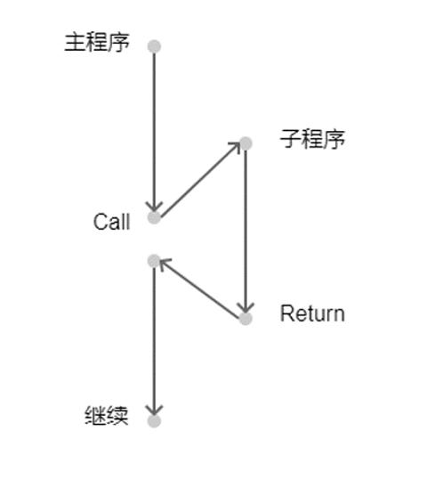

# GB/CPU/LR35902 标准指令集

LR35902 拥有两套指令集, 一套是 8 位指令集, 另一套则是 16 位指令集, 其中 16 位指令集的操作码固定以 0xcb 作为前缀. 16 位指令集也常被称作扩展指令集, 因为原版 z80 CPU 不支持移位操作, 所以 LR35902 通过外接扩展电路的形式额外添加了移位指令.

关于其标准指令集与扩张指令集, 可以在网站 [http://www.pastraiser.com/cpu/gameboy/gameboy_opcodes.html](http://www.pastraiser.com/cpu/gameboy/gameboy_opcodes.html) 上找到它的简要概览.

我们首先将聚焦在标准指令集上, 这套指令被同时应用在诸如 Intel 8080, z80 和 LR35902 等 CPU 上, 更是如今 x86 架构的前身. 请注意, 对 CPU 指令集的仿真是一个繁琐且不能出任何差错的工程, 初学者通常会花大量的时间在调式上. 更糟糕的是, 除非已经完成了整个项目, 不然几乎无法在开发阶段验证自己写的代码是否正确. 因此请做好准备, 并且在遇到困难时不必过于沮丧!

## 结构体定义

在开始之前, 定义如下的对 CPU 结构进行仿真的结构体, 后续所有的开发都将围绕该结构体进行.

```rs
pub struct Cpu {
    pub reg: Register,                // 寄存器
    pub mem: Rc<RefCell<dyn Memory>>, // 可访问的内存空间
    pub halted: bool,                 // 表明 CPU 是否处于工作状态
    pub ei: bool,                     // enable interrupt 的简写, 表明 CPU 是否接收硬件中断
}
```

同时为该结构体实现两个根据当前 PC 从内存中读取 u8 和 u16 的两个函数, 记得读取数据后需要准确地移动 PC: 如果读取的是 u8 数据则 PC 加 1, 如果是 u16 数据则 PC 加 2.

```rs
impl Cpu {
    fn imm(&mut self) -> u8 {
        let v = self.mem.borrow().get(self.reg.pc);
        self.reg.pc += 1;
        v
    }

    fn imm_word(&mut self) -> u16 {
        let v = self.mem.borrow().get_word(self.reg.pc);
        self.reg.pc += 2;
        v
    }
}
```

此处需要注意一个细节, u16 数据低位数据在内存前半部分, 高位数据在后半部分. 比如数字 0x0150, 其内存分布则是 0x50, 0x01. 这在计算机中被称为小端序(Little endian).

## 如何取指与执行

CPU 总是不断的根据当前 PC 进行取指过程, 并且在指令被取指后, 进入指令执行过程. 为 CPU 添加如下的指令执行函数:

```rs
fn ex(&mut self) -> u32 {
    let opcode = self.imm();
    match opcode {
        ...
    }
}
```

其中 Opcode 为操作码, 不同的 Opcode 代表不同的指令, 在代码实现中需要使用 match 语句对 Opcode 进行匹配. 该函数返回一个 u32, 代表该指令所消耗的机器周期(CPU 执行该指令所花费的时间).

下面给出了标准指令的摘要与仿真实现. 如果该指令影响了标志位寄存器 Flag, 则会在指令描述中特别指明. 在此约定指令的书写方法如下:

```text
Instruction (Parameter1) (Parameter2)
```

- Instruction: 指令的英文缩写
- Parameter1/Parameter2: 指令的参数

其中 Parameter 可以是如下几种情况之一:

- 特定寄存器: 特定的目标寄存器, 可以是任意 8 位寄存器或 16 位组合寄存器之一.
- r8: 8 位寄存器. 可以是寄存器 A, F, B, C, D, E, H 或 L.
- d8: 8 位立即数. 立即数是指采用立即寻址方式指令中给出的数, 该数值紧跟在操作码之后.
- r16: 16 位寄存器. 可以是寄存器 AF, BC, DE 或 HL.
- d16: 16位立即数.
- (r16): 以 16 位寄存器所存储数据视为内存地址取得的数
- (d16): 以 16 位立即数所存储数据视为内存地址取得的数
- (a8): 以 0xff00 与 8 位立即参数的或运算结果视为内存地址取得的数

## 8 位数据加载

**LD r8, d8**

1) 描述

将一个 8 位的立即参数写入到相应的 8 位寄存器中.

2) 标志位变化

无

3) 指令

下表分为 4 列, 第一列 Instruction 表示指令的缩写类型, 第二列 Parameters 表示详细的参数签名, 第三列 Opcode 为指令的操作码(16进制表示), 最后一列 Cycles 为指令所需消耗的时钟周期. 比如下表第一行, 就表示如果 CPU 从内存中读取到 0x06, 则将之视为 LD B, n 指令处理, 处理过程将消耗 8 个时钟周期. 后文同.

Instruction | Parameters | Opcode | Cycles
----------- | ---------- | ------ | ------
LD          | B, n       | 06     | 8
LD          | C, n       | 0e     | 8
LD          | D, n       | 16     | 8
LD          | E, n       | 1e     | 8
LD          | H, n       | 26     | 8
LD          | L, n       | 2e     | 8
LD          | (HL), n    | 36     | 8
LD          | A, n       | 3e     | 8

4) 代码实现

指令的仿真代码需填写入前文的 ex() 函数的 match 语句内. 数据加载的代码实现较为简单, 首先使用 self.imm() 读取一个 8 位立即数, 然后赋值到对应的寄存器即可. 稍微需要注意的是 Opcode 为 36 时, 立即数不是赋值给 HL 寄存器, 而是赋值给以 HL 寄存器存储数据为地址的内存中.

```rs
fn ex(&mut self) -> u32 {
    let opcode = self.imm();
    match opcode {
        0x06 => self.reg.b = self.imm(),
        0x0e => self.reg.c = self.imm(),
        0x16 => self.reg.d = self.imm(),
        0x1e => self.reg.e = self.imm(),
        0x26 => self.reg.h = self.imm(),
        0x2e => self.reg.l = self.imm(),
        0x36 => {
            let a = self.reg.get_hl();
            let v = self.imm();
            self.mem.borrow_mut().set(a, v);
        }
        0x3e => self.reg.a = self.imm(),
        ...
    }
}
```

**LD r8, r8**

1) 描述

将一个 8 位寄存器的值写入到另一个 8 位寄存器.

2) 标志位变化

无

3) 指令

Instruction | Parameters | Opcode | Cycles
----------- | ---------- | ------ | ------
LD          | B, B       | 40     | 4
LD          | B, C       | 41     | 4
LD          | B, D       | 42     | 4
LD          | B, E       | 43     | 4
LD          | B, H       | 44     | 4
LD          | B, L       | 45     | 4
LD          | B, (HL)    | 46     | 8
LD          | B, A       | 47     | 4
LD          | C, B       | 48     | 4
LD          | C, C       | 49     | 4
LD          | C, D       | 4A     | 4
LD          | C, E       | 4B     | 4
LD          | C, H       | 4C     | 4
LD          | C, L       | 4D     | 4
LD          | C, (HL)    | 4E     | 8
LD          | C, A       | 4F     | 4
LD          | D, B       | 50     | 4
LD          | D, C       | 51     | 4
LD          | D, D       | 52     | 4
LD          | D, E       | 53     | 4
LD          | D, H       | 54     | 4
LD          | D, L       | 55     | 4
LD          | D, (HL)    | 56     | 8
LD          | D, A       | 57     | 4
LD          | E, B       | 58     | 4
LD          | E, C       | 59     | 4
LD          | E, D       | 5A     | 4
LD          | E, E       | 5B     | 4
LD          | E, H       | 5C     | 4
LD          | E, L       | 5D     | 4
LD          | E, (HL)    | 5E     | 8
LD          | E, A       | 5F     | 4
LD          | H, B       | 60     | 4
LD          | H, C       | 61     | 4
LD          | H, D       | 62     | 4
LD          | H, E       | 63     | 4
LD          | H, H       | 64     | 4
LD          | H, L       | 65     | 4
LD          | H, (HL)    | 66     | 8
LD          | H, A       | 67     | 4
LD          | L, B       | 68     | 4
LD          | L, C       | 69     | 4
LD          | L, D       | 6A     | 4
LD          | L, E       | 6B     | 4
LD          | L, H       | 6C     | 4
LD          | L, L       | 6D     | 4
LD          | L, (HL)    | 6E     | 8
LD          | L, A       | 6F     | 4
LD          | (HL), B    | 70     | 8
LD          | (HL), C    | 71     | 8
LD          | (HL), D    | 72     | 8
LD          | (HL), E    | 73     | 8
LD          | (HL), H    | 74     | 8
LD          | (HL), L    | 75     | 8
LD          | (HL), A    | 77     | 8
LD          | A, B       | 78     | 4
LD          | A, C       | 79     | 4
LD          | A, D       | 7A     | 4
LD          | A, E       | 7B     | 4
LD          | A, H       | 7C     | 4
LD          | A, L       | 7D     | 4
LD          | A, (HL)    | 7E     | 8
LD          | A, A       | 7F     | 4
LD          | (BC), A    | 02     | 8
LD          | (DE), A    | 12     | 8
LD          | A, (BC)    | 0a     | 8
LD          | A, (DE)    | 1a     | 8

表中有一类指令可能会引起读者困惑, 以 0x40 Opcode 为例, 它可表示为 LD B, B, 其两个参数均是 B, 其含义是"读取寄存器 B 的值, 并写入寄存器 B". 从结果上来说, 它不会引起任何寄存器内容的变化, 但该操作仍然需要消耗 CPU 的时钟周期. 在后文会有专门章节对此进行介绍.

4) 代码实现

代码实现相对简单, 只需要读取对应的 8 位数据并写入目标寄存器即可.

```rs
fn ex(&mut self) -> u32 {
    let opcode = self.imm();
    match opcode {
        0x40 => {}
        0x41 => self.reg.b = self.reg.c,
        0x42 => self.reg.b = self.reg.d,
        0x43 => self.reg.b = self.reg.e,
        0x44 => self.reg.b = self.reg.h,
        0x45 => self.reg.b = self.reg.l,
        0x46 => self.reg.b = self.mem.borrow().get(self.reg.get_hl()),
        0x47 => self.reg.b = self.reg.a,
        0x48 => self.reg.c = self.reg.b,
        0x49 => {}
        0x4a => self.reg.c = self.reg.d,
        0x4b => self.reg.c = self.reg.e,
        0x4c => self.reg.c = self.reg.h,
        0x4d => self.reg.c = self.reg.l,
        0x4e => self.reg.c = self.mem.borrow().get(self.reg.get_hl()),
        0x4f => self.reg.c = self.reg.a,
        0x50 => self.reg.d = self.reg.b,
        0x51 => self.reg.d = self.reg.c,
        0x52 => {}
        0x53 => self.reg.d = self.reg.e,
        0x54 => self.reg.d = self.reg.h,
        0x55 => self.reg.d = self.reg.l,
        0x56 => self.reg.d = self.mem.borrow().get(self.reg.get_hl()),
        0x57 => self.reg.d = self.reg.a,
        0x58 => self.reg.e = self.reg.b,
        0x59 => self.reg.e = self.reg.c,
        0x5a => self.reg.e = self.reg.d,
        0x5b => {}
        0x5c => self.reg.e = self.reg.h,
        0x5d => self.reg.e = self.reg.l,
        0x5e => self.reg.e = self.mem.borrow().get(self.reg.get_hl()),
        0x5f => self.reg.e = self.reg.a,
        0x60 => self.reg.h = self.reg.b,
        0x61 => self.reg.h = self.reg.c,
        0x62 => self.reg.h = self.reg.d,
        0x63 => self.reg.h = self.reg.e,
        0x64 => {}
        0x65 => self.reg.h = self.reg.l,
        0x66 => self.reg.h = self.mem.borrow().get(self.reg.get_hl()),
        0x67 => self.reg.h = self.reg.a,
        0x68 => self.reg.l = self.reg.b,
        0x69 => self.reg.l = self.reg.c,
        0x6a => self.reg.l = self.reg.d,
        0x6b => self.reg.l = self.reg.e,
        0x6c => self.reg.l = self.reg.h,
        0x6d => {}
        0x6e => self.reg.l = self.mem.borrow().get(self.reg.get_hl()),
        0x6f => self.reg.l = self.reg.a,
        0x70 => self.mem.borrow_mut().set(self.reg.get_hl(), self.reg.b),
        0x71 => self.mem.borrow_mut().set(self.reg.get_hl(), self.reg.c),
        0x72 => self.mem.borrow_mut().set(self.reg.get_hl(), self.reg.d),
        0x73 => self.mem.borrow_mut().set(self.reg.get_hl(), self.reg.e),
        0x74 => self.mem.borrow_mut().set(self.reg.get_hl(), self.reg.h),
        0x75 => self.mem.borrow_mut().set(self.reg.get_hl(), self.reg.l),
        0x77 => self.mem.borrow_mut().set(self.reg.get_hl(), self.reg.a),
        0x78 => self.reg.a = self.reg.b,
        0x79 => self.reg.a = self.reg.c,
        0x7a => self.reg.a = self.reg.d,
        0x7b => self.reg.a = self.reg.e,
        0x7c => self.reg.a = self.reg.h,
        0x7d => self.reg.a = self.reg.l,
        0x7e => self.reg.a = self.mem.borrow().get(self.reg.get_hl()),
        0x7f => {},
        0x02 => self.mem.borrow_mut().set(self.reg.get_bc(), self.reg.a),
        0x12 => self.mem.borrow_mut().set(self.reg.get_de(), self.reg.a),
        0x0a => self.reg.a = self.mem.borrow().get(self.reg.get_bc()),
        0x1a => self.reg.a = self.mem.borrow().get(self.reg.get_de()),
        ...
    }
}
```

**LD (C), A**

1) 描述

将寄存器 A 的值写入目标内存地址(由 0xff00 | 寄存器 C 指定).

2) 标志位变化

无

3) 指令

Instruction | Parameters | Opcode | Cycles
----------- | ---------- | ------ | ------
LD          | (C), A     | e2     | 8

4) 代码实现

```rs
fn ex(&mut self) -> u32 {
    let opcode = self.imm();
    match opcode {
        0xe2 => self.mem.borrow_mut().set(0xff00 | u16::from(self.reg.c), self.reg.a),
        ...
    }
}
```

**LD A, (C)**

1) 描述

将目标内存地址(由 0xff00 | 寄存器 C 指定)的值写入寄存器 A.

2) 标志位变化

无

3) 指令

Instruction | Parameters | Opcode | Cycles
----------- | ---------- | ------ | ------
LD          | A, (C)     | f2     | 8

4) 代码实现

```rs
fn ex(&mut self) -> u32 {
    let opcode = self.imm();
    match opcode {
        0xf2 => self.reg.a = self.mem.borrow().get(0xff00 | u16::from(self.reg.c)),
        ...
    }
}
```

**LD (HL+), A**

1) 描述

将寄存器 A 写入目标内存地址(由 HL 寄存器指定), 同时 HL 自增.

2) 标志位变化

无

3) 指令

Instruction | Parameters | Opcode | Cycles
----------- | ---------- | ------ | ------
LD          | (HL+), A   | 22     | 8

4) 代码实现

```rs
fn ex(&mut self) -> u32 {
    let opcode = self.imm();
    match opcode {
        0x22 => {
            let a = self.reg.get_hl();
            self.mem.borrow_mut().set(a, self.reg.a);
            self.reg.set_hl(a + 1);
        }
        ...
    }
}
```

**LD (HL-), A**

1) 描述

将寄存器 A 写入目标内存地址(由 HL 寄存器指定), 同时 HL 自减.

2) 标志位变化

无

3) 指令

Instruction | Parameters | Opcode | Cycles
----------- | ---------- | ------ | ------
LD          | (HL-), A   | 32     | 8

4) 代码实现

```rs
fn ex(&mut self) -> u32 {
    let opcode = self.imm();
    match opcode {
        0x32 => {
            let a = self.reg.get_hl();
            self.mem.borrow_mut().set(a, self.reg.a);
            self.reg.set_hl(a - 1);
        }
        ...
    }
}
```

**LD A, (HL+)**

1) 描述

将目标内存地址(由 HL 寄存器指定)的值写入寄存器 A, 同时 HL 自增.

2) 标志位变化

无

3) 指令

Instruction | Parameters | Opcode | Cycles
----------- | ---------- | ------ | ------
LD          | A, (HL+)   | 2a     | 8

4) 代码实现

```rs
fn ex(&mut self) -> u32 {
    let opcode = self.imm();
    match opcode {
        0x2a => {
            let v = self.reg.get_hl();
            self.reg.a = self.mem.borrow().get(v);
            self.reg.set_hl(v + 1);
        }
        ...
    }
}
```

**LD A, (HL-)**

1) 描述

将目标内存地址(由 HL 寄存器指定)的值写入寄存器 A, 同时 HL 自减.

2) 标志位变化

无

3) 指令

Instruction | Parameters | Opcode | Cycles
----------- | ---------- | ------ | ------
LD          | A, (HL-)   | 3a     | 8

4) 代码实现

```rs
fn ex(&mut self) -> u32 {
    let opcode = self.imm();
    match opcode {
        0x3a => {
            let v = self.reg.get_hl();
            self.reg.a = self.mem.borrow().get(v);
            self.reg.set_hl(v - 1);
        }
        ...
    }
}
```

**LD (d8), A**

1) 描述

将寄存器 A 的值写入目标内存地址(由 0xff00 | 8 位立即参数指定).

2) 标志位变化

无

3) 指令

Instruction | Parameters | Opcode | Cycles
----------- | ---------- | ------ | ------
LD          | (d8), A    | e0     | 12

4) 代码实现

```rs
fn ex(&mut self) -> u32 {
    let opcode = self.imm();
    match opcode {
        0xe0 => {
            let a = 0xff00 | u16::from(self.imm());
            self.mem.borrow_mut().set(a, self.reg.a);
        }
        ...
    }
}
```

**LD A, (a8)**

1) 描述

将目标内存地址(由 0xff00 | 8 位立即参数指定)的值写入寄存器 A.

2) 标志位变化

无

3) 指令

Instruction | Parameters | Opcode | Cycles
----------- | ---------- | ------ | ------
LD          | A, (d8)    | f0     | 12

4) 代码实现

```rs
fn ex(&mut self) -> u32 {
    let opcode = self.imm();
    match opcode {
        0xf0 => {
            let a = 0xff00 | u16::from(self.imm());
            self.reg.a = self.mem.borrow().get(a);
        }
        ...
    }
}
```

**LD (d16), A**

1) 描述

将寄存器 A 的值写入目标内存地址(由 16 位立即参数指定).

2) 标志位变化

无

3) 指令

Instruction | Parameters | Opcode | Cycles
----------- | ---------- | ------ | ------
LD          | (a16), A   | ea     | 16

4) 代码实现

```rs
fn ex(&mut self) -> u32 {
    let opcode = self.imm();
    match opcode {
        0xea => {
            let a = self.imm_word();
            self.mem.borrow_mut().set(a, self.reg.a);
        }
        ...
    }
}
```

**LD A, (d16)**

1) 描述

将目标内存地址(由 16 位立即参数指定)的值写入寄存器 A.

2) 标志位变化

无

3) 指令

Instruction | Parameters | Opcode | Cycles
----------- | ---------- | ------ | ------
LD          | A, (a16)   | fa     | 16

4) 代码实现

```rs
fn ex(&mut self) -> u32 {
    let opcode = self.imm();
    match opcode {
        0xfa => {
            let a = self.imm_word();
            self.reg.a = self.mem.borrow().get(a);
        }
        ...
    }
}
```

## 16 位数据加载

**LD r16, d16**

1) 描述

将 16 位立即参数写入相应 16 位寄存器中.

2) 标志位变化

无

3) 指令

Instruction | Parameters | Opcode | Cycles
----------- | ---------- | ------ | ------
LD          | BC, d16    | 01     | 12
LD          | DE, d16    | 11     | 12
LD          | HL, d16    | 21     | 12
LD          | SP, d16    | 31     | 12

4) 代码实现

```rs
fn ex(&mut self) -> u32 {
    let opcode = self.imm();
    match opcode {
        0x01 | 0x11 | 0x21 | 0x31 => {
            let v = self.imm_word();
            match opcode {
                0x01 => self.reg.set_bc(v),
                0x11 => self.reg.set_de(v),
                0x21 => self.reg.set_hl(v),
                0x31 => self.reg.sp = v,
                _ => {}
            }
        }
        ...
    }
}
```

**LD SP, HL**

1) 描述

将寄存器 HL 写入到寄存器 SP.

2) 标志位变化

无

3) 指令

Instruction | Parameters | Opcode | Cycles
----------- | ---------- | ------ | ------
LD          | SP, HL     | f9     | 8

4) 代码实现

```rs
fn ex(&mut self) -> u32 {
    let opcode = self.imm();
    match opcode {
        0xf9 => self.reg.sp = self.reg.get_hl(),
        ...
    }
}
```

**LD HL, SP + d8**

1) 描述

将 SP 寄存器 + 有符号 8 位立即参数的结果写入寄存器 HL.

2) 标志位变化

- Z - 置零
- N - 置零
- H - 第 3 位进位时, 则置位
- C - 第 7 位进位时, 则置位

3) 指令

Instruction | Parameters | Opcode | Cycles
----------- | ---------- | ------ | ------
LD          | SP, d8     | f8     | 12

4) 代码实现

```rs
fn ex(&mut self) -> u32 {
    let opcode = self.imm();
    match opcode {
        0xf8 => {
            let a = self.reg.sp;
            let b = i16::from(self.imm() as i8) as u16;
            self.reg.set_flag(C, (a & 0x00ff) + (b & 0x00ff) > 0x00ff);
            self.reg.set_flag(H, (a & 0x000f) + (b & 0x000f) > 0x000f);
            self.reg.set_flag(N, false);
            self.reg.set_flag(Z, false);
            self.reg.set_hl(a.wrapping_add(b));
        }
        ...
    }
}
```

**LD (d16), SP**

1) 描述

将 SP 寄存器的值写入目标内存地址(由 16 位立即参数指定).

2) 标志位变化

无

3) 指令

Instruction | Parameters | Opcode | Cycles
----------- | ---------- | ------ | ------
LD          | (d16), SP  | 0x08   | 20

4) 代码实现

```rs
fn ex(&mut self) -> u32 {
    let opcode = self.imm();
    match opcode {
        0x08 => {
            let a = self.imm_word();
            self.mem.borrow_mut().set_word(a, self.reg.sp);
        }
        ...
    }
}
```

**PUSH**

1) 描述

栈指令. 将相应 16 位寄存器的值入栈.

2) 标志位变化

无

3) 指令

Instruction | Parameters | Opcode | Cycles
----------- | ---------- | ------ | ------
PUSH        | BC         | 0xc5   | 20
PUSH        | DE         | 0xd5   | 20
PUSH        | HL         | 0xe5   | 20
PUSH        | AF         | 0xf5   | 20

4) 代码实现

```rs
impl Cpu {
    fn stack_push(&mut self, v: u16) {
        self.reg.sp -= 2;
        self.mem.borrow_mut().set_word(self.reg.sp, v);
    }
}

fn ex(&mut self) -> u32 {
    let opcode = self.imm();
    match opcode {
        0xc5 => self.stack_add(self.reg.get_bc()),
        0xd5 => self.stack_add(self.reg.get_de()),
        0xe5 => self.stack_add(self.reg.get_hl()),
        0xf5 => self.stack_add(self.reg.get_af()),
        ...
    }
}
```

**POP**

1) 描述

栈指令. 出栈并将数据写入相应 16 位寄存器.

2) 标志位变化

无

3) 指令

Instruction | Parameters | Opcode | Cycles
----------- | ---------- | ------ | ------
POP         | BC         | 0xc1   | 20
POP         | DE         | 0xd1   | 20
POP         | HL         | 0xe1   | 20
POP         | AF         | 0xf1   | 20

4) 代码实现

```rs
impl Cpu {
    fn stack_pop(&mut self) -> u16 {
        let r = self.mem.borrow().get_word(self.reg.sp);
        self.reg.sp += 2;
        r
    }
}

fn ex(&mut self) -> u32 {
    let opcode = self.imm();
    match opcode {
        0xc1 | 0xf1 | 0xd1 | 0xe1 => {
            let v = self.stack_pop();
            match opcode {
                0xc1 => self.reg.set_bc(v),
                0xd1 => self.reg.set_de(v),
                0xe1 => self.reg.set_hl(v),
                0xf1 => self.reg.set_af(v),
                _ => {}
            }
        }
        ...
    }
}
```

## 8 位算数逻辑运算

**ADD A, r8/d8**

1) 描述

算术加法运算. 将指定的 8 位数与寄存器 A 相加, 并将结果回写入寄存器 A.

2) 标志位变化

- Z - 计算结果为零, 则置位
- N - 置零
- H - 第 3 位进位时, 则置位
- C - 第 7 位进位时, 则置位

3) 指令

Instruction | Parameters | Opcode | Cycles
----------- | ---------- | ------ | ------
ADD         | B          | 0x80   | 4
ADD         | C          | 0x81   | 4
ADD         | D          | 0x82   | 4
ADD         | E          | 0x83   | 4
ADD         | H          | 0x84   | 4
ADD         | L          | 0x85   | 4
ADD         | (HL)       | 0x86   | 8
ADD         | A          | 0x87   | 4
ADD         | (d8)       | 0xc6   | 8

4) 代码实现

```rs
impl Cpu {
    // Add n to A.
    // n = A,B,C,D,E,H,L,(HL),#
    //
    // Flags affected:
    // Z - Set if result is zero.
    // N - Reset.
    // H - Set if carry from bit 3.
    // C - Set if carry from bit 7.
    fn alu_add(&mut self, n: u8) {
        let a = self.reg.a;
        let r = a.wrapping_add(n);
        self.reg.set_flag(C, u16::from(a) + u16::from(n) > 0xff);
        self.reg.set_flag(H, (a & 0x0f) + (n & 0x0f) > 0x0f);
        self.reg.set_flag(N, false);
        self.reg.set_flag(Z, r == 0x00);
        self.reg.a = r;
    }
}

fn ex(&mut self) -> u32 {
    let opcode = self.imm();
    match opcode {
        0x80 => self.alu_add(self.reg.b),
        0x81 => self.alu_add(self.reg.c),
        0x82 => self.alu_add(self.reg.d),
        0x83 => self.alu_add(self.reg.e),
        0x84 => self.alu_add(self.reg.h),
        0x85 => self.alu_add(self.reg.l),
        0x86 => {
            let v = self.mem.borrow().get(self.reg.get_hl());
            self.alu_add(v);
        }
        0x87 => self.alu_add(self.reg.a),
        0xc6 => {
            let v = self.imm();
            self.alu_add(v);
        }
        ...
    }
}
```

**ADC A, r8/d8**

1) 描述

带进位的算术加法运算.

2) 标志位变化

- Z - 计算结果为零, 则置位
- N - 置零
- H - 第 3 位进位时, 则置位
- C - 第 7 位进位时, 则置位

3) 指令

Instruction | Parameters | Opcode | Cycles
----------- | ---------- | ------ | ------
ADC         | B          | 0x88   | 4
ADC         | C          | 0x89   | 4
ADC         | D          | 0x8a   | 4
ADC         | E          | 0x8b   | 4
ADC         | H          | 0x8c   | 4
ADC         | L          | 0x8d   | 4
ADC         | (HL)       | 0x8e   | 8
ADC         | A          | 0x8f   | 4
ADC         | (d8)       | 0xce   | 8

4) 代码实现

```rs
impl Cpu {
    // Add n to A.
    // n = A,B,C,D,E,H,L,(HL),#
    //
    // Flags affected:
    // Z - Set if result is zero.
    // N - Reset.
    // H - Set if carry from bit 3.
    // C - Set if carry from bit 7.
    fn alu_adc(&mut self, n: u8) {
        let a = self.reg.a;
        let c = u8::from(self.reg.get_flag(C));
        let r = a.wrapping_add(n).wrapping_add(c);
        self.reg
            .set_flag(C, u16::from(a) + u16::from(n) + u16::from(c) > 0xff);
        self.reg
            .set_flag(H, (a & 0x0f) + (n & 0x0f) + (c & 0x0f) > 0x0f);
        self.reg.set_flag(N, false);
        self.reg.set_flag(Z, r == 0x00);
        self.reg.a = r;
    }
}

fn ex(&mut self) -> u32 {
    let opcode = self.imm();
    match opcode {
        0x88 => self.alu_adc(self.reg.b),
        0x89 => self.alu_adc(self.reg.c),
        0x8a => self.alu_adc(self.reg.d),
        0x8b => self.alu_adc(self.reg.e),
        0x8c => self.alu_adc(self.reg.h),
        0x8d => self.alu_adc(self.reg.l),
        0x8e => {
            let a = self.mem.borrow().get(self.reg.get_hl());
            self.alu_adc(a);
        }
        0x8f => self.alu_adc(self.reg.a),
        0xce => {
            let v = self.imm();
            self.alu_adc(v);
        }
        ...
    }
}
```

**SUB A, r8/d8**

1) 描述

算术减法运算.

2) 标志位变化

- Z - 计算结果为零, 则置位
- N - 置位
- H - 第 4 位借位时, 则置位
- C - 没有发生借位, 则置位

3) 指令

Instruction | Parameters | Opcode | Cycles
----------- | ---------- | ------ | ------
SUB         | B          | 0x90   | 4
SUB         | C          | 0x91   | 4
SUB         | D          | 0x92   | 4
SUB         | E          | 0x93   | 4
SUB         | H          | 0x94   | 4
SUB         | L          | 0x95   | 4
SUB         | (HL)       | 0x96   | 8
SUB         | A          | 0x97   | 4
SUB         | (d8)       | 0xd6   | 8

4) 代码实现

```rs
impl Cpu {
    // Subtract n from A.
    // n = A,B,C,D,E,H,L,(HL),#
    //
    // Flags affected:
    // Z - Set if result is zero.
    // N - Set.
    // H - Set if no borrow from bit 4.
    // C - Set if no borrow
    fn alu_sub(&mut self, n: u8) {
        let a = self.reg.a;
        let r = a.wrapping_sub(n);
        self.reg.set_flag(C, u16::from(a) < u16::from(n));
        self.reg.set_flag(H, (a & 0x0f) < (n & 0x0f));
        self.reg.set_flag(N, true);
        self.reg.set_flag(Z, r == 0x00);
        self.reg.a = r;
    }
}

fn ex(&mut self) -> u32 {
    let opcode = self.imm();
    match opcode {
        0x90 => self.alu_sub(self.reg.b),
        0x91 => self.alu_sub(self.reg.c),
        0x92 => self.alu_sub(self.reg.d),
        0x93 => self.alu_sub(self.reg.e),
        0x94 => self.alu_sub(self.reg.h),
        0x95 => self.alu_sub(self.reg.l),
        0x96 => {
            let a = self.mem.borrow().get(self.reg.get_hl());
            self.alu_sub(a);
        }
        0x97 => self.alu_sub(self.reg.a),
        0xd6 => {
            let v = self.imm();
            self.alu_sub(v);
        }
        ...
    }
}
```

**SBC A, r8/d8**

1) 描述

带借位的算术减法运算.

2) 标志位变化

- Z - 计算结果为零, 则置位
- N - 置位
- H - 第 4 位借位时, 则置位
- C - 没有发生借位, 则置位

3) 指令

Instruction | Parameters | Opcode | Cycles
----------- | ---------- | ------ | ------
SBC         | B          | 0x98   | 4
SBC         | C          | 0x99   | 4
SBC         | D          | 0x9a   | 4
SBC         | E          | 0x9b   | 4
SBC         | H          | 0x9c   | 4
SBC         | L          | 0x9d   | 4
SBC         | (HL)       | 0x9e   | 8
SBC         | A          | 0x9f   | 4
SBC         | (d8)       | 0xde   | 8

4) 代码实现

```rs
impl Cpu {
    // Subtract n + Carry flag from A.
    // n = A,B,C,D,E,H,L,(HL),#
    //
    // Flags affected:
    // Z - Set if result is zero.
    // N - Set.
    // H - Set if no borrow from bit 4.
    // C - Set if no borrow.
    fn alu_sbc(&mut self, n: u8) {
        let a = self.reg.a;
        let c = u8::from(self.reg.get_flag(C));
        let r = a.wrapping_sub(n).wrapping_sub(c);
        self.reg
            .set_flag(C, u16::from(a) < u16::from(n) + u16::from(c));
        self.reg.set_flag(H, (a & 0x0f) < (n & 0x0f) + c);
        self.reg.set_flag(N, true);
        self.reg.set_flag(Z, r == 0x00);
        self.reg.a = r;
    }
}

fn ex(&mut self) -> u32 {
    let opcode = self.imm();
    match opcode {
        0x98 => self.alu_sbc(self.reg.b),
        0x99 => self.alu_sbc(self.reg.c),
        0x9a => self.alu_sbc(self.reg.d),
        0x9b => self.alu_sbc(self.reg.e),
        0x9c => self.alu_sbc(self.reg.h),
        0x9d => self.alu_sbc(self.reg.l),
        0x9e => {
            let a = self.mem.borrow().get(self.reg.get_hl());
            self.alu_sbc(a);
        }
        0x9f => self.alu_sbc(self.reg.a),
        0xde => {
            let v = self.imm();
            self.alu_sbc(v);
        }
        ...
    }
}
```

**AND A, r8/d8**

1) 描述

逻辑和运算.

2) 标志位变化

- Z - 计算结果为零, 则置位
- N - 置零
- H - 置位
- C - 置零

3) 指令

Instruction | Parameters | Opcode | Cycles
----------- | ---------- | ------ | ------
AND         | B          | 0xa0   | 4
AND         | C          | 0xa1   | 4
AND         | D          | 0xa2   | 4
AND         | E          | 0xa3   | 4
AND         | H          | 0xa4   | 4
AND         | L          | 0xa5   | 4
AND         | (HL)       | 0xa6   | 8
AND         | A          | 0xa7   | 4
AND         | (d8)       | 0xe6   | 8

4) 代码实现

```rs
impl Cpu {
    // Logically AND n with A, result in A.
    // n = A,B,C,D,E,H,L,(HL),#
    //
    // Flags affected:
    // Z - Set if result is zero.
    // N - Reset.
    // H - Set.
    // C - Reset
    fn alu_and(&mut self, n: u8) {
        let r = self.reg.a & n;
        self.reg.set_flag(C, false);
        self.reg.set_flag(H, true);
        self.reg.set_flag(N, false);
        self.reg.set_flag(Z, r == 0x00);
        self.reg.a = r;
    }
}

fn ex(&mut self) -> u32 {
    let opcode = self.imm();
    match opcode {
        0xa0 => self.alu_and(self.reg.b),
        0xa1 => self.alu_and(self.reg.c),
        0xa2 => self.alu_and(self.reg.d),
        0xa3 => self.alu_and(self.reg.e),
        0xa4 => self.alu_and(self.reg.h),
        0xa5 => self.alu_and(self.reg.l),
        0xa6 => {
            let a = self.mem.borrow().get(self.reg.get_hl());
            self.alu_and(a);
        }
        0xa7 => self.alu_and(self.reg.a),
        0xe6 => {
            let v = self.imm();
            self.alu_and(v);
        }
        ...
    }
}
```

**OR A, r8/d8**

1) 描述

逻辑或运算.

2) 标志位变化

- Z - 计算结果为零, 则置位
- N - 置零
- H - 置零
- C - 置零

3) 指令

Instruction | Parameters | Opcode | Cycles
----------- | ---------- | ------ | ------
OR          | B          | 0xb0   | 4
OR          | C          | 0xb1   | 4
OR          | D          | 0xb2   | 4
OR          | E          | 0xb3   | 4
OR          | H          | 0xb4   | 4
OR          | L          | 0xb5   | 4
OR          | (HL)       | 0xb6   | 8
OR          | A          | 0xb7   | 4
OR          | (d8)       | 0xf6   | 8

4) 代码实现

```rs
impl Cpu {
    // Logical OR n with register A, result in A.
    // n = A,B,C,D,E,H,L,(HL),#
    //
    // Flags affected:
    // Z - Set if result is zero.
    // N - Reset.
    // H - Reset.
    // C - Reset.
    fn alu_or(&mut self, n: u8) {
        let r = self.reg.a | n;
        self.reg.set_flag(C, false);
        self.reg.set_flag(H, false);
        self.reg.set_flag(N, false);
        self.reg.set_flag(Z, r == 0x00);
        self.reg.a = r;
    }
}

fn ex(&mut self) -> u32 {
    let opcode = self.imm();
    match opcode {
        0xb0 => self.alu_or(self.reg.b),
        0xb1 => self.alu_or(self.reg.c),
        0xb2 => self.alu_or(self.reg.d),
        0xb3 => self.alu_or(self.reg.e),
        0xb4 => self.alu_or(self.reg.h),
        0xb5 => self.alu_or(self.reg.l),
        0xb6 => {
            let a = self.mem.borrow().get(self.reg.get_hl());
            self.alu_or(a);
        }
        0xb7 => self.alu_or(self.reg.a),
        0xf6 => {
            let v = self.imm();
            self.alu_or(v);
        }
        ...
    }
}
```

**XOR A, r8/d8**

1) 描述

逻辑异或运算.

2) 标志位变化

- Z - 计算结果为零, 则置位
- N - 置零
- H - 置零
- C - 置零

3) 指令

Instruction | Parameters | Opcode | Cycles
----------- | ---------- | ------ | ------
XOR         | B          | 0xa8   | 4
XOR         | C          | 0xa9   | 4
XOR         | D          | 0xaa   | 4
XOR         | E          | 0xab   | 4
XOR         | H          | 0xac   | 4
XOR         | L          | 0xad   | 4
XOR         | (HL)       | 0xae   | 8
XOR         | A          | 0xaf   | 4
XOR         | (d8)       | 0xee   | 8

4) 代码实现

```rs
impl Cpu {
    // Logical exclusive OR n with register A, result in A.
    // n = A,B,C,D,E,H,L,(HL),#
    //
    // Flags affected:
    // Z - Set if result is zero.
    // N - Reset.
    // H - Reset.
    // C - Reset.
    fn alu_xor(&mut self, n: u8) {
        let r = self.reg.a ^ n;
        self.reg.set_flag(C, false);
        self.reg.set_flag(H, false);
        self.reg.set_flag(N, false);
        self.reg.set_flag(Z, r == 0x00);
        self.reg.a = r;
    }
}

fn ex(&mut self) -> u32 {
    let opcode = self.imm();
    match opcode {
        0xa8 => self.alu_xor(self.reg.b),
        0xa9 => self.alu_xor(self.reg.c),
        0xaa => self.alu_xor(self.reg.d),
        0xab => self.alu_xor(self.reg.e),
        0xac => self.alu_xor(self.reg.h),
        0xad => self.alu_xor(self.reg.l),
        0xae => {
            let a = self.mem.borrow().get(self.reg.get_hl());
            self.alu_xor(a);
        }
        0xaf => self.alu_xor(self.reg.a),
        0xee => {
            let v = self.imm();
            self.alu_xor(v);
        }
        ...
    }
}
```

**CP A, r8/d8**

1) 描述

将寄存器 A 与相应 8 位数据进行比较. 该指令类似一个 A - n 减法指令, 但计算结果被丢弃了.

2) 标志位变化

- Z - 计算结果为零, 则置位
- N - 置位
- H - 第 4 位借位时, 则置位
- C - 没有发生借位, 则置位

3) 指令

Instruction | Parameters | Opcode | Cycles
----------- | ---------- | ------ | ------
CP          | B          | 0xb8   | 4
CP          | C          | 0xb9   | 4
CP          | D          | 0xba   | 4
CP          | E          | 0xbb   | 4
CP          | H          | 0xbc   | 4
CP          | L          | 0xbd   | 4
CP          | (HL)       | 0xbe   | 8
CP          | A          | 0xbf   | 4
CP          | (d8)       | 0xfe   | 8

4) 代码实现

```rs
impl Cpu {
    // Compare A with n. This is basically an A - n subtraction
    // instruction but the results are thrown away.
    // n = A,B,C,D,E,H,L,(HL),#
    //
    // Flags affected:
    // Z - Set if result is zero. (Set if A = n.)
    // N - Set.
    // H - Set if no borrow from bit 4.
    // C - Set for no borrow. (Set if A < n.)
    fn alu_cp(&mut self, n: u8) {
        let r = self.reg.a;
        self.alu_sub(n);
        self.reg.a = r;
    }
}

fn ex(&mut self) -> u32 {
    let opcode = self.imm();
    match opcode {
        0xb8 => self.alu_cp(self.reg.b),
        0xb9 => self.alu_cp(self.reg.c),
        0xba => self.alu_cp(self.reg.d),
        0xbb => self.alu_cp(self.reg.e),
        0xbc => self.alu_cp(self.reg.h),
        0xbd => self.alu_cp(self.reg.l),
        0xbe => {
            let a = self.mem.borrow().get(self.reg.get_hl());
            self.alu_cp(a);
        }
        0xbf => self.alu_cp(self.reg.a),
        0xfe => {
            let v = self.imm();
            self.alu_cp(v);
        }
        ...
    }
}
```

**INC r8**

1) 描述

相应 8 位寄存器自增.

2) 标志位变化

- Z - 计算结果为零, 则置位
- N - 置零
- H - 第 3 位进位时, 则置位
- C - 保持不变

3) 指令

Instruction | Parameters | Opcode | Cycles
----------- | ---------- | ------ | ------
INC         | B          | 0x04   | 4
INC         | C          | 0x0c   | 4
INC         | D          | 0x14   | 4
INC         | E          | 0x1c   | 4
INC         | H          | 0x24   | 4
INC         | L          | 0x2c   | 4
INC         | (HL)       | 0x34   | 12
INC         | A          | 0x3c   | 4

4) 代码实现

```rs
impl Cpu {
    // Increment register n.
    // n = A,B,C,D,E,H,L,(HL)
    //
    // Flags affected:
    // Z - Set if result is zero.
    // N - Reset.
    // H - Set if carry from bit 3.
    // C - Not affected.
    fn alu_inc(&mut self, a: u8) -> u8 {
        let r = a.wrapping_add(1);
        self.reg.set_flag(H, (a & 0x0f) + 0x01 > 0x0f);
        self.reg.set_flag(N, false);
        self.reg.set_flag(Z, r == 0x00);
        r
    }
}

fn ex(&mut self) -> u32 {
    let opcode = self.imm();
    match opcode {
        0x04 => self.reg.b = self.alu_inc(self.reg.b),
        0x0c => self.reg.c = self.alu_inc(self.reg.c),
        0x14 => self.reg.d = self.alu_inc(self.reg.d),
        0x1c => self.reg.e = self.alu_inc(self.reg.e),
        0x24 => self.reg.h = self.alu_inc(self.reg.h),
        0x2c => self.reg.l = self.alu_inc(self.reg.l),
        0x34 => {
            let a = self.reg.get_hl();
            let v = self.mem.borrow().get(a);
            let h = self.alu_inc(v);
            self.mem.borrow_mut().set(a, h);
        }
        0x3c => self.reg.a = self.alu_inc(self.reg.a),
        ...
    }
}
```

**DEC r8**

1) 描述

相应 8 位寄存器自减.

2) 标志位变化

- Z - 计算结果为零, 则置位
- N - 置位
- H - 第 4 位借位时, 则置位
- C - 保持不变

3) 指令

Instruction | Parameters | Opcode | Cycles
----------- | ---------- | ------ | ------
DEC         | B          | 0x05   | 4
DEC         | C          | 0x0d   | 4
DEC         | D          | 0x15   | 4
DEC         | E          | 0x1d   | 4
DEC         | H          | 0x25   | 4
DEC         | L          | 0x2d   | 4
DEC         | (HL)       | 0x35   | 12
DEC         | A          | 0x3d   | 4

4) 代码实现

```rs
impl Cpu {
    // Decrement register n.
    // n = A,B,C,D,E,H,L,(HL)
    //
    // Flags affected:
    // Z - Set if reselt is zero.
    // N - Set.
    // H - Set if no borrow from bit 4.
    // C - Not affected
    fn alu_dec(&mut self, a: u8) -> u8 {
        let r = a.wrapping_sub(1);
        self.reg.set_flag(H, a.trailing_zeros() >= 4);
        self.reg.set_flag(N, true);
        self.reg.set_flag(Z, r == 0);
        r
    }
}

fn ex(&mut self) -> u32 {
    let opcode = self.imm();
    match opcode {
        0x05 => self.reg.b = self.alu_dec(self.reg.b),
        0x0d => self.reg.c = self.alu_dec(self.reg.c),
        0x15 => self.reg.d = self.alu_dec(self.reg.d),
        0x1d => self.reg.e = self.alu_dec(self.reg.e),
        0x25 => self.reg.h = self.alu_dec(self.reg.h),
        0x2d => self.reg.l = self.alu_dec(self.reg.l),
        0x35 => {
            let a = self.reg.get_hl();
            let v = self.mem.borrow().get(a);
            let h = self.alu_dec(v);
            self.mem.borrow_mut().set(a, h);
        }
        0x3d => self.reg.a = self.alu_dec(self.reg.a),
        ...
    }
}
```

## 16 位算数逻辑运算

**ADD HL, r16**

1) 描述

算数加法运算. 将寄存器 HL 与相应 16 位数据相加, 并将结果写入 HL.

2) 标志位变化

- Z - 保持不变
- N - 置零
- H - 第 11 位进位时, 则置位
- C - 第 15 位进位时, 则置位

3) 指令

Instruction | Parameters | Opcode | Cycles
----------- | ---------- | ------ | ------
ADD         | (HL), BC   | 0x09   | 8
ADD         | (HL), DE   | 0x19   | 8
ADD         | (HL), HL   | 0x29   | 8
ADD         | (HL), SP   | 0x39   | 8

4) 代码实现

```rs
impl Cpu {
    // Add n to HL
    // n = BC,DE,HL,SP
    //
    // Flags affected:
    // Z - Not affected.
    // N - Reset.
    // H - Set if carry from bit 11.
    // C - Set if carry from bit 15.
    fn alu_add_hl(&mut self, n: u16) {
        let a = self.reg.get_hl();
        let r = a.wrapping_add(n);
        self.reg.set_flag(C, a > 0xffff - n);
        self.reg.set_flag(H, (a & 0x0fff) + (n & 0x0fff) > 0x0fff);
        self.reg.set_flag(N, false);
        self.reg.set_hl(r);
    }
}

fn ex(&mut self) -> u32 {
    let opcode = self.imm();
    match opcode {
        0x09 => self.alu_add_hl(self.reg.get_bc()),
        0x19 => self.alu_add_hl(self.reg.get_de()),
        0x29 => self.alu_add_hl(self.reg.get_hl()),
        0x39 => self.alu_add_hl(self.reg.sp),
        ...
    }
}
```

**ADD SP, d8**

1) 描述

算数加法运算. 将寄存器 SP 与 8 位立即参数相加, 并将结果写入 SP. 立即参数以有符号 8 整数表示.

2) 标志位变化

- Z - 置零
- N - 置零
- H - 第 4 位进位时, 则置位
- C - 第 7 位进位时, 则置位

3) 指令

Instruction | Parameters | Opcode | Cycles
----------- | ---------- | ------ | ------
ADD         | SP, (d8)   | 0xe8   | 4

4) 代码实现

```rs
impl Cpu {
    // Add n to Stack Pointer (SP).
    // n = one byte signed immediate value (#).
    //
    // Flags affected:
    // Z - Reset.
    // N - Reset.
    // H - Set or reset according to operation.
    // C - Set or reset according to operation.
    fn alu_add_sp(&mut self) {
        let a = self.reg.sp;
        let b = i16::from(self.imm() as i8) as u16;
        self.reg.set_flag(C, (a & 0x00ff) + (b & 0x00ff) > 0x00ff);
        self.reg.set_flag(H, (a & 0x000f) + (b & 0x000f) > 0x000f);
        self.reg.set_flag(N, false);
        self.reg.set_flag(Z, false);
        self.reg.sp = a.wrapping_add(b);
    }
}

fn ex(&mut self) -> u32 {
    let opcode = self.imm();
    match opcode {
        0xe8 => self.alu_add_sp(),
        ...
    }
}
```

**INC r16**

1) 描述

相应 16 位寄存器自增.

2) 标志位变化

无

3) 指令

Instruction | Parameters | Opcode | Cycles
----------- | ---------- | ------ | ------
INC         | BC         | 0x03   | 8
INC         | DE         | 0x13   | 8
INC         | HL         | 0x23   | 8
INC         | SP         | 0x33   | 8

4) 代码实现

```rs
fn ex(&mut self) -> u32 {
    let opcode = self.imm();
    match opcode {
        0x03 => {
            let v = self.reg.get_bc().wrapping_add(1);
            self.reg.set_bc(v);
        }
        0x13 => {
            let v = self.reg.get_de().wrapping_add(1);
            self.reg.set_de(v);
        }
        0x23 => {
            let v = self.reg.get_hl().wrapping_add(1);
            self.reg.set_hl(v);
        }
        0x33 => {
            let v = self.reg.sp.wrapping_add(1);
            self.reg.sp = v;
        }
        ...
    }
}
```

**DEC r16**

1) 描述

相应 16 位寄存器自减.

2) 标志位变化

无

3) 指令

Instruction | Parameters | Opcode | Cycles
----------- | ---------- | ------ | ------
DEC         | BC         | 0x0b   | 8
DEC         | DE         | 0x1b   | 8
DEC         | HL         | 0x2b   | 8
DEC         | SP         | 0x3b   | 8

4) 代码实现

```rs
fn ex(&mut self) -> u32 {
    let opcode = self.imm();
    match opcode {
        0x0b => {
            let v = self.reg.get_bc().wrapping_sub(1);
            self.reg.set_bc(v);
        }
        0x1b => {
            let v = self.reg.get_de().wrapping_sub(1);
            self.reg.set_de(v);
        }
        0x2b => {
            let v = self.reg.get_hl().wrapping_sub(1);
            self.reg.set_hl(v);
        }
        0x3b => {
            let v = self.reg.sp.wrapping_sub(1);
            self.reg.sp = v;
        }
        ...
    }
}
```

## 杂项

**DAA**

1) 描述

该指令调整寄存器 A, 以便获得二进制编码十进制(BCD)的正确表示.

2) 标志位变化

- Z - 计算结果为零, 则置位
- N - 保持不变
- H - 置零
- C - 根据操作判断

3) 指令

Instruction | Parameters | Opcode | Cycles
----------- | ---------- | ------ | ------
DAA         | -          | 0x27   | 4

4) 代码实现

```rs
impl Cpu {
    // Decimal adjust register A. This instruction adjusts register
    // A so that the correct representation of Binary
    // Coded Decimal (BCD) is obtained.
    //
    // Flags affected:
    // Z - Set if register A is zero.
    // N - Not affected.
    // H - Reset.
    // C - Set or reset according to operation
    fn alu_daa(&mut self) {
        let mut a = self.reg.a;
        let mut adjust = if self.reg.get_flag(C) { 0x60 } else { 0x00 };
        if self.reg.get_flag(H) {
            adjust |= 0x06;
        };
        if !self.reg.get_flag(N) {
            if a & 0x0f > 0x09 {
                adjust |= 0x06;
            };
            if a > 0x99 {
                adjust |= 0x60;
            };
            a = a.wrapping_add(adjust);
        } else {
            a = a.wrapping_sub(adjust);
        }
        self.reg.set_flag(C, adjust >= 0x60);
        self.reg.set_flag(H, false);
        self.reg.set_flag(Z, a == 0x00);
        self.reg.a = a;
    }
}

fn ex(&mut self) -> u32 {
    let opcode = self.imm();
    match opcode {
        0x27 => self.alu_daa(),
        ...
    }
}
```

**CPL**

1) 描述

对寄存器 A 取反.

2) 标志位变化

- Z - 保持不变
- N - 置位
- H - 置位
- C - 保持不变

3) 指令

Instruction | Parameters | Opcode | Cycles
----------- | ---------- | ------ | ------
CPL         | -          | 0x2f   | 4

4) 代码实现

```rs
impl Cpu {
    // Complement A register. (Flip all bits.)
    //
    // Flags affected:
    // Z - Not affected.
    // N - Set.
    // H - Set.
    // C - Not affected.
    fn alu_cpl(&mut self) {
        self.reg.a = !self.reg.a;
        self.reg.set_flag(H, true);
        self.reg.set_flag(N, true);
    }
}


fn ex(&mut self) -> u32 {
    let opcode = self.imm();
    match opcode {
        0x2f => self.alu_cpl(),
        ...
    }
}
```

**CCF**

1) 描述

对进位标志位取反. 如果当前进位标志位为 1, 则置零；否则置位.

2) 标志位变化

- Z - 保持不变
- N - 置零
- H - 置零
- C - 取反

3) 指令

Instruction | Parameters | Opcode | Cycles
----------- | ---------- | ------ | ------
CCF         | -          | 0x3f   | 4

4) 代码实现

```rs
impl Cpu {
    // Complement carry flag. If C flag is set, then reset it.
    // If C flag is reset, then set it.
    // Flags affected:
    //
    // Z - Not affected.
    // N - Reset.
    // H - Reset.
    // C - Complemented.
    fn alu_ccf(&mut self) {
        let v = !self.reg.get_flag(C);
        self.reg.set_flag(C, v);
        self.reg.set_flag(H, false);
        self.reg.set_flag(N, false);
    }
}

fn ex(&mut self) -> u32 {
    let opcode = self.imm();
    match opcode {
        0x3f => self.alu_ccf(),
        ...
    }
}
```

**SCF**

1) 描述

置位进位标志位.

2) 标志位变化

- Z - 保持不变
- N - 置零
- H - 置零
- C - 置位

3) 指令

Instruction | Parameters | Opcode | Cycles
----------- | ---------- | ------ | ------
SCF         | -          | 0x37   | 4

4) 代码实现

```rs
impl Cpu {
    // Set Carry flag.
    //
    // Flags affected:
    // Z - Not affected.
    // N - Reset.
    // H - Reset.
    // C - Set.
    fn alu_scf(&mut self) {
        self.reg.set_flag(C, true);
        self.reg.set_flag(H, false);
        self.reg.set_flag(N, false);
    }
}

fn ex(&mut self) -> u32 {
    let opcode = self.imm();
    match opcode {
        0x37 => self.alu_scf(),
        ...
    }
}
```

**NOP**

1) 描述

不做操作.

2) 标志位变化

无

3) 指令

Instruction | Parameters | Opcode | Cycles
----------- | ---------- | ------ | ------
NOP         | -          | 0x00   | 20

4) 代码实现

```rs
fn ex(&mut self) -> u32 {
    let opcode = self.imm();
    match opcode {
        0x00 => {},
        ...
    }
}
```

**HALT**

1) 描述

关闭 CPU, 直到发生新的中断事件. 在程序开发中尽可能使用它可以降低能耗.

2) 标志位变化

无

3) 指令

Instruction | Parameters | Opcode | Cycles
----------- | ---------- | ------ | ------
HALT        | -          | 0x76   | 4

4) 代码实现

```rs
fn ex(&mut self) -> u32 {
    let opcode = self.imm();
    match opcode {
        0x76 => self.halted = true,
        ...
    }
}
```

**STOP**

1) 描述

在按下按钮之前暂停 CPU 和 LCD 显示. 仿真器实现时无需做特殊处理.

2) 标志位变化

无.

3) 指令

Instruction | Parameters | Opcode | Cycles
----------- | ---------- | ------ | ------
STOP        | -          | 0x10   | 4

4) 代码实现

```rs
fn ex(&mut self) -> u32 {
    let opcode = self.imm();
    match opcode {
        0x10 => {},
        ...
    }
}
```

**DI/EI**

1) 描述

DI(Disable Interrupt)指令禁用中断但不立即禁用. 执行 DI 后在下一个指令时禁用中断. EI(Enable Interrupt)指令启用中断, 该指令声明启用中断但不能立即执行. 执行 EI 后, 在下一个指令时启用中断.

2) 标志位变化

无

3) 指令

Instruction | Parameters | Opcode | Cycles
----------- | ---------- | ------ | ------
DI          | -          | 0xf3   | 4
EI          | -          | 0xfb   | 4

4) 代码实现

```rs
fn ex(&mut self) -> u32 {
    let opcode = self.imm();
    match opcode {
        0xf3 => self.ei = false,
        0xfb => self.ei = true,
        ...
    }
}
```

## 循环和移位操作

移位操作是位操作的一种. 移位运算可以在二进制的基础上对数字进行平移. 按照平移的方向和填充数字的规则分为多种: 左移, 带符号右移, 无符号右移, 循环左移, 循环右移等.

左移运算是将一个二进制位的操作数按指定移动的位数向左移动, 移出位被丢弃, 右边移出的空位一律补 0. 右移运算是将一个二进制位的操作数按指定移动的位数向右移动, 移出位被丢弃, 左边移出的空位一律补 0, 或者补符号位, 这由不同的机器而定. 在使用补码作为机器数的机器中, 正数的符号位为 0, 负数的符号位为 1.

**RLCA**

1) 描述

按位左移运算. 最高位移动至溢出标志位.

2) 标志位变化

- Z - 计算结果为零, 则置位
- N - 置零
- H - 置零
- C - 原始值的最高位.

3) 指令

Instruction | Parameters | Opcode | Cycles
----------- | ---------- | ------ | ------
RLCA        | -          | 0x07   | 4

4) 代码实现

```rs
impl Cpu {
    // Rotate A left. Old bit 7 to Carry flag.
    //
    // Flags affected:
    // Z - Set if result is zero.
    // N - Reset.
    // H - Reset.
    // C - Contains old bit 7 data.
    fn alu_rlc(&mut self, a: u8) -> u8 {
        let c = (a & 0x80) >> 7 == 0x01;
        let r = (a << 1) | u8::from(c);
        self.reg.set_flag(C, c);
        self.reg.set_flag(H, false);
        self.reg.set_flag(N, false);
        self.reg.set_flag(Z, r == 0x00);
        r
    }
}

fn ex(&mut self) -> u32 {
    let opcode = self.imm();
    match opcode {
        0x07 => {
            self.reg.a = self.alu_rlc(self.reg.a);
            self.reg.set_flag(Z, false);
        }
        ...
    }
}
```

**RLA**

1) 描述

按位左移运算. 溢出标志位补充最低位, 同时最高位移动至溢出标志位.

2) 标志位变化

- Z - 计算结果为零, 则置位
- N - 置零
- H - 置零
- C - 原始值的最高位.

3) 指令

Instruction | Parameters | Opcode | Cycles
----------- | ---------- | ------ | ------
RLA         | -          | 0x17   | 4

4) 代码实现

```rs
impl Cpu {
    // Rotate A left through Carry flag.
    //
    // Flags affected:
    // Z - Set if result is zero.
    // N - Reset.
    // H - Reset.
    // C - Contains old bit 7 data.
    fn alu_rl(&mut self, a: u8) -> u8 {
        let c = (a & 0x80) >> 7 == 0x01;
        let r = (a << 1) + u8::from(self.reg.get_flag(C));
        self.reg.set_flag(C, c);
        self.reg.set_flag(H, false);
        self.reg.set_flag(N, false);
        self.reg.set_flag(Z, r == 0x00);
        r
    }
}

fn ex(&mut self) -> u32 {
    let opcode = self.imm();
    match opcode {
        0x17 => {
            self.reg.a = self.alu_rl(self.reg.a);
            self.reg.set_flag(Z, false);
        }
        ...
    }
}
```

**RRCA**

1) 描述

按位右移运算. 最低位移动至溢出标志位.

2) 标志位变化

- Z - 计算结果为零, 则置位
- N - 置零
- H - 置零
- C - 原始值的最低位

3) 指令

Instruction | Parameters | Opcode | Cycles
----------- | ---------- | ------ | ------
RRCA        | -          | 0x0f   | 4

4) 代码实现

```rs
impl Cpu {
    // Rotate A right. Old bit 0 to Carry flag.
    //
    // Flags affected:
    // Z - Set if result is zero.
    // N - Reset.
    // H - Reset.
    // C - Contains old bit 0 data
    fn alu_rrc(&mut self, a: u8) -> u8 {
        let c = a & 0x01 == 0x01;
        let r = if c { 0x80 | (a >> 1) } else { (a >> 1) };
        self.reg.set_flag(C, c);
        self.reg.set_flag(H, false);
        self.reg.set_flag(N, false);
        self.reg.set_flag(Z, r == 0x00);
        r
    }
}

fn ex(&mut self) -> u32 {
    let opcode = self.imm();
    match opcode {
        0x0f => {
            self.reg.a = self.alu_rrc(self.reg.a);
            self.reg.set_flag(Z, false);
        }
        ...
    }
}
```

**RRA**

1) 描述

按位右移运算. 溢出标志位移动至最高位, 同时最低位移动至溢出标志位.

2) 标志位变化

- Z - 计算结果为零, 则置位
- N - 置零
- H - 置零
- C - 原始数据最低位

3) 指令

Instruction | Parameters | Opcode | Cycles
----------- | ---------- | ------ | ------
RRA         | -          | 0x1f   | 4

4) 代码实现

```rs
impl Cpu {
    // Rotate A right through Carry flag.
    //
    // Flags affected:
    // Z - Set if result is zero.
    // N - Reset.
    // H - Reset.
    // C - Contains old bit 0 data.
    fn alu_rr(&mut self, a: u8) -> u8 {
        let c = a & 0x01 == 0x01;
        let r = if self.reg.get_flag(C) {
            0x80 | (a >> 1)
        } else {
            a >> 1
        };
        self.reg.set_flag(C, c);
        self.reg.set_flag(H, false);
        self.reg.set_flag(N, false);
        self.reg.set_flag(Z, r == 0x00);
        r
    }
}

fn ex(&mut self) -> u32 {
    let opcode = self.imm();
    match opcode {
        0x1f => {
            self.reg.a = self.alu_rr(self.reg.a);
            self.reg.set_flag(Z, false);
        }
        ...
    }
}
```

## 分支跳转

在正式介绍 LR35902 的分支/跳转指令前, 先对该处理器的分支指令类型进行简单的介绍. 对于绝大部分处理器来说, 分支指令常常被分类为如下两类:

- 无条件分支跳转. 该类型的指令是指无需判断条件一定会发生的跳转指令. 而按照跳转的目标地址计算方式, 还可以被分为以下两种情况:
    –	无条件直接地址跳转. 该类型的跳转目标地址是直接从指令编码的立即参数中获得的.
    –	无条件间接地址跳转. 该类型的跳转目标地址从寄存器中取得(或添加一定量的计算).
- 有条件分支跳转. 该类型的指令是指在跳转前需要判断条件是否成立而决定是否发生跳转的指令. 同样按照跳转的目标地址计算方式, 还可以被分为以下两种情况:
    –	带条件直接地址跳转. 该类型的跳转目标地址是直接从指令编码的立即参数中获得的.
    –	带条件间接地址跳转. 该类型的跳转目标地址从寄存器中取得(或添加一定量的计算).

对于带条件分支/跳转指令而言, 是否发生跳转, 处理器将消耗不同的时钟周期. 理论上只有在执行阶段完成后, 才能够确切的解析出该指令消耗的时钟周期和目标跳转地址, 在仿真器的实现过程中需要特别注意.
对于现实世界的处理器而言, 为了提高性能, 在取指时会使用分支预测(Branch Prediction)技术. 该技术预测分支指令是否需要跳转以及跳转地址是什么, 也就是跳转的"方向"和"地址". 取指时对指令进行预测的方式被称为预测取指(Speculative Fetch), 对预取的指令进行执行也被称为预测执行(Speculative Exectution). 现代处理器已经可以非常高效的对分支进行预测, 预测正确率一般在 90% 到 99%.

**JUMP**

1)描述

跳转到指定的地址. 地址由 16 位立即参数指定.

2)标志位变化

无

3)指令

Instruction | Parameters | Opcode | Cycles
----------- | ---------- | ------ | ------
JUMP        | (d16)      | 0xc3   | 12

4)代码实现

```rs
fn ex(&mut self) -> u32 {
    let opcode = self.imm();
    match opcode {
        0xc3 => self.reg.pc = self.imm_word(),
        0xe9 => self.reg.pc = self.reg.get_hl(),
        ...
    }
}
```

**JUMP IF**

1)描述

带条件的 JUMP 指令. 条件由下表指定.

2)标志位变化

无

3)指令

  Instruction   | Parameters | Opcode | Cycles
--------------- | ---------- | ------ | ------
JUMP IF Z == 0  | (d16)      | 0xc2   | 12
JUMP IF z != 0  | (d16)      | 0xca   | 12
JUMP IF c ==  0 | (d16)      | 0xd2   | 12
JUMP IF c != 0  | (d16)      | 0xda   | 12

4)代码实现

```rs
fn ex(&mut self) -> u32 {
    let opcode = self.imm();
    match opcode {
        0xc2 | 0xca | 0xd2 | 0xda => {
            let pc = self.imm_word();
            let cond = match opcode {
                0xc2 => !self.reg.get_flag(Z),
                0xca => self.reg.get_flag(Z),
                0xd2 => !self.reg.get_flag(C),
                0xda => self.reg.get_flag(C),
                _ => panic!(""),
            };
            if cond {
                self.reg.pc = pc;
            }
        }
        ...
    }
}
```

**JR**

1) 描述

读取一个 8 位有符号立即参数 n, 并跳转到 pc + n 位置.

2) 标志位变化

无

3) 指令

Instruction | Parameters | Opcode | Cycles
----------- | ---------- | ------ | ------
JR          | (d8)       | 0x18   | 8

4)代码实现

```rs
impl Cpu {
    // Add n to current address and jump to it.
    // n = one byte signed immediate value
    fn alu_jr(&mut self, n: u8) {
        let n = n as i8;
        self.reg.pc = ((u32::from(self.reg.pc) as i32) + i32::from(n)) as u16;
    }
}

fn ex(&mut self) -> u32 {
    let opcode = self.imm();
    match opcode {
        0x18 => {
            let n = self.imm();
            self.alu_jr(n);
        }
        ...
    }
}
```

**JR IF**

1) 描述

带条件的 JR 指令. 条件由下表指定.

2) 标志位变化

无

3) 指令

Instruction  | Parameters | Opcode | Cycles
------------ | ---------- | ------ | ------
JR IF z == 0 | -          | 0x20   | 8
JR IF z == 1 | -          | 0x28   | 8
JR IF c == 0 | -          | 0x30   | 8
JR IF c == 1 | -          | 0x38   | 8

4)代码实现

```rs
fn ex(&mut self) -> u32 {
    let opcode = self.imm();
    match opcode {
        0x20 | 0x28 | 0x30 | 0x38 => {
            let cond = match opcode {
                0x20 => !self.reg.get_flag(Z),
                0x28 => self.reg.get_flag(Z),
                0x30 => !self.reg.get_flag(C),
                0x38 => self.reg.get_flag(C),
                _ => panic!(""),
            };
            let n = self.imm();
            if cond {
                self.alu_jr(n);
            }
        }
        ...
    }
}
```

## 调用

调用命令通常泛指 CALL 类型的指令. 它们用于处理主程序与子程序之间的调用关系. 经典的主程序/子程序切换流程如下图所示.



子程序是用于完成特定功能的一段程序. 当主程序(调用程序)需要执行这个功能时, 采用 CALL 调用指令转移到该子程序的起始处执行. 当运行完子程序功能后, 采用 RET 返回指令回到主程序继续执行.

**CALL**

1) 描述

将下一条指令的地址压入堆栈, 并跳转到相应地址(由 16 位立即参数指定). 类似高级语言中的函数调用.

2) 标志位变化

无

3) 指令

Instruction | Parameters | Opcode | Cycles
----------- | ---------- | ------ | ------
CALL        | -          | 0xcd   | 12

4) 代码实现

```rs
fn ex(&mut self) -> u32 {
    let opcode = self.imm();
    match opcode {
        0xcd => {
            let nn = self.imm_word();
            self.stack_add(self.reg.pc);
            self.reg.pc = nn;
        }
        ...
    }
}
```

**CALL IF**

1) 描述

带条件的 CALL 指令. 条件由下表指定.

2) 标志位变化

无

3) 指令

 Instruction   | Parameters | Opcode | Cycles
-------------- | ---------- | ------ | ------
CALL IF z == 0 | -          | 0xc4   | 12
CALL IF z == 1 | -          | 0xcc   | 12
CALL IF c == 0 | -          | 0xd4   | 12
CALL IF c == 1 | -          | 0xdc   | 12

4) 代码实现

```rs
fn ex(&mut self) -> u32 {
    let opcode = self.imm();
    match opcode {
        0xc4 | 0xcc | 0xd4 | 0xdc => {
            let cond = match opcode {
                0xc4 => !self.reg.get_flag(Z),
                0xcc => self.reg.get_flag(Z),
                0xd4 => !self.reg.get_flag(C),
                0xdc => self.reg.get_flag(C),
                _ => panic!(""),
            };
            let nn = self.imm_word();
            if cond {
                self.stack_add(self.reg.pc);
                self.reg.pc = nn;
            }
        }
        ...
    }
}
```

## 复位

**RST**

1) 描述

将当前地址推送到堆栈, 并跳转到某个固定地址. 地址见下表.

2) 标志位变化

无

3) 指令

Instruction | Parameters | Opcode | Cycles
----------- | ---------- | ------ | ------
RST         | 0x00       | 0xc7   | 32
RST         | 0x08       | 0xcf   | 32
RST         | 0x10       | 0xd7   | 32
RST         | 0x18       | 0xdf   | 32
RST         | 0x20       | 0xe7   | 32
RST         | 0x28       | 0xef   | 32
RST         | 0x30       | 0xf7   | 32
RST         | 0x38       | 0xcf   | 32

4) 代码实现

```rs
fn ex(&mut self) -> u32 {
    let opcode = self.imm();
    match opcode {
        0xc7 => {
            self.stack_add(self.reg.pc);
            self.reg.pc = 0x00;
        }
        0xcf => {
            self.stack_add(self.reg.pc);
            self.reg.pc = 0x08;
        }
        0xd7 => {
            self.stack_add(self.reg.pc);
            self.reg.pc = 0x10;
        }
        0xdf => {
            self.stack_add(self.reg.pc);
            self.reg.pc = 0x18;
        }
        0xe7 => {
            self.stack_add(self.reg.pc);
            self.reg.pc = 0x20;
        }
        0xef => {
            self.stack_add(self.reg.pc);
            self.reg.pc = 0x28;
        }
        0xf7 => {
            self.stack_add(self.reg.pc);
            self.reg.pc = 0x30;
        }
        0xff => {
            self.stack_add(self.reg.pc);
            self.reg.pc = 0x38;
        }
        ...
    }
}
```

## 返回

**RET**

1) 描述

从堆栈中弹出一个 16 位地址, 并跳转到该地址. 它类似高级语言中的 Return 语句.

2) 标志位变化

无

3) 指令

Instruction | Parameters | Opcode | Cycles
----------- | ---------- | ------ | ------
RET         | -          | 0xc9   | 8

4) 代码实现

```rs
fn ex(&mut self) -> u32 {
    let opcode = self.imm();
    match opcode {
        0xc9 => self.reg.pc = self.stack_pop(),
        ...
    }
}
```

**RET IF**

1) 描述

带条件的 RET 指令. 条件由下表指定.

2) 标志位变化

无

3) 指令

 Instruction  | Parameters | Opcode | Cycles
------------- | ---------- | ------ | ------
RET IF z == 0 | -          | 0xc0   | 8
RET IF z == 1 | -          | 0xc8   | 8
RET IF c == 0 | -          | 0xd0   | 8
RET IF c == 1 | -          | 0xd8   | 8

4) 代码实现

```rs
fn ex(&mut self) -> u32 {
    let opcode = self.imm();
    match opcode {
        0xc0 | 0xc8 | 0xd0 | 0xd8 => {
            let cond = match opcode {
                0xc0 => !self.reg.get_flag(Z),
                0xc8 => self.reg.get_flag(Z),
                0xd0 => !self.reg.get_flag(C),
                0xd8 => self.reg.get_flag(C),
                _ => panic!(""),
            };
            if cond {
                self.reg.pc = self.stack_pop();
            }
        }
        ...
    }
}
```

**RETI**

1) 描述

执行 RET 指令并启用中断.

2) 标志位变化

无

3) 指令

Instruction | Parameters | Opcode | Cycles
----------- | ---------- | ------ | ------
RETI        | _          | 0xd9   | 8

4) 代码实现

```rs
fn ex(&mut self) -> u32 {
    let opcode = self.imm();
    match opcode {
        0xd9 => {
            self.reg.pc = self.stack_pop();
            self.ei = true;
        }
        ...
    }
}
```
