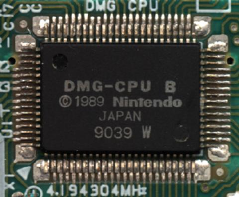

# GB/CPU/概览

CPU, 中文名中央处理单元, 又称为处理器, 是计算机的核心. 一些开发者容易将 CPU 与 Core(处理器核)搞混淆, 简单来说, Core 是处理器内部最为核心的部分, 而 CPU 是 Core 与其它一些外部电路如存储器的统称. CPU 的历史发展最早可追溯到 18 世纪: Si(硅)元素的发现.

年份 |                                        事件
---- | -----------------------------------------------------------------------------------
1823 | Si(硅)被发现, 这是构成现今 CPU 最为重要的元素.
1903 | 尼古拉·特斯拉(Nikola Tesla)在 1903 年为称为"门"和"开关"的电气逻辑电路申请了专利.
1947 | 第一只晶体管在实验室诞生.
1958 | 第一个集成电路被实现.
1960 | IBM 在纽约开发了第一个晶体管自动批量生产设施.
1968 | 英特尔公司由罗伯特·诺伊斯和戈登·摩尔于1968年创立.
1969 | AMD 成立.
1971 | 英特尔在 Ted Hoff 的帮助下于 1971 年 11 月 15 日推出了第一个微处理器, 即 Intel 4004.
1972 | Intel 8008 CPU 发布.
1974 | Intel 8080 CPU 发布, 成为计算机行业的标准.
1976 | Intel 8085/8086 CPU 发布.
1979 | Intel 8088 CPU 发布.
1982 | Intel 80286 CPU 发布.
1985 | Intel 80386 CPU 发布.
1987 | SPARC 处理器由 Sun 公司首次推出.
1988 | Intel 80386SX CPU 发布.
1989 | Cyrix 发布了他们的第一个协处理器 FasMath 83D87 和 83S87.
1991 | AMD 推出 AM386 微处理器系列.
1993 | Intel 推出 Pentium(奔腾) 系列处理器.
1994 | Intel 发布第二代 Pentium 处理器.
1995 | Cyrix 发布了 Cx5x86 处理器, 试图与 Intel Pentium 处理器竞争.
1996 | Cyrix 发布了他们的 MediaGX 处理器. 该处理器将处理器与声音和视频处理结合在一个芯片上.
1996 | AMD 发布了第一款完全自研的 K5 处理器.
1997 | AMD 发布 K6 处理器.
1997 | Intel Pentium II 发布.
1998 | Intel 发布 Xeon processor.
1999 | Intel 发布 Celeron(赛扬) 处理器.
1999 | Intel Pentium III 发布.
2000 | AMD 发布 Duron 处理器.
2000 | 由于故障, Intel 召回部分 Pentium III 处理器.
2001 | Intel Pentium 4 发布.
2003 | Intel Pentium M 发布.
2003 | AMD 发布了首款单核 Opteron CPU.
2006 | Intel 推出了带有 2 核心的 E6300 处理器.
2007 | Intel 推出多款双核处理器: Q6600, E4300, Q6700 E4400, E4500, E4600 等.
2008 | Intel 推出多款双核处理器: Q9300, Q9450, E4700 等.
2008 | i7 处理器发布.
2009 | AMD 推出 Athlon II X2 处理器.
2009 | i5 处理器发布(没错, 先有的 i7 处理器).
2010 | i3 处理器发布(没错).
2010 | AMD 发布 Phenom II X6.
2011 | AMD 发布移动端处理器 A4-3300M, A4-3310MX.
2012 | AMD 发布移动端处理器 A10-5700, A10-5800K.
2013 | Intel 发布第一张带核显的处理器.
2017 | i9 处理器发布.
2018 | Intel 发布第一张为移动端设计的 i9 处理器 i9-8950HK.

许多人认为 Game Boy 的 CPU 是 Intel 的 8080 CPU 或 Zillog Z80 CPU(Intel 8080 为英特尔早期发布的处理器, 它于 1974 年 4 月发布, 是一枚 8 位元处理器, 包含 6000 个晶体管, 频率为 2MHz, 亦是世界上第一枚有商业意义的通用处理器. 它和早先的尝试 8008 CPU 奠定了今天英特尔公司 x86 系列微处理器指令集的基础. 而 Z80 CPU 是由 Zilog 推出的 8 位微处理器, 使用上兼容 Intel 8080 CPU, 与前者是竞争关系), 这其实是不准确的. Game Boy 所使用的 CPU 是任天堂特别定制的基于 Z80 的衍生芯片, 其官方名称是 Sharp LR35902(芯片如图所示). LR35902 处理器的基础结构, 尤其是寄存器与基础指令集与 Z80 CPU 没有太多区别, 但它移除了 Z80 CPU 中多余的寄存器, 并将涉及位操作的扩展指令集被额外加入到了 LR35902.

在本章中将首先探究冯·诺依曼体系结构下 CPU 的工作原理, 随后以实现 LR35902 CPU 的硬件仿真来结束本章.
