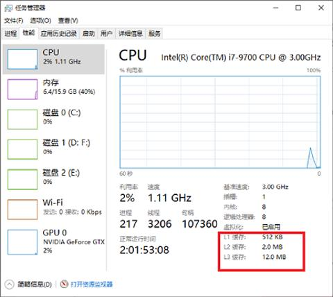
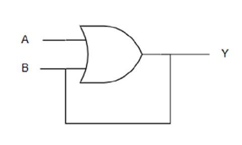
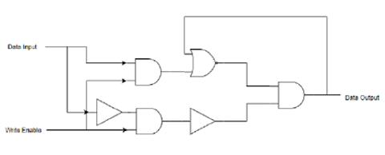

# GB/CPU/寄存器与存储系统

ALU 可以完成对数据的算数和逻辑运算, 本小节将要介绍的是如何对数据进行存储. 在计算机体系结构下存储系统通常分为如下几个层次:

0. 寄存器. 对于 CPU 来说拥有最快的访问速度. 在 8 位处理器, 每个寄存器就是 8 位.
0. 高速缓存(L1-L3: SRAM)
    1. 第一级高速缓存(L1): 通常访问只需要几个周期, 通常是几十个 KB.
    2. 第二级高速缓存(L2): 比 L1 约有 2 到 10 倍较高延迟性, 通常是几百个 KB 或更多.
    3. 第三级高速缓存(L3)(不一定有): 比 L2 更高的延迟性, 通常有数 MB 之大.
    4. 第四级高速缓存(L4)(不普遍): CPU 外部的 DRAM, 但速度较主存高.
0. 主存(DRAM): 访问需要几百个周期, 可以大到数十 GB.
0. 磁盘存储: 需要成千上百个周期, 容量非常大.

在 Windows 系统下可以很容易的查看 CPU 的高速缓存信息, 其位于任务管理器的性能分页下.

每一层相较于下一层相比都拥有较高的速度和较低延迟性, 以及较小的容量(也有少量例外, 如 AMD 早期的 Duron CPU). 大部分现今的中央处理器的速度都非常的快. 大部分程序工作量需要存储器访问, 由于高速缓存的效率和存储器传输位于层次结构中的不同等级, 所以实际上会限制处理的速度, 导致中央处理器花费大量的时间等待存储器 I/O 完成工作.

寄存器与高速缓存其硬件电路实现原理比较类似, 都是 SRAM(静态随机存储器), 这类硬件的特点是读写速度快, 但是成本贵, 所以一般容量都不是很大. 到主存时, 通常采用 DRAM, 基本单元由一个晶体管和一个电容组成, 相对廉价, 不过由于使用电容充放电的高低电平表示 0 和 1, 因此需要不断刷新.

寄存器是 CPU 中重要的组成部分, 它们可用来暂存指令, 数据和地址. 要实现一个基本的寄存器并不难, 只需要几个门电路再加上一点点的思考.

## 将基本门电路的输出连接至输入

首先, 来思考一下该场景: 如果将一个或门的输入接入到它的输入上, 会发生生么事情?

1. 假设该或门的输入 A 与 B 的初始值均为 0, 此时三个端口状态(A=0, B=0, Y=0).
2. 如果此时 A 从 0 变为 1, 此时三个端口状态(A=1, B=0, Y=1).
3. 输出 Y 反馈至输入 B, 此时三个端口状态(A=1, B=1, Y=1).
4. 在此后的时间,无论 A 如何改变, 由于 B 始终为 1, 因此输出 Y 将始终为 1.

没错! 仅仅通过简单的改变, 一个能"持久存储(输出)二进制数字 1"的电路便诞生了. 作为一道简单的思考题, 读者能设计一个能"持久存储二进制数字 0"的电路吗?

## 锁存器与寄存器

锁存器(Latch)是一个能锁存和读取二进制数字 0 或 1 的电路, 它有两个输入 Data Input 和 Write Enable, 以及一个输出 Data Output, 其经典实现的电路图如下所示.

Write Enable 输入用来保护, Data Output 输出防止被修改. 当 Write Enable 为 0 时, 无论是否改变 Data Input 的值, Data Output 都不会改变; 当 Write Enable 为 1 时, Data Output 跟随 Data Input 的改变而改变. Data Output 从 1 变为 0 的过程称之为复位或清零, 从 0 变为 1 的过程称之为置位或置幺. 有时候也用大写字母 R(Reset) 和 S(Set) 来表达复位与置位. 所谓的锁存器,就是输出端的状态不会随输入端的状态变化而变化, 仅在有锁存信号(Write Enable)时输入的状态才被保存到输出, 直到下一个锁存信号到来时才改变.

在有了能锁存 1 个比特的锁存器后, 自然而然想到去锁存更大宽度的数据, 比如一个 u8 整数. 这种能存储多个比特的电路被称为寄存器. 通常来讲有两种类型的寄存器, 一种类型的寄存器使用多个锁存器构成, 另一种类型的寄存器使用多个触发器构成. 对于第一种类型的寄存器来说, 只要将许多锁存器并排, 比如 8 个锁存器, 那这个电路就能锁存一个 u8 数据而构成一个 8 位寄存器. 至于触发器的话, 它和锁存器同样能存储数据并构成寄存器, 但其底层原理稍有不同: 锁存器是一种对脉冲电平(也就是 0 或者 1)敏感的存储单元电路, 而触发器是一种对脉冲边沿(即上升沿或者下降沿)敏感的存储电路.
