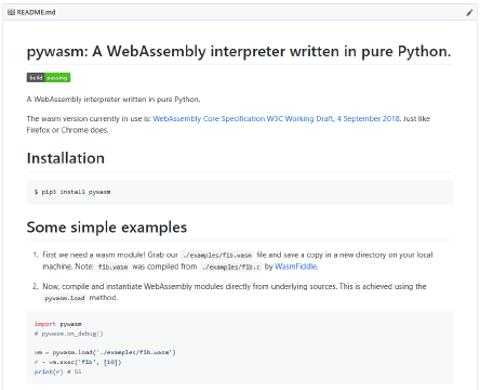

# GB/虚拟机发展史/程序虚拟机

与硬件仿真器相比, 程序虚拟机则是另一个概念. 硬件仿真器作用是模拟一个真实存在的机器, 而程序虚拟机则更像是"模拟一个虚构的机器". 程序虚拟机有时也被称为托管运行时环境, 像 JVM 就是常见的一个程序虚拟机. 不同于 C/C++/Rust 等可以直接运行在物理机器上的编程语言, Java 编译后生成的是 Java 字节码: 它只能运行在 JVM 中. JVM 负责将 Java 字节码翻译为本地机器码. 程序虚拟机的目的是提供一个和平台无关的编程环境.

## Python 是解释器还是虚拟机

在这里可能需要花比较大的篇幅去解释另一个东西: Python 也是将源码 py 编译成字节码 pyc 再执行, 那么为什么这个执行工具被称为 Python 解释器而不是 Python 虚拟机?

要解释这个问题, 需要从 CPU 讲起. 虚拟机的原始使命是模拟另一台计算机(它可能是一台真实存在过的计算机, 也可能是一台虚构的计算机), 而"计算"的核心本质是 CPU. CPU 拥有一组特定的指令, 该指令集独立于任何特定的编程语言或使用环境. 指令仅基于 CPU 的当前状态确定性地执行, 并且不依赖于该时间点的指令流中的其他地方的信息. JVM 符合这个描述, 它工作在非常低的层面上, 几乎与 CPU 相同.

但对于 Python 解释器来说, 情况就有点不一样了. 它解析语法流, 并且特定时间点的语法 Token 必须依赖上下文 Token 进行解析. 解释器不能孤立地查看每个字节甚至每一行, 并确切知道下一步该做什么. Python 字节码中的字节不能像 JVM 中的字节那样独立运行. 简单来说, Python 的字节码 pyc 只是将计算机程序相对不好解释分析的源码转换成另一种相对好点的源码, 它的本质仍然是解释执行.

## JVM

Java virtual machine(JVM)是一种虚拟机, 它可以使计算机运行 Java 程序以及其它语言编写的程序(被编译成 Java 字节码后). 程序作者可以使用 Java Development Kit(JDK)使开发过程中不必担心底层硬件平台的特质, 正应了 Java 的最初口号是"一次编译, 到处运行". JVM 有自己完善的硬体架构, 如处理器和堆栈等, 还具有相应的指令系统.

JVM 的历史用"一将功成万骨枯"来形容最适合不过.

- 在 1996 年 1 月 23 日, Sun 发布 JDK 1.0, 其中自带的虚拟机就是 Classic VM. 它只能使用纯解释器的方式来执行 Java 代码. 直到 JDK 1.3 之前, 其一直是 JDK 的默认虚拟机.
- 在 Sun Classic 发布后, Sun 的虚拟机团队在 JDK 1.2 时发布了一款名为 Exact VM 的虚拟机, 尝试解决 Classic VM 遇到的问题. 它的执行系统解决了 Classic VM 存在的解释器和编译器无法同时工作的问题, 还具备了一些现代高性能处理器的特性, 如: 两级即时编译等. 但从它出生到死亡从未被大规模使用过, 在 JDK 1.3 发布时, 其仅仅作为 HotSpot VM 的备用虚拟机.
- HotSpot VM 可以说是使用最为广泛的 Java 虚拟机, 几乎所有的 Java 虚拟机都知道它. 但实际上, 这个虚拟机并不是由 Sun 公司原生开发的, 而是由一个叫 Longview Technologies 公司开发的. 而 Sun 公司注意到了这款虚拟机在 JIT 编译上的许多优秀成果, 于 1997 年收购了 Longview Technologies 公司, 从而获得了 HotSpot VM.总的来说, 从 2000 年 JDK 1.3 发布, HotSpot VM 作为默认的虚拟机开始登上历史舞台. 到现在 2020 年, 20 年时间过去了, 其依然是最常用的 JVM 虚拟机.
- 前面说的都是 Sun 公司推出的虚拟机, 但除了 Sun 公司之外, 其他组织, 公司也研发过不少的虚拟机实现, 其中最著名的要算 BEA 公司的 BEA JRockit 和 IBM 公司的 J9 VM 了. BEA 公司的 JRockit 是一款专注于服务器硬件和服务端应用场景的虚拟机, 其针对服务端场景做了大量的优化, 因此其不太关注程序启动速度. JRockit 虚拟机内部不包含解释器实现, 全部代码都靠即时编译器编译后执行. 此外, 其提供的 MissionControl 服务套件也十分强大. IBM 公司的 J9 VM 则是一款比较通用的虚拟机, 其定位应用于从服务端到桌面应用再到嵌入式的多用途虚拟机. IBM 公司开发 J9 VM 的目的是将其作为 IBM 公司各种 Java 产品的执行平台.
- 此外还有许许多多其他的虚拟机存在, 例如: Apache Harmony, Google Android Dalvik VM, Microsoft JVM 等等.

虽然 JVM 在程序虚拟机领域十分有名, 但是值得注意的是, 它并非是程序虚拟机的唯一实践. 除了 JVM 之外, 仍然有许多优秀的虚拟机, 例如下面将要介绍的 WebAssembly.

## WebAssembly

WebAssembly 诞生的目的是为了解决 JavaScript 的性能问题. JavaScript 是一门解释型语言, 虽然有许多著名公司和开发者一直不断对 JS 引擎做优化, 但限于 JS 本身的语言特性, 其性能对比传统 C/C++ 等编译型语言仍然相差两个数量级以上. 在 WebAssembly 之前, 曾有两个项目 ASM.js 与 NaCl/PNacl 试图在不动摇 JS 的根基的前提下对 JS 做性能提升, 但无一例外以悲剧收尾. 这使人们意识到: 只有彻底摆脱 JS 的束缚才可能使前端真正在高性能领域获得发展.

WebAssembly 是一种结构化的二进制代码格式, 服务器通过分发包含 WebAssembly 代码的文件可以使其中的代码在不同操作系统和不同浏览器下快速高效地运行. 以下是一段加法函数的 WebAssembly 代码:

```
(module
    (table 0 anyfunc)
    (memory $0 1)
    (export "memory" (memory $0))
    (export "add" (func $add))
    (func $add (; 0 ;) (param $0 i32) (param $1 i32) (result i32)
        (i32.add
            (get_local $1)
            (get_local $0)
        )
    )
)
```

其编译自以下 C 代码:

```c
int add(int a, int b) {
    return a + b;
}
```

WebAssembly 自从 2015 年被提出后, 目前依然处在早期开发阶段. 其最初的 MVP(Minimum Viable Product) 版本功能与 ASM.js 功能相当, 并以 C/C++ 作为前端语言为优先. 在 2017 年推出第一个版本后, 同时也列出了下一阶段将实现的特色:

- 制定规格
- 线程
- 固定长度的 SIMD
- 异常处理
- 垃圾回收
- 存储器区块操作
- 网页内容安全性政策
- ECMAScript 模块集成
- 尾端调用
- Non-trapping 浮点数-整数转换
- 多值函数
- Host bindings

WebAssembly 是入门程序虚拟机不错的初学者项目, 它的指令集与现代硬件指令集十分接近, 指令紧凑并且设计良好. 笔者是 WebAssembly 虚拟机的纯 Python 实现 pywasm 项目的作者, 其首个可运行版本大概只花了笔者两周时间, 对程序虚拟机感兴趣的读者可以将 pywasm 当作一个实现 WebAssembly 虚拟机的示例教程. 项目截图如下.


