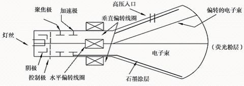
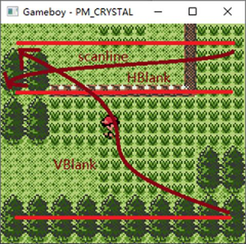

# GB/视频/光栅成像原理与概念

Game Boy 的成像原理与阴极射线管(CRT)成像原理非常相像, 我们首先从阴极射线管开始进行原理介绍, 随后便可自然过渡到 Game Boy 的成像原理.

阴极射线管是一种真空管, 其中包含一个或多个电子枪和一个磷光屏, 可用于显示图像. 它通过调制, 加速和偏转从电子枪发射出去的电子束到屏幕上以创建图像, 其结构如图所示. 在许多老电影中常常出现它的身影, 它过去曾用于示波器, 电视, 雷达或其他现象.



在每一帧的开始, 电子束通常先打在屏幕左上角, 然后从左至右打印一行; 紧接着跳转到下一行的开始(左边), 并重复以上步骤. 直至最后一行, 电子束重新回到左上角. 在任意时刻, 屏幕只有一个点接收电子束并发光, 之所以人眼能看到整幅画面是由于人眼的视觉暂留现象(人眼在观察景物时, 光信号传入大脑神经, 需经过一段短暂的时间, 光的作用结束后, 视觉形象并不立即消失, 这种残留的视觉称后像). 阴极射线成像具有明显的特色, 一般肉眼就能看出其扫描行.


阴极射线管有一些很重要的概念, 如下:

- 点距: 指屏幕上相邻两个像素单元之间的距离.
- 柵距: 平行光柵之间的距离.
- 场频: 场频又称"垂直扫描频率"或"刷新率", 指单位时间内(通常是秒)对整个屏幕扫描的次数.
- 行频: 行频又称"水平扫描频率", 指电子枪每秒在荧光屏上扫过的水平线的数量. 其值约等于"场频 x 垂直解析度".
- 扫描频率: 是场频和行频的统称.
- 解析度: 解析度就是屏幕图像的精密度, 是指显示器所能显示像素点的多少. 以解析度为 1024×768 像素的屏幕來说, 即每一条水平线上包含有 1024 个像素点, 共有 768 条线, 即扫描列数为 1024 列, 行数为 768 行.
- 带宽: 带宽是显示器视频放大器通频带宽度的简称, 指电子枪每秒在屏幕上扫过的最大总像素数, 以 MHz(兆赫茲) 为单位.

Game Boy 硬件在其显示画面的时候模拟阴极射线管的成像原理, Game Boy 制作一帧的画面时, 首先确认屏幕左上角的像素值, 然后从左至右, 从上至下依次进行计算. 它的过程涉及以下几个术语: Scanline, HBlank 和 Vblank.



- Scanline(水平扫描): Game Boy 模拟阴极射线管的水平扫描过程.
- HBlank(水平消影): 指光束从一条扫描线的末端移动到下一条线的开始处的过程.
- VBlank(垂直消影): 指光束从画面的右下角返回画面左上角的过程. 由于光束在 VBlank 中移动距离比 HBlank 大, 因此该时间段通常比 HBlank 要更加的长.

## 一帧的时间周期

Game Boy 的一帧分为多个不同的时间段, 下表根据 CPU 的时钟频率(4194304Hz)表示 GPU 在每个周期内保持多长时间:

|            Period             | GPU mode number | Time spent (clocks) |
| ----------------------------- | --------------- | ------------------- |
| Scanline (accessing OAM)      | 2               | 80                  |
| Scanline (accessing VRAM)     | 3               | 172                 |
| Horizontal blank              | 0               | 204                 |
| One line (scan and blank)     | -               | 456                 |
| Vertical blank                | 1               | 4560 (10 lines)     |
| Full frame (scans and vblank) | -               | 70224               |

Game Boy 绘制图像时可处于四种不同的状态, 以 GPU Mode 作为区分.

- Mode 0: 处于 H-Blank 期间
- Mode 1: 处于 V-Blank 期间
- Mode 2: 处于搜索 OAM(一段内存, 用于存储画面片段)期间
- Mode 3: 处于传输画面数据期间(从游戏卡带到 GPU 内存)

如此, 便可以先在代码中仿真实现这些步骤过程. 为了保持对硬件系统的模拟, CPU 每执行完一个指令, 就必须通知 GPU 该指令的指令周期. 创建一个 Stat 对象保存当前所处的时间段, 并实现 next 函数: 它接收 CPU 的指令周期, 并更新自己的 Stat, 同时更新 ly 字段, 该字段负责存储当前扫描线位于第几行.

```rs
// LCD Status Register.
pub struct Stat {
    // Bit 1-0 - Mode Flag       (Mode 0-3, see below) (Read Only)
    //    0: During H-Blank
    //    1: During V-Blank
    //    2: During Searching OAM
    //    3: During Transferring Data to LCD Driver
    mode: u8,
}

pub struct Gpu {
    stat: Stat,
    dots: u32,
    ly: u8,
    ...
}

impl Gpu {
    pub fn next(&mut self, cycles: u32) {
        if cycles == 0 {
            return;
        }
        let c = (cycles - 1) / 80 + 1;
        for i in 0..c {
            if i == (c - 1) {
                self.dots += cycles % 80
            } else {
                self.dots += 80
            }
            let d = self.dots;
            self.dots %= 456;
            if d != self.dots {
                self.ly = (self.ly + 1) % 154;
            }
            if self.ly >= 144 {
                if self.stat.mode == 1 {
                    continue;
                }
                self.stat.mode = 1;
                self.v_blank = true;
            } else if self.dots <= 80 {
                if self.stat.mode == 2 {
                    continue;
                }
                self.stat.mode = 2;
            } else if self.dots <= (80 + 172) {
                self.stat.mode = 3;
            } else {
                if self.stat.mode == 0 {
                    continue;
                }
                self.stat.mode = 0;

                // Render scanline Here
            }
        }
    }
}
```

在上面的代码中, GPU 的时序已经确定(即 Scanline, HBlank 和 VBlank 等阶段), 但 GPU 的工作尚未到位: 因为Scanlilne 目前并没有被实际去绘制.
