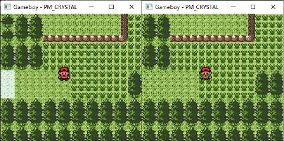

# GB/视频/GPU 寄存器与内存结构

GPU 在图像渲染中需要管理一些额外的状态数据, 比如在光栅成像过程中记录当前已经渲染了到第几行第几列. 这些数据均保存在 GPU 寄存器之内, CPU 可以通过修改寄存器来控制 GPU 的行为. GPU 所拥有的寄存器数量较多, 本节将对此进行一一解释.

GPU 寄存器总览:

|                名称                 |  地址  |                            描述                             |
| ----------------------------------- | ------ | ----------------------------------------------------------- |
| LCD Control Register(LCDC)          | 0xff40 | LCD 控制寄存器                                              |
| LCD Status Register                 | 0xff41 | LCD 状态寄存器                                              |
| Scroll Y(SCY)                       | 0xff42 | Scroll Y 寄存器                                             |
| Scroll X(SCX)                       | 0xff43 | Scroll X 寄存器                                             |
| LCDC Y-Coordinate(LY)               | 0xff44 | 当前数据传输到 LCD 驱动器的垂直线                           |
| LY Compare(LYC)                     | 0xff45 | 用于和 LY 进行比较的值                                      |
| Window Y Position(WY)               | 0xff4a | Window Y 寄存器                                             |
| Window X Position(WX)               | 0xff4b | Window X 寄存器                                             |
| BG Palette Data(BGP)                | 0xff47 | 为 BG 和 Window 图块的颜色编号分配灰色阴影, 非 CGB 模式专用 |
| Object Palette 0 Data(OBP0)         | 0xff48 | sprite 调色板 0, 非 CGB 模式专用                            |
| Object Palette 1 Data(OBP1)         | 0xff49 | sprite 调色板 1, 非 CGB 模式专用                            |
| Background Palette Index(BCPS/BGPI) | 0xff68 | Background Palette Index, CGB 模式专用                      |
| Background Palette Data(BCPD/BGPD)  | 0xff69 | Background Palette Data, CGB 模式专用                       |
| Sprite Palette Index(OCPS/OBPI)     | 0xff6a | Sprite Palette Index, CGB 模式专用                          |
| Sprite Palette Data(OCPD/OBPD)      | 0xff6b | Sprite Palette Data, CGB 模式专用                           |
| DMA Transfer and Start Address(DMA) | 0xff46 | DMA 传输起始地址                                            |
| New DMA Source, High(HDMA1)         | 0xff51 | DMA 传输起始地址的高位, CGB 模式专用                        |
| New DMA Source, Low(HDMA2)          | 0xff52 | DMA 传输起始地址的低位, CGB 模式专用                        |
| New DMA Destination, High(HDMA3)    | 0xff53 | DMA 传输目的地址的高位, CGB 模式专用                        |
| New DMA Destination, Low(HDMA4)     | 0xff54 | DMA 传输目的地址的低位, CGB 模式专用                        |
| New DMA Length/Mode/Start(HDMA5)    | 0xff55 | 用于启动从 ROM 或 RAM 到 VRAM 的 DMA 传输                   |
| VRAM Bank(VBK)                      | 0xff4f | VRAM Bank Number                                            |

## LCDC

LCDC 是主要的 LCD 控制寄存器. 它控制画面上的对象是否显示以及如何显示.

> LCD 液晶显示器(英语: liquid-crystal display)为平面薄型的显示设备, 由一定数量的彩色或黑白像素组成, 放置于光源或者反面前方. 液晶显示器功耗低, 因此备受工程师青睐, 适用于使用电池的电子设备. 它的主要原理是以电流刺激液晶分子产生点, 线, 面配合背部灯管构成画面.
> 全称: Liquid Crystal Display
> 简称: LCD
> 组成: 一定数量的彩色或黑白像素
> 特点: 低功耗
>
> 摘自: https://zh.wikipedia.org/wiki/液晶显示器

|  位   |              名称              |                                    说明                                    |
| ----- | ------------------------------ | -------------------------------------------------------------------------- |
| Bit 7 | LCD Display Enable             | 控制 LCD 是否亮起                                                          |
| Bit 6 | Window Tile Map Display Select | 选择 Window Tile Map. 当它为 0 时, Tile Map 起始地址为 0x9800, 否则 0x9C00 |
| Bit 5 | Window Display Enable          | 控制是否显示窗口                                                           |
| Bit 4 | BG & Window Tile Data Select   | 该位控制 BG 和 Window 用于寻找 Tile 时的寻址模式                           |
| Bit 3 | BG Tile Map Display Select     | 选择 BG Tile Map. 当它为 0 时, Tile Map 起始地址使用 0x9800, 否则 0x9C00   |
| Bit 2 | OBJ Size                       | 控制 Sprite 的大小. Sprite 大小可以为一个 Tile 或 2 个竖直排列的 Tile      |
| Bit 1 | OBJ Display Enable             | 是否显示 Sprite                                                            |
| Bit 0 | BG/Window Display/Priority     | 控制 Sprite 的优先级. 如果设置, Sprite 将始终显示在 BG 之上                |

Bit 0 控制 Sprite 相对于 BG 的优先级. 一个例子是游戏人物可以被游戏背景所遮掩(例如当游戏人物进入草丛时), 下面的截图展示了这一现象. 它的优势在于开发者无需专门为这种遮掩做额外的画面.



**代码实现**

```rs
// LCDC is the main LCD Control register. Its bits toggle what elements are displayed on the screen, and how.
pub struct Lcdc {
    data: u8,
}

#[rustfmt::skip]
impl Lcdc {
    pub fn power_up() -> Self {
        Self { data: 0b0100_1000 }
    }

    // LCDC.7 - LCD Display Enable
    // This bit controls whether the LCD is on and the PPU is active. Setting it to 0 turns both off, which grants
    // immediate and full access to VRAM, OAM, etc.
    fn bit7(&self) -> bool { self.data & 0b1000_0000 != 0x00 }

    // LCDC.6 - Window Tile Map Display Select
    // This bit controls which background map the Window uses for rendering. When it's reset, the $9800 tilemap is used,
    // otherwise it's the $9C00 one.
    fn bit6(&self) -> bool { self.data & 0b0100_0000 != 0x00 }

    // LCDC.5 - Window Display Enable
    // This bit controls whether the window shall be displayed or not. (TODO : what happens when toggling this
    // mid-scanline ?) This bit is overridden on DMG by bit 0 if that bit is reset.
    // Note that on CGB models, setting this bit to 0 then back to 1 mid-frame may cause the second write to be ignored.
    fn bit5(&self) -> bool { self.data & 0b0010_0000 != 0x00 }

    // LCDC.4 - BG & Window Tile Data Select
    // This bit controls which addressing mode the BG and Window use to pick tiles.
    // Sprites aren't affected by this, and will always use $8000 addressing mode.
    fn bit4(&self) -> bool { self.data & 0b0001_0000 != 0x00 }

    // LCDC.3 - BG Tile Map Display Select
    // This bit works similarly to bit 6: if the bit is reset, the BG uses tilemap $9800, otherwise tilemap $9C00.
    fn bit3(&self) -> bool { self.data & 0b0000_1000 != 0x00 }

    // LCDC.2 - OBJ Size
    // This bit controls the sprite size (1 tile or 2 stacked vertically).
    // Be cautious when changing this mid-frame from 8x8 to 8x16 : "remnants" of the sprites intended for 8x8 could
    // "leak" into the 8x16 zone and cause artifacts.
    fn bit2(&self) -> bool { self.data & 0b0000_0100 != 0x00 }

    // LCDC.1 - OBJ Display Enable
    // This bit toggles whether sprites are displayed or not.
    // This can be toggled mid-frame, for example to avoid sprites being displayed on top of a status bar or text box.
    // (Note: toggling mid-scanline might have funky results on DMG? Investigation needed.)
    fn bit1(&self) -> bool { self.data & 0b0000_0010 != 0x00 }


    // LCDC.0 - BG/Window Display/Priority
    // LCDC.0 has different meanings depending on Gameboy type and Mode:
    // Monochrome Gameboy, SGB and CGB in Non-CGB Mode: BG Display
    // When Bit 0 is cleared, both background and window become blank (white), and the Window Display Bit is ignored in
    // that case. Only Sprites may still be displayed (if enabled in Bit 1).
    // CGB in CGB Mode: BG and Window Master Priority
    // When Bit 0 is cleared, the background and window lose their priority - the sprites will be always displayed on
    // top of background and window, independently of the priority flags in OAM and BG Map attributes.
    fn bit0(&self) -> bool { self.data & 0b0000_0001 != 0x00 }
}
```

## LCD Status Register

LCD Status Register 寄存器控制 LCD 当前的显示状态.

|   位    |             名称             |                   说明                   |
| ------- | ---------------------------- | ---------------------------------------- |
| Bit 6   | LYC=LY Coincidence Interrupt | 当 LYC 与 LY 相等且该位为 1 时, 触发中断 |
| Bit 5   | Mode 2 OAM Interrupt         | 模式 2 OAM 中断开关                      |
| Bit 4   | Mode 1 V-Blank Interrupt     | 模式 1 V-Blank 中断开关                  |
| Bit 3   | Mode 0 H-Blank Interrupt     | 模式 0 H-Blank 中断开关                  |
| Bit 2   | Coincidence Flag             | 当前 LY 是否与 LYC 相等                  |
| Bit 1-0 | Mode Flag                    | 当前 GPU 所处的周期                      |

Bit 1 和 Bit 0 共同负责存储 LCD 控制器的当前状态/模式. 模式有以下四种可选值:

- Mode 0: During H-Blank
- Mode 1: During V-Blank
- Mode 2: During Searching OAM
- Mode 3: During Transferring Data to LCD Driver

LCD 控制器以 4.194 MHz 的时钟工作. 游戏的一帧可表达为 154 条 scanline, 70224 像素点或 16.74 ms. 在 scanline 0 到 143 上, LCD 控制器每 456 点在模式2, 3 和 0 上循环一次. Scanline 144 至 153 为模式 1.

启用画面显示后, 以下是一个典型的 Mode 切换流程:

```text
Mode 2  2_____2_____2_____2_____2_____2___________________2____
Mode 3  _33____33____33____33____33____33__________________3___
Mode 0  ___000___000___000___000___000___000________________000
Mode 1  ____________________________________11111111111111_____
```

当 LCD 控制器正在读取视频存储器的特定部分时, CPU 将无法访问某些特定存储器.

- 在 Mode 2 和 3 下，CPU 无法访问 OAM(0xfe00-0xfe9f)
- 在 Mode 3 期间, CPU 无法访问 VRAM 或 CGB 调色板数据(0xff69, 0xff6b)

**代码实现**

```rs
// LCD Status Register.
pub struct Stat {
    // Bit 6 - LYC=LY Coincidence Interrupt (1=Enable) (Read/Write)
    enable_ly_interrupt: bool,
    // Bit 5 - Mode 2 OAM Interrupt         (1=Enable) (Read/Write)
    enable_m2_interrupt: bool,
    // Bit 4 - Mode 1 V-Blank Interrupt     (1=Enable) (Read/Write)
    enable_m1_interrupt: bool,
    // Bit 3 - Mode 0 H-Blank Interrupt     (1=Enable) (Read/Write)
    enable_m0_interrupt: bool,
    // Bit 1-0 - Mode Flag       (Mode 0-3, see below) (Read Only)
    //    0: During H-Blank
    //    1: During V-Blank
    //    2: During Searching OAM
    //    3: During Transferring Data to LCD Driver
    mode: u8,
}

impl Stat {
    pub fn power_up() -> Self {
        Self {
            enable_ly_interrupt: false,
            enable_m2_interrupt: false,
            enable_m1_interrupt: false,
            enable_m0_interrupt: false,
            mode: 0x00,
        }
    }
}
```

## LCD Interrupts

LCD 可以产生两种不同类型的中断, 它们分别是 INT 40 和 INT 48.

- INT 40 - V-Blank Interrupt: V-Blank 中断每秒可固定产生约 60 次, 该中断发生在 V-Blank 期间(LY == 144 时). 在此期间, Game Boy 硬件不会使用 VRAM, 因此 CPU 可以自由访问它. 该时间段持续大约 1.1 毫秒.
- INT 48 - LCDC Status Interrupt: 如 STAT 寄存器(0xff40)所述, 有多种原因可以导致此中断发生. 一个非常普遍的原因是向用户指示 Game Boy 的 GPU 硬件何时将重画给定的 LCD scanline. 这对于动态控制 SCX/SCY 寄存器(0xff43/0xff42)来执行特殊的视频效果很有用.

## Scroll Y, Scroll X

SCY(Scroll Y), SCX(Scroll X) 指定要显示在 LCD 上的图像在 256 * 256 BG 中的位置(左上角). 当绘图大小超过 BG 地图区域的右下边界时, 视频控制器自动回绕到 BG 地图中的左上位置. 在上一小节《图像显示系统简介》有详细介绍.

## LCDC Y-Coordinate

LY(LCDC Y-Coordinate) 表示当前正在绘制 LCD 屏幕的第几行. LY 可以取 0 到 153 之间的任何值, 其中 144 和 153 之间的值表示正处于 V-Blank 周期.

## LYC

LYC(LY Compare) 是一个特殊的值, Game Boy 永久地比较 LYC 和 LY 寄存器的值. 当两个值相同时, LCD Status Register 中的 Coincidence Flag 被置位, 并且请求 STAT 中断(如果允许的话).

## Window Y, Window X

用于表示指定 Window 区域的左上位置. Window 是一个可以在正常背景上方显示的备用背景区域, Sprite 可能仍然显示在窗口的上方或后方, 就像正常的 BG 一样. 一个比较形象的例子是, 当游戏任务在大地图上与 NPC 交谈时, 对话框通常就是一个窗口. Window 在上一小节《图像显示系统简介》有详细介绍.

当位置设置在范围 0 <= WX <= 166, 0 <= WY <= 143 时, 窗口变为可见(如果 LCDC 寄存器允许显示窗口的话). 注意: WX = 7, WY = 0 的位置将使窗口位于 LCD 的左上角(完全覆盖正常背景).

## BGP

BGP(BG Palette Data) 为 BG 和 Window Tile 的颜色编号指定对应灰度. 只在非 CGB 模式(非彩色 Game Boy 或彩色 Game Boy 以黑白模式运行)下有效.

|   位    |         说明          |
| ------- | --------------------- |
| Bit 7-6 | 编号为 3 的灰度(黑)   |
| Bit 5-4 | 编号为 2 的灰度(深灰) |
| Bit 3-2 | 编号为 1 的灰度(浅灰) |
| Bit 1-0 | 编号为 0 的灰度(白)   |

一种常见的灰度值选择是

| 编号 |    颜色    |
| ---- | ---------- |
| 0    | White      |
| 1    | Light gray |
| 2    | Dark gray  |
| 3    | Black      |

对于 CGB 来说, Palettes 数据取自 CGB Palettes Memory, 后文将会介绍.

## OBP0

OBP0(Object Palette 0 Data) 为 Sprite Palettes 0 指定灰度. 它与 BGP(0xff47)完全相同, 只是因为 Sprite 的颜色数据 00 是透明的, 所以不使用低两位.

## OBP1

OBP1(Object Palette 1 Data) 为 Sprite Palettes 1 指定灰度. 它与 BGP(0xff47)完全相同, 只是因为 Sprite 的颜色数据 00 是透明的, 所以不使用低两位.

## BCPS/BGPI

BGPI(Background Palette Index) 用于寻址 BG Palettes 存储器中的一个字节. 该存储器中的每两个字节定义一个颜色值. 前 8 个字节定义 Palette 0(BGP0) 的 Color 0-3, 以此类推 BGP 1-7.

|   位    |                 说明                 |
| ------- | ------------------------------------ |
| Bit 0-5 | 索引(00-3f)                          |
| Bit 7   | 自增开关(0=禁用, 1=每次写操作后自增) |

可以通过寄存器 0xff69 从指定的索引地址读取/写入数据. 如果设置了自增开关, 每次写数据到 0xff69 后索引(Bit 0-5)会自动递增. 当从 0xff69 读取时, 不会自动递增. 因此在这种情况下必须手动递增索引.

可以在非 V-Blank 和 H-Blank 期间访问该寄存器.

**代码实现**

```rs
// This register is used to address a byte in the CGBs Background Palette Memory. Each two byte in that memory define a
// color value. The first 8 bytes define Color 0-3 of Palette 0 (BGP0), and so on for BGP1-7.
//  Bit 0-5   Index (00-3F)
//  Bit 7     Auto Increment  (0=Disabled, 1=Increment after Writing)
// Data can be read/written to/from the specified index address through Register FF69. When the Auto Increment bit is
// set then the index is automatically incremented after each <write> to FF69. Auto Increment has no effect when
// <reading> from FF69, so the index must be manually incremented in that case. Writing to FF69 during rendering still
// causes auto-increment to occur.
// Unlike the following, this register can be accessed outside V-Blank and H-Blank.
struct Bgpi {
    i: u8,
    auto_increment: bool,
}

impl Bgpi {
    fn power_up() -> Self {
        Self {
            i: 0x00,
            auto_increment: false,
        }
    }

    fn get(&self) -> u8 {
        let a = if self.auto_increment { 0x80 } else { 0x00 };
        a | self.i
    }

    fn set(&mut self, v: u8) {
        self.auto_increment = v & 0x80 != 0x00;
        self.i = v & 0x3f;
    }
}
```

## BCPD/BGPD

BGPD(Background Palette Data) 寄存器允许读取或写入通过寄存器 0xff68 寻址的 BG Palettes 的数据. 每种颜色由两个字节定义.

|    位     |    说明    |
| --------- | ---------- |
| Bit 0-4   | 红 (00-1f) |
| Bit 5-9   | 绿 (00-1f) |
| Bit 10-14 | 蓝 (00-1f) |

与 VRAM 极为相似, 在从 LCD 控制器读取调色板内存期间, 无法读取/写入调色板内存中的数据(即当 STAT 寄存器指示模式 3 时).

## OCPS/OBPI

OBPI(Sprite Palette Index) 寄存器与 BGPI 寄存器描述的几乎完全一样, 但区别在于其初始化 Sprite Palettes OBP 0-7.

## OCPD/OBPD

OBPD(Sprite Palette Data) 寄存器与 BGPD 寄存器描述的几乎完全一样, 但区别在于其初始化 Sprite Palettes OBP 0-7. 请注意, 虽然可以为每个 OBP Palettes 定义四种颜色, 但是只能显示每个 Sprite Palette 的 Color 1-3, 而 Color 0 始终是透明的, 并且可以初始化为无关值或从不初始化.

注意：所有 Sprite 的颜色都不会由引导 ROM 初始化.

## 仿真器开发过程中的 RGB 色彩转换

与现在常用的 8 位 RGB 色彩模式不同, Game Boy 只使用 4 位表示一种颜色通道, 每种色彩通道的范围使 0x00 到 0x1f. 在 PC 上显示图像颜色时, 需要进行一次对比拉伸, 即拉伸到 0x00 到 0xff 范围. 但是要注意这种转换并不是线性的, 目前尝试下来比较合理的拉伸算法如下所示:

```rs
fn get_rgb(r: u8, g: u8, b: u8) -> (u8, u8, u8) {
    let r = u32::from(r);
    let g = u32::from(g);
    let b = u32::from(b);

    let lr = ((r * 13 + g * 2 + b) >> 1) as u8;
    let lg = ((g * 3 + b) << 1) as u8;
    let lb = ((r * 3 + g * 2 + b * 11) >> 1) as u8;

    return (lr, lg, lb);
}
```

这个算法并非包含什么数学证明在里面, 只是在不断尝试各种转换方法后发现其对人眼比较友好. 与之类似的在彩色图像转灰度图上, 有一个很著名的心理学公式:

```text
Gray = R*0.299 + G*0.587 + B*0.114
```

该公式同样是人为挑选出来的.

## DMA

写入 DMA(DMA Transfer and Start Address) 寄存器会启动从 ROM 或 RAM 到 OAM 存储器的 DMA 传输(传输的数据是 Sprite 属性表). 写入的值会除以 0x0100 后作为数据源地址的高两位地址, 数据源与数据目的地如下所示:

```text
Source:      XX00-XX9F
Destination: FE00-FE9F
```

传输需要 160 个机器周期, 约 152 微秒. 在此期间, CPU 只能访问 HRAM 内存区间(0xff80-0xfffe).

## HDMA1, HDMA2

两个寄存器共同组成了 New DMA Source. New DMA Source 的行为同 DMA 类似, 这两个寄存器指定传输源的地址, 通常, 这应该是 ROM, SRAM 或 WRAM 中的一个地址, 因此在 0x0000-0x7ff0 或 0xa000-0xdff0 范围内.

该地址的低 4 位将被忽略并视为 0.

## HDMA3, HDMA4

两个寄存器共同组成了 New DMA Destination. New DMA Destination 只有中间的第 12-4 位有效, 且低 4 位被忽略视为 0. 因此 New DMA Destination 的范围是 0x8000-0x9ff0.

## HDMA5

HDMA5(New DMA Length/Mode/Start) 用于启动从 ROM 或 RAM 到 VRAM 的 DMA 传输. 源起始地址为 New DMA Source, 目标地址为 New DMA Destination.

向该寄存器写入数据即可开始传输, 其低 7 位指定传输长度. 传输长度与低 7 位数据的关系为 `Length = 0x10 * (X + 1)`, 因此 Length 的范围为 0x0010 到 0x0800. 该寄存器最高位表示传输模式:

- Bit7=0 时, 使用 General Purpose DMA. 使用此传输方法时, 将立即传输所有数据. 程序的执行将暂停, 直到传输完成. 请注意, 即使 LCD 控制器当前正在访问 VRAM, DMA 也会尝试复制数据. 因此, 仅当显示器被禁用时, 或者在 V-Blank 期间, 或者(对于相当短的块长度)在 H-Blank 期间, 才应使用通用 DMA. 传输完成后程序的执行继续, 并向 0xff55 写入值 0xff.
- Bit7=1 时, 使用 H-Blank DMA. H-Blank DMA 在每个 H-Blank 期间传输 0x10 字节的数据(即 LY = 0-143 时). 在 V-Blank 期间不会传输数据(即 LY = 144-153) 时. 寄存器 0xff55 的低 7 位存储剩余待传输数据的大小(注意需要使用上述公式进行转换). 值 0xff 表示当前传输已完成. 通过将 0 写入 0xff55 的最高位, 也可以终止当前的 H-Blank DMA 传输.

## DMA 代码实现

```rs
pub struct Hdma {
    // These two registers specify the address at which the transfer will read data from. Normally, this should be
    // either in ROM, SRAM or WRAM, thus either in range 0000-7FF0 or A000-DFF0. [Note : this has yet to be tested on
    // Echo RAM, OAM, FEXX, IO and HRAM]. Trying to specify a source address in VRAM will cause garbage to be copied.
    // The four lower bits of this address will be ignored and treated as 0.
    pub src: u16,
    // These two registers specify the address within 8000-9FF0 to which the data will be copied. Only bits 12-4 are
    // respected; others are ignored. The four lower bits of this address will be ignored and treated as 0.
    pub dst: u16,
    pub active: bool,
    pub mode: HdmaMode,
    pub remain: u8,
}

impl Gpu {
    fn run_dma(&mut self) -> u32 {
        if !self.hdma.active {
            return 0;
        }
        match self.hdma.mode {
            HdmaMode::Gdma => {
                let len = u32::from(self.hdma.remain) + 1;
                for _ in 0..len {
                    self.run_dma_hrampart();
                }
                self.hdma.active = false;
                len * 8
            }
            HdmaMode::Hdma => {
                if !self.gpu.h_blank {
                    return 0;
                }
                self.run_dma_hrampart();
                if self.hdma.remain == 0x7f {
                    self.hdma.active = false;
                }
                8
            }
        }
    }

    fn run_dma_hrampart(&mut self) {
        let mmu_src = self.hdma.src;
        for i in 0..0x10 {
            let b: u8 = self.get(mmu_src + i);
            self.gpu.set(self.hdma.dst + i, b);
        }
        self.hdma.src += 0x10;
        self.hdma.dst += 0x10;
        if self.hdma.remain == 0 {
            self.hdma.remain = 0x7f;
        } else {
            self.hdma.remain -= 1;
        }
    }
}
```

## VRAM Tile Data

Tile 数据存储在 VRAM 中的地址 0x8000-0x97ff 区间内, 其中一个 Tile 为 16 字节大, 该区域总共定义了 384 个 Tile 的数据. 在 CGB 模式下, 由于有两个 VRAM 库, 因此它加倍至 768 个 Tile.

每个 Tile 的大小为 8x8 像素, 颜色深度为 4 种颜色/灰色阴影. Tile 可以用于显示为 BG 或 Window 贴图的一部分, 或显示为 Sprite. 请注意, Sprite 不使用颜色 0, 颜色 0 在 Sprite 中是透明的.

0x8000-0x97ff 内存区间被分为 3 个明显的功能不同的块(Block), 每个块包含 128 个 Tile:

- Block 0 is 0x8000-0x87ff
- Block 1 is 0x8800-0x8fff
- Block 2 is 0x9000-0x97ff

观察每个区间的范围, 可以发现每个 Tile 都可以被一个 Block Index 和一个 8 位的 Tile Index 进行索引, 不过不同的区间索引方式可能不同: "8000 寻址"方法采用 0x8000 作为其基础地址, 并将 8 位 Tile Index 作为无符号整数与其相加(这意味着 Tile 0-127 在 Block 0 中, Tile 128-255 在 Block 1中); "8800 寻址"方法采用 0x9000 作为其基础地址, 并将 8 位 Tile Index 作为有符号整数与其相加. 换句话说, "8000 寻址"从 Block 0 获取 Tile 0-127, 从 Block 1 获取 Tile 128-255, 而"8800 寻址"从 Block 2 获取 Tile 0-127, 从 Block 1 获取 Tile 128-255. 可以注意到 Block 1 由两种寻址方法共享.

Sprite 总是使用 8000 寻址, 但 BG 和 Window 可以使用任何一种模式, 具体由 LCDC(LCD Control Register) 的 Bit 4 控制.

每个 Tile 占用 16 个字节, 其中每个 2 个字节代表一行:

```text
Byte 0-1  First Line (Upper 8 pixels)
Byte 2-3  Next Line
etc.
```

Tile 中的每个像素的低位保持在一个字节中, 而高位在另一个字节中. 下面的结构表示 Tile 中的 8 个像素, 第一个像素是 01 = 深灰, 第二个像素是 10 = 浅灰, 并以此类推.

```text
[0x803e] | 0 | 1 | 0 | 0 | 1 | 1 | 1 | 0 | = 0x4e
[0x803f] | 1 | 0 | 0 | 0 | 1 | 0 | 1 | 1 | = 0x8d
```

因此, 每个像素的色数范围为 0-3. 根据当前调色板, 颜色编号被转换为真实颜色(或灰色阴影).

## VRAM Background Maps

Game Boy 在地址 0x9800-0x9bff 和 0x9c00-0x9fff 的 VRAM 中包含两个大小为 32x32 的 Tile 映射. 每个映射关系都可用于显示 BG 或 Window 的背景.

VRAM 中包含一个被称之为 Background Tile Map 的一个区域, 其中包含要显示的 Tile 数量. 它组织为 32 行, 每行 32 个字节. 每个字节包含许多要显示的图块. 可以使用两种寻址模式进行寻址(如上所述). 由于一个背景图块的大小为 8x8 像素, 因此 BG 贴图可以容纳 256x256 像素的图片, 并且该图片的其中 160x144 像素的区域可以显示在 LCD 屏幕上.

在 CGB 模式下, VRAM Bank 1 中存储了额外的一个 32x32 字节的映射(每个字节定义了 VRAM Bank 0 中相应的 Tile 的属性). 举个简单的例子: 1:9800 定义了存储于 0:9800 的 Tile 的属性.

|   位    |                                 说明                                  |
| ------- | --------------------------------------------------------------------- |
| Bit 0-2 | 背景调色板编号 (BGP0-7)                                               |
| Bit 3   | Tile VRAM 的 Bank number (0=Bank 0, 1=Bank 1)                         |
| Bit 4   | 未使用                                                                |
| Bit 5   | 是否水平翻转 (0=Normal, 1=Mirror horizontally)                        |
| Bit 6   | 是否垂直翻转 (0=Normal, 1=Mirror vertically)                          |
| Bit 7   | BG 相对于 Sprite 的显示优先级 (0=Use OAM priority bit, 1=BG Priority) |

当 Bit 7 置位时, 相应的 BG Tile 将优先于所有 Sprite(无论 OAM 存储器中的优先级位如何). LCDC 寄存器的位 0 还有一个主优先级标志, 当清零时, 它会覆盖所有其他优先级位.

SCY 和 SCX 寄存器可用于滚动 BG, 其允许在总 256x256 像素 BG 图中选择可见的 160x144 像素区域的原点.

除了 BG, 还有一个覆盖 BG 的 Windos. Windos 不可滚动, 也就是说, 它始终从左上角开始显示. 可以通过 WX 和 WY 寄存器调整屏幕上窗口的位置. 注意窗口左上角的屏幕坐标为 (WX-7, WY). 窗口与 BG 共享相同的 Tile 数据表. 背景和窗口都可以通过 LCDC 寄存器中的特定位单独禁用或启用.

## VBK

由于 CGB 拥有两倍的 VRAM, 因此需要一个 Bank Number 用于指定当前的 VRAM Bank. 可以向 VBK(VRAM Banks) 写入以更改 VRAM Bank, 只有位 0 有意义, 所有其他位都被忽略.

VRAM Bank 1 像 VRAM Bank 0 一样被分割为不同区域. 0x8000-0x97ff 还存储了 Tile(就像在 Bank 0 中一样), 其可以与 Bank 0 Tile 相同的方式访问. 0x9800-0x9fff 包含相应 Tile Maps 的属性.

从该寄存器读取将返回位 0 中当前加载的 VRAM 存储区的编号, 并且所有其他位将设置为 1.

## VRAM Sprite Attribute Table (OAM)

Game Boy 视频控制器最多可以显示 40 个 8x8 或 8x16 像素的 Sprite. 由于硬件的限制, 每条 Scanline 只能显示 10 个 Sprite. Sprite Tile 与 BG Tile 数据格式相同, 但它们取自位于 0x8000-0x8fff 的 Sprite Pattern Table. OAM 中的一个元素占用 4 个字节大小.

**Byte0 - Y Position**

指定屏幕上的 Sprite 的垂直位置(减去 16). 屏幕外的值(例如, Y = 0 或 Y >= 160)不会显示 Sprite.

**Byte1 - X Position**

指定屏幕上的 Sprite 的水平位置(减去 8). 屏幕外的值(例如, X = 0 或 X >= 168)不会显示 Sprite.

**Byte2 - Tile/Pattern Number**

指定 Sprite 的编号(0x00-0xff). 此值从内存中选择位于 0x8000-0x8fff 的 Tile. 在 CGB 模式下, Tile 可以位于 VRAM Bank 0 或 1 中, 具体取决于后续字节的位 3. 在 8x16 模式下, Tile 编号的低位被忽略, 例如: 上部 8x8 Tile 编号是 N 的话, 那下半部分 Tile 编号就是 N + 1.

**Byte3 - Attributes/Flags:**

|   位   |        名称        |                           说明                           |
| ------ | ------------------ | -------------------------------------------------------- |
| Bit7   | OBJ-to-BG Priority | 显示优先级 (0=OBJ 优先显示 BG, 1=OBJ 滞后 BG color 1-3 ) |
| Bit6   | Y flip             | 是否翻转 Y 轴                                            |
| Bit5   | X flip             | 是否翻转 X 轴                                            |
| Bit4   | Palette number     | 非 CGB 模式下有效 (0=OBP0, 1=OBP1)                       |
| Bit3   | Tile VRAM-Bank     | CGB 模式下有效 (0=Bank 0, 1=Bank 1)                      |
| Bit2-0 | Palette number     | CGB 模式下有效 (OBP0-7)                                  |

**代码实现**

```rs
// Bit7   OBJ-to-BG Priority (0=OBJ Above BG, 1=OBJ Behind BG color 1-3)
//     (Used for both BG and Window. BG color 0 is always behind OBJ)
// Bit6   Y flip          (0=Normal, 1=Vertically mirrored)
// Bit5   X flip          (0=Normal, 1=Horizontally mirrored)
// Bit4   Palette number  **Non CGB Mode Only** (0=OBP0, 1=OBP1)
// Bit3   Tile VRAM-Bank  **CGB Mode Only**     (0=Bank 0, 1=Bank 1)
// Bit2-0 Palette number  **CGB Mode Only**     (OBP0-7)
struct Attr {
    priority: bool,
    yflip: bool,
    xflip: bool,
    palette_number_0: usize,
    bank: bool,
    palette_number_1: usize,
}

impl From<u8> for Attr {
    fn from(u: u8) -> Self {
        Self {
            priority: u & (1 << 7) != 0,
            yflip: u & (1 << 6) != 0,
            xflip: u & (1 << 5) != 0,
            palette_number_0: u as usize & (1 << 4),
            bank: u & (1 << 3) != 0,
            palette_number_1: u as usize & 0x07,
        }
    }
}
```

**Sprite 优先级**

在每个 Scanline 的 OAM 扫描期间, LCD 控制器将 LY 与每个 Sprite 的 Y 进行比较, 以找到该行中最先出现在 OAM 中的 10 个 Sprite. GPU 将舍弃其余的 Sprite, 因为其只允许在任何一行上显示 10 个 Sprite. 超过此限制时, 将不会显示后续在 OAM 中出现的 Sprite. 为了防止未使用的 Sprite 影响屏幕上的 Sprite, 游戏开发者通常将其 Y 坐标设置为 Y = 0 或 Y >= 160(144 + 16)(注意: 如果将 Sprite 大小设置为 8x8 像素, Y <= 8 也可以使用). 或者将一个 Srpite 上的 X 坐标设置为 X = 0 或 X >= 168(160 + 8)也可将其隐藏, 但仍会影响共享同一行的其他 Sprite.

当这 10 个 Sprite 坐标重叠时, 优先级最高的将出现在所有其他 Sprite 之上, 依此类推. 在 CGB 模式下, OAM 中的第一个 Sprite(0xfe00- 0xfe03)具有最高优先级. 在非 CGB 模式下, X 坐标越小, 优先级越高, 若 X 坐标相同, 则优先级退化至 CGB 模式下.

Sprite 之间的优先级计算将忽略 OBJ 到 BG 的优先级(LCDC 寄存器的位 0), 其仅将任意给定点上优先级最高的非透明色彩的子画面像素与 BG 进行比较. 因此, 如果具有较高优先级(基于 OAM 索引)但启用了 OBJ-to-BG 优先级的精灵与具有较低优先级和非透明色彩像素的 Sprite 重叠, 则显示背景像素, 而不考虑优先级较低的 Sprite 的 OBJ-to-BG 优先级.
