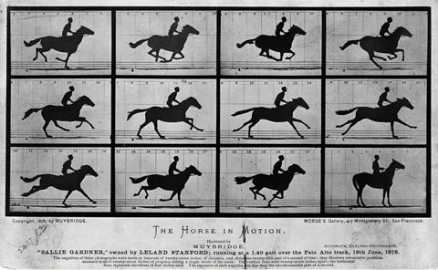

# GB/视频/概览

在笔者小的时候, 曾一度认为动画——确切的说是会动的视频, 是一个很神秘的东西. 我开始搜刮各种各样的资料, 开始自学动画软件, 比如 Flash. 但我随后意识到, 创建一部动画要比我想象的难的多, 尤其是我缺乏关于视频和动画的理论知识的情况下.

若干年后, 我在物理课上开始有机会了解到视频的原理, 我的启蒙老师是下面这张图片, 图片的名字叫做《The House In Motion(运动中的马)》.

《运动中的马》是在 1878 年 6 月拍摄完成的, 它包括六张卡, 每张卡依次显示六到十二张描绘马运动的"自动电子照片". 如果将每张马的剪影剪下并按照顺序快速用手指拨动, 将能看到运动的图像.

无独有偶, 中国古代也有类似的玩意. 走马灯是中国传统玩具之一, 其灯内产生的热力可造成气流, 令轮轴转动. 轮轴上有剪纸, 烛光将剪纸的影投射在屏上, 图像便可以不断走动. 因多在灯各个面上绘制古代武将骑马的图画, 而灯转动时看起来好像几个人你追我赶一样, 故名走马灯.

看到这里, 相信读者已经明白视频的本质的. 视频的本质是一系列静止的图片, 当这些图片以一定的频率快速切换时, 人眼就可以看到连续的画面. 图片快速切换的最低阈值是 16Hz, 频率过低则人眼能感受到明显卡顿, 频率过高则人眼会感觉画面"失真": 因为过于真实而显得不真实. 如今的两大视频产业电影和游戏, 分别采用的是 24Hz 与 60Hz.

从早期的像素游戏作品到如今主机上的爆炸画面效果, 虽然画面提升了无数倍, 但从制作每一帧的游戏画面到将每一帧的游戏画面显示到屏幕上的技术却是相似的.

本章节将探究 Game Boy 是如何制作每帧的画面, 并将之显示在屏幕上成为动画的.
