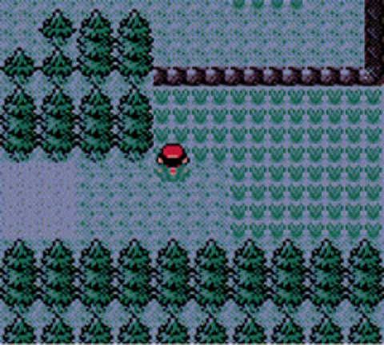
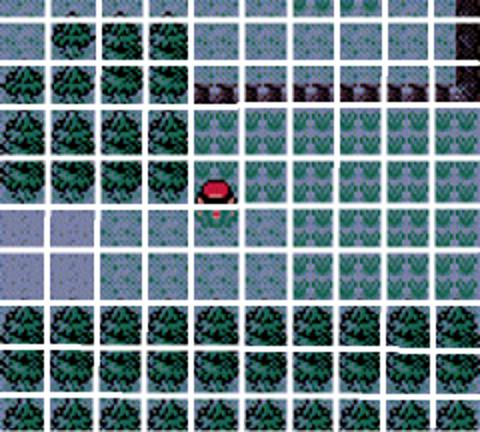
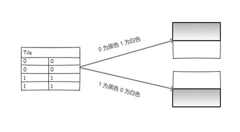
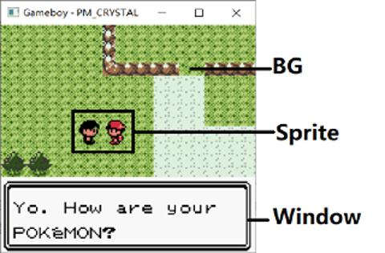
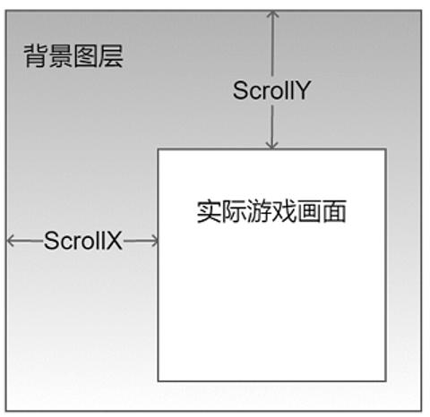

# GB/视频/图像显示系统

Game Boy 的图像显示系统初看会比较复杂, 但在了解相关概念后会有一种"原来如此"的感觉. 本小节将带领读者从全局高度了解 Game Boy 的显示系统, 并不会涉及具体技术细节, 内容包括:

- 瓷砖(Tile)系统简介
- 调色板(Palettles)的工作原理和目的
- 图层介绍

## 瓷砖系统

一款游戏最重要的是什么? 不同的玩家可能会有不同的答案, 但画面一定在其中占有重要的比例. 如果一个游戏画面黑漆漆一片, 纵然有动听的音乐或满屏的"游戏性", 相信也很难成为热卖的大作. 相比起前辈 NES 来说, Game Boy 的屏幕分辨率很低, 并且其图像绘制受到内存大小和卡带容量大小的极大限制, 为了绘制一张图片, 当年的开发者和美工可谓是绞尽脑汁, 发明出了一种另类的技巧.

上面的游戏画面相信大家已经非常熟悉了, 它正是大名鼎鼎的游戏《精灵宝可梦-水晶》的游戏画面. 书中引用的这张图片的原格式是 png, 长宽是 160x144, 保存在硬盘后的文件大小是 226k. 发现什么问题了吗? Game Boy 的内存大小是 64k, 如果用 png 格式的图像用来显示游戏画面, 即使让整个 Game Boy 耗尽内存也放不下一张图片.

但是, 如果此时仔细的去观察该画面, 可以明显发现画面是由大量且重复的方块(Tile)构成的. 加上白色的辅助线后可以更加明显的感受到.

Game Boy 游戏拥有一张全局的 Tile 表, 每一个 Tile 有一个唯一编号, 当想要显示画面时, 只需要在内存中引用 Tile 表的编号, 就能拼凑出一副完整的游戏画面. 通过 Tile 素材的重复引用, 可以使一帧游戏画面的内存大小降低至 1024 字节. 以一个简单的例子来说明的话, 如果要绘制一幅草地的图像, 可以将单个方块图像"小草"保存在 Tile 表中并获取其编号, 在屏幕的特定位置就可以以"小草"的编号代替实际图像. 因此其实际内存消耗为单个方块图像小草以及该图像被引用的次数.

## 调色板系统

在介绍 Palettes(调色板)之前, 先聊会一个许多 RPG 游戏中后期会出现的普遍现象: 怪物换皮. 比如一些游戏早期主角会在村门口遇到蓝史莱姆, 然后切换地图到火山环境后便会遇到红史莱姆, 切换地图到冰原后便会遇到白史莱姆, 更有甚者会遇到所谓"大"史莱姆(不负责任的放大模型). 这些史莱姆之间除了颜色和大小不同外在画面表现上几乎没有其他区别. 玩家们对此是深恶痛绝的.

当一种做法在游戏行业得以普遍, 一定是有其优越之处. 换皮的优势是可以节省游戏卡带容量和节约美工时间. 在游戏中(无论是古早游戏还是现代大型 3D 游戏), 一个模型(主角, 敌人, 物品, 武器等)的形状和颜色通常是分开存储的, 其带来的优势除了方便换皮之外, 还经常作用于与环境交互之中, 比如在黑夜场景, 角色的皮肤会较白天更暗. 对于 Game Boy 而言, 就是其 Tile 只存储形状, Tile 的颜色的解析则交由 Palettes. 因此, 只需要更改 Palettes 的数据就能对一个 Tile 进行换皮. 如下图所示, 假设一个 Tile 由数据 0 和 1 构成, 那么根据调色板的不同, 它可以被显示出两种不同的样貌.

Tile 中并未保存颜色, 而是保存一个颜色的编号. Palettes 的工作是用于将游戏中的颜色编号映射为真实世界中的颜色. Game Boy 可以处理 4 种颜色, 分别是白色, 浅灰色, 深灰色和黑色. 在 Tile 的数据中表示这四种颜色之一需要两位(00, 01, 10, 11), 由于 Tile 通常的大小是 8x8 分辨率, 因此一个 Tile 在内存中仅需要占用 16 字节. 将 00, 01, 10 和 11 映射为真实的颜色需要经过 Palettes 模块, 默认情况下, 它负责将 00 映射为黑色, 01 映射为深灰色, 10 映射为浅灰色, 11 映射为白色. 至于 Game Boy Color 情况又有点不同, 在下一节中会继续介绍.

## BG, Sprite 和 Window

Game Boy 的显示系统分为三个图层, 分别是 BG(背景图层), Sprite/OBJ(活动图层)和 Window(窗口图层). 背景图层通常放置静止或循环播放的背景画面, 活动图层通常放置玩家所操纵的角色和敌人, 而窗口图层的作用类似弹出窗口, 常常用于放置 RPG 游戏中的对话框一类的区域.

注意的是, 无论是 BG, Sprite/OBJ 还是 Window, 这些图层均是由 Tile 构成的. 值得注意的是, Game Boy 中并不包含传统意义上的字库, 因此玩家所能看到的文字其实也是一个 Tile.

Game Boy 的 BG 的大小是 256x256 像素, 一个 Tile 的大小通常是 8x8 像素, 因此为了表示一幅完整的背景, 需要 32x32 个 Tile. 但是由于 Game Boy 的显示器大小是 160x144, 因此需要一组坐标表示当前的显示画面位于背景图层的位置, 这组坐标使用寄存器 Scroll X 与 Scroll Y 表示.

所以说玩家在屏幕上看到的画面其实只是实际游戏画面的一部分, 屏幕上展现的画面是 BG 中 [Scroll_X, Scroll_Y] 到 [Scroll_X + 160, Scroll_Y + 144] 的部分. 因此, 部分开源的 Game Boy 仿真器宣传其"可以显示游戏画面外的区域", 实际上就是将整个 BG 显示出来.

最后分享一个冷知识, Sprite 也常称为雪碧图, 因为其英文名称与一款著名饮料相同. 由于基本上游戏内受玩家控制的小人都生活在活动图层中, 因此有的人也称其为精灵图.
