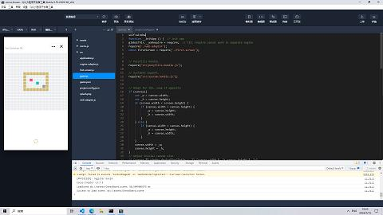
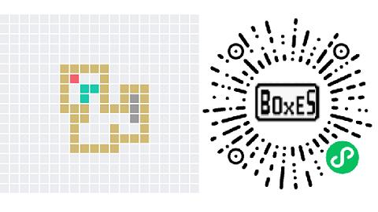

# 独立游戏开发/Cocos Creator 将微信小游戏发布到 QQ 小游戏

一件很奇怪的事情, Cocos Creator 可以打包发布到微信平台但是却不能打包发布到 QQ 小游戏平台, 而根据网上的说法, QQ 小游戏和微信小游戏是几乎完全一样的东西.

[Cocos Creator 与 QQ 小游戏的爱恨情仇](https://forum.cocos.org/t/topic/138000)

目前我使用的 Cocos Creator 版本是最新的 3.7.3, 网上能搜索到的一些教程已经过时了, 例如 [Cocos Creator 3.5.2 打包微信小游戏发布到 QQ 小游戏修改](https://blog.csdn.net/xuyid/article/details/126018424), 遂决定自己动手完成移植.

移植过程大概花了我一个晚上时间, 生啃压缩过的 JavaScript 代码, 比对同样的代码在微信和 QQ 平台上运行过程的一些差异, 所幸功夫不负有心人, 终于搞定了. Cocos Creator 3.7.3 版本移植步骤如下:

1. 编译生成微信小游戏发布包
2. 使用 QQ 小程序开发工具导入发布包
3. 打开 `project.config.js`, 修改 `appid` 为 QQ 小游戏的 `appid`
4. 打开 `game.js`, 第一行添加代码 `self = window`
5. 搞定

但是目前有个小问题, QQ 小游戏只允许企业用户发布, 我创办的工作室目前还没有开好银行对公账户, 等此事办妥, 我就会将游戏发布到 QQ 平台.

欢迎访问微信小游戏 "像素推箱" 了解我的第一款独立游戏.

