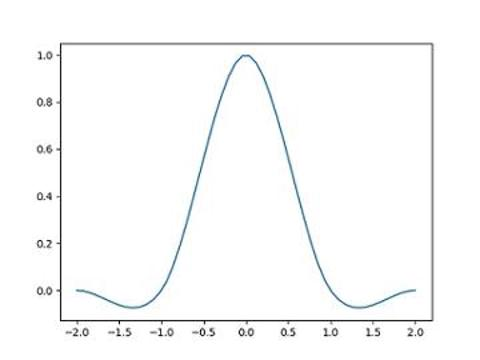

# 数字图像处理/缩放/双三次插值法

双三次插值法通常应用在图像放大中. 相比于双线性算法, 它在放大后保留了更好的细节. 在这种方法中, 函数 f 在点 (x, y) 的值可以通过矩形网格中最近的 16 个采样点的加权平均得到, 在这里需要使用两个多项式插值三次函数, 每个方向使用一个. 与仅考虑 4 个像素的双线性插值不同, 使用双三次插值重采样的图像更平滑, 具有更小的插值失真, 但代价是急剧增加的计算量, 因此性能上或许是一个问题.

## 转换函数

先了解下三次插值算法在处理一维数据时的过程.假设已知一个一维矩阵:

```text
X = [10, 20, 20, 10]
```

该矩阵下标从 -1 开始, 即 X[-1] = 10, X[0] = X[1] = 20, X[2] = 10, 如果我们希望近似得到 X[0.5] 的结果, 那么可以首先假设有一个基于距离的权重函数 W, 容易得到

```text
X[0.5] = W(1.5)X[-1] + W(0.5)X[0] + W(-0.5)X[1] + W(-1.5)X[2]
```

上述公式可以很容易扩展到二维矩阵.

## 权重函数

在双三次插值法中, 权重函数 W 通常为:

```text
W(x) = (a+2)|x|^3 - (a+3)|x|^2 + 1; |x| <= 1
     = a|x|^3 - 5a|x|^2 + 8a|x|-4a; 1 < |x| < 2
     = 0                          ; |x| > 2
```

a 是一个变量, 但 a 常取 -0.5 或 -0.75, 它们具有相似的性质.

W 在 [-2, 2] 区间上的函数图像如下图所示:



## 代码实现

下面使用 Python 实现双三次插值法缩放图像. 注意下示代码未经优化, 在放大图片至 2160*3840 时可能需要花费超过 1 小时在我的 xeon cpu 上.

```py
import numpy as np
import PIL.Image
import scipy.misc


def get_item(arr, *args):
    indexes = []
    for i, entry in enumerate(args):
        index = entry
        if index < 0:
            index = abs(index) - 1
        if index >= arr.shape[i]:
            index = arr.shape[i] - index % arr.shape[i] - 1
        indexes.append(index)
    r = arr
    for index in indexes:
        r = r[index]
    return r


def get_w(x):
    a = -0.5
    absx = abs(x)
    if absx <= 1:
        return (a + 2) * absx**3 - (a + 3) * absx ** 2 + 1
    elif 1 < absx < 2:
        return a * absx**3 - 5 * a * absx**2 + 8 * a * absx - 4 * a
    else:
        return 0


im = PIL.Image.open('/img/jp.jpg')
im_mat = np.asarray(im)
im_mat_resized = np.empty((270, 480, im_mat.shape[2]), dtype=np.uint8)

for r in range(im_mat_resized.shape[0]):
    for c in range(im_mat_resized.shape[1]):
        rr = (r + 1) / im_mat_resized.shape[0] * im_mat.shape[0] - 1
        cc = (c + 1) / im_mat_resized.shape[1] * im_mat.shape[1] - 1

        rr_int = int(rr)
        cc_int = int(cc)

        sum_p = np.empty(im_mat.shape[2])
        for j in range(rr_int - 1, rr_int + 3):
            for i in range(cc_int - 1, cc_int + 3):
                w = get_w(rr - j) * get_w(cc - i)
                p = get_item(im_mat, j, i) * w
                sum_p += p

        for i, entry in enumerate(sum_p):
            sum_p[i] = min(max(entry, 0), 255)

        im_mat_resized[r][c] = sum_p

im_resized = PIL.Image.fromarray(im_mat_resized)
im_resized.show()
```
