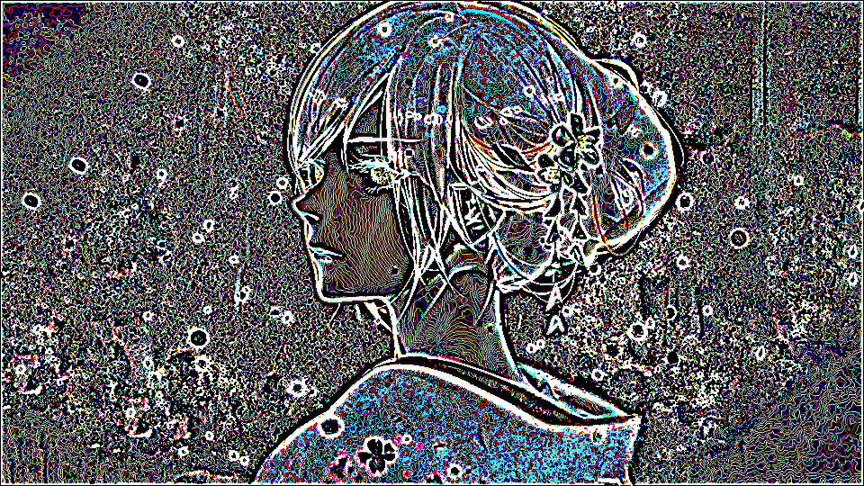

# 数字图像处理/图像减法

两幅图像 f 与 h 的差异表示为:

```text
g = f - h
```

图像的差异是通过计算这两幅图像所有对应像素点的差而得出的. 减法处理最主要的作用就是增强两幅图像的差异. 在差值图像中, 像素最小取值为 -255, 最大取值为 255. 因此, 显示这一图像需要某种标度. 首先, 提取最小差值, 并且把它的负值加到插值图像的所有像素中, 此时差值图像的像素范围为 [0, max], 然后通过 255 / max 值去乘每个像素将图像中所有像素标定到 0 到 255 范围中.

## 注意事项

在 numpy 中图像存储类型是 uint8, 范围是 0-255, 如果图像相减后得到负值, 就会截取为 0 值. 因此处理差值图像时需要将数据以 float 保存. 处理完成后再转换为 uint8.

## 代码实现

```py
# 取得原图与其高斯模糊图像的差值图像
import PIL.Image
import PIL.ImageFilter
import scipy.misc
import numpy as np


def convert_2d(r, h):
    # 矩阵减法
    s = r - h
    if np.min(s) >= 0 and np.max(s) <= 255:
        return s
    # 线性拉伸
    s = s - np.full(s.shape, np.min(s))
    s = s * 255 / np.max(s)
    s = s.astype(np.uint8)
    return s


def convert_3d(r, h):
    s_dsplit = []
    for d in range(r.shape[2]):
        rr = r[:, :, d]
        hh = h[:, :, d]
        ss = convert_2d(rr, hh)
        s_dsplit.append(ss)
    s = np.dstack(s_dsplit)
    return s


im = PIL.Image.open('/img/jp.jpg')
im = im.convert('RGB')
im_mat = np.asarray(im)
# 高斯模糊
im_converted = im.filter(PIL.ImageFilter.GaussianBlur(radius=2))
im_converted_mat = scipy.misc.fromimage(im_converted)
im_sub_mat = convert_3d(im_mat, im_converted_mat)
im_sub = PIL.Image.fromarray(im_sub_mat)
im_sub.show()
```


