# Python/Matplotlib

## 从美国 GDP 数据开始

有一天我在我的知乎上刷到了这个问题: [2022 年美国第一季度经济折合年率萎缩 1.4%, 还有哪些信息值得关注? 或受哪些因素导致?](https://www.zhihu.com/question/530511433)

问题的信息源是财联社:

> 美国 2022 年第一季度经济折合年率萎缩 1.4%, 预估为增长 1.1%, 前值为 6.9%.

上面这句话似乎给了很多信息, 1.4%, 1.1%, 6.9% ... 但又似乎什么都没说, 你几乎无法从中得出有意义的信息. 直到有位答主贴了一张图:

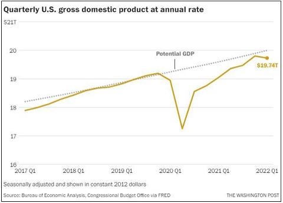

通过这张图, 读者几乎可以在一秒之内就了解近三年美国的 GDP 变化.

## 一图胜千言

"A picture is worth a thousand words."

许多重要人物都发表过类似的观点, 例如拿破仑曾经说过, "A good sketch is better than a long speech". 同时 1913 年在俄亥俄州 Piqua 的 Piqua Auto Supply House 的一份报纸广告中, 出现了类似理念:


- 我们在视觉上学习和记忆.
- 视觉智商的增长速度快于其他形式的智商.
- 带有图片的文字影响更大. 在研究演示文稿的类型时, 明尼苏达大学和 3M 的研究人员发现, 包含"良好"图形的演示文稿的说服力比纯文本演示文稿高 43%.
- 我们没有时间阅读. 尼尔森·诺曼小组研究了用户在网络上的阅读方式, 发现用户仅阅读页面内容的 25%.
- 图表可以在更短的时间内传达更多信息.
- 视觉信息突破了语言障碍.
- 图表有助于设计和规划. 尤其是在研究经济问题, 或者对链上数据进行分析时.
- 图表适合所有人.

## Matplotlib

Matplotlib 是一个 Python 绘图库. 无论是技术人员还是非技术人员, 都可以在短时间内快速上手.

Python 有一些云端执行环境, 这意味着你可以完全不安装任何软件就能体验到 Matplotlib 的强大! [https://notebooks.gesis.org/binder/jupyter/user/matplotlib-mpl-brochure-binder-7kd9dfue/doc/workspaces/auto-U/tree/MatplotlibExample.ipynb](https://notebooks.gesis.org/binder/jupyter/user/matplotlib-mpl-brochure-binder-7kd9dfue/doc/workspaces/auto-U/tree/MatplotlibExample.ipynb)

## 折线图

**折线图**

```py
import numpy as np
import matplotlib.pyplot as plt
plt.style.use('seaborn-v0_8-darkgrid')

x = np.linspace(-np.pi, np.pi, 256)
y = np.sin(x)

plt.plot(x, y)
plt.show()
```

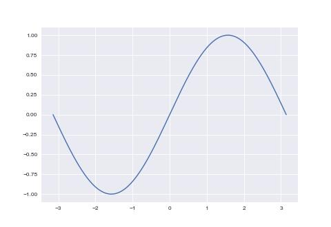

**样式**

```py
import numpy as np
import matplotlib.pyplot as plt
plt.style.use('seaborn')

x = np.linspace(-np.pi, np.pi, 256)
y = np.sin(x)

# 设置颜色 color
# 如下的 color 值是被支持的
# ==========  ========
# character   color
# ==========  ========
# 'b'         blue
# 'g'         green
# 'r'         red
# 'c'         cyan
# 'm'         magenta
# 'y'         yellow
# 'k'         black
# 'w'         white
# ==========  ========
# 另外, 可以使用全名('green'), 16 进制('#008000'), RGB 或 RGBA 元组(0,1,0,1) 或
# 灰度值(0.8)

# 设置样式 linestyle
# ================    ===============================
# character           description
# ================    ===============================
# ``'-'``             solid line style
# ``'--'``            dashed line style
# ``'-.'``            dash-dot line style
# ``':'``             dotted line style
# ``'.'``             point marker
# ``','``             pixel marker
# ``'o'``             circle marker
# ``'v'``             triangle_down marker
# ``'^'``             triangle_up marker
# ``'<'``             triangle_left marker
# ``'>'``             triangle_right marker
# ``'1'``             tri_down marker
# ``'2'``             tri_up marker
# ``'3'``             tri_left marker
# ``'4'``             tri_right marker
# ``'s'``             square marker
# ``'p'``             pentagon marker
# ``'*'``             star marker
# ``'h'``             hexagon1 marker
# ``'H'``             hexagon2 marker
# ``'+'``             plus marker
# ``'x'``             x marker
# ``'D'``             diamond marker
# ``'d'``             thin_diamond marker
# ``'|'``             vline marker
# ``'_'``             hline marker

# 设置曲线宽度 linewidth
plt.plot(x, np.sin(x), color='pink', linewidth=2, linestyle='--')
plt.show()
```

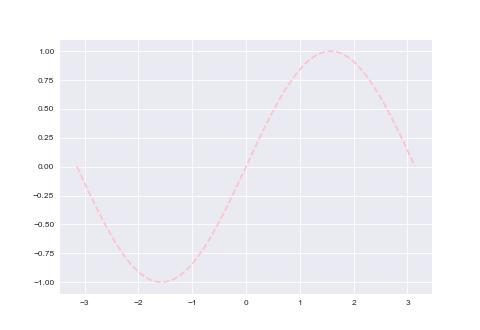

**坐标范围**

```py
import numpy as np
import matplotlib.pyplot as plt
plt.style.use('seaborn-v0_8-darkgrid')

x = np.linspace(-np.pi, np.pi, 256)
y = np.sin(x)
p = plt.subplot()
p.plot(x, y)
# 设置 x 轴坐标宽度; 默认情况下, 左右会各保留一小段空白区间
p.set_xlim(x.min(), x.max())

plt.show()
```

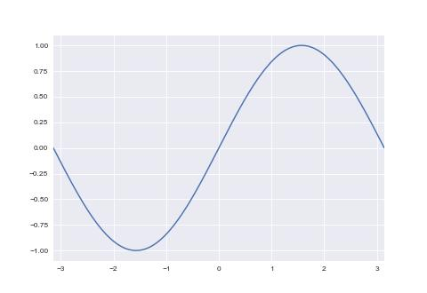

**填充**

```py
import numpy as np
import matplotlib.pyplot as plt
plt.style.use('seaborn-v0_8-darkgrid')

x = np.linspace(-np.pi*2, np.pi*2, 256)
y = np.sin(x)
# 参数以 .plot 相似, 区别是会填充曲线的面积, 填充分界线为 y=c(c 为 x = 0 时的数)
# alpha 为透明度
plt.fill(x, y, alpha=0.5)
# 当需要自定义分界线时, 使用 .fill_between 函数
plt.fill_between(x, 0, np.sin(x - np.pi / 4), alpha=0.5)
plt.show()
```


**坐标位置与坐标样式**

```py
import numpy as np
import matplotlib.pyplot as plt
plt.style.use('seaborn-v0_8-darkgrid')

x = np.linspace(-np.pi, np.pi, 256)
y = np.sin(x)
p = plt.subplot()
p.plot(x, y)

# 移动坐标轴与设置坐标轴样式
p.spines['bottom'].set_color('#646882')
p.spines['bottom'].set_linewidth(1)
p.spines['bottom'].set_position(('data', 0))
p.spines['left'].set_color('#646882')
p.spines['left'].set_linewidth(1)
p.spines['left'].set_position(('data', 0))
plt.show()
```

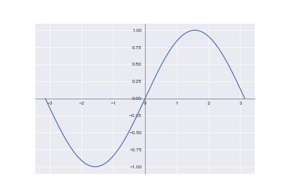

**坐标刻度**

```py
import numpy as np
import matplotlib.pyplot as plt
plt.style.use('seaborn-v0_8-darkgrid')

x = np.linspace(-np.pi, np.pi, 256)
y = np.sin(x)

p = plt.subplot()
p.plot(x, y)
# 手工指定坐标轴上的刻度
p.set_xticks([-np.pi, -np.pi / 2, 0, np.pi / 2, np.pi])
p.set_yticks([])

plt.show()
```

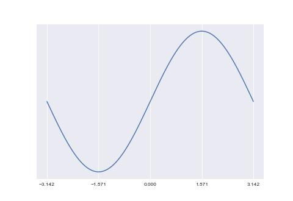

**函数名称**

```py
import numpy as np
import matplotlib.pyplot as plt
plt.style.use('seaborn-v0_8-darkgrid')

x = np.linspace(-np.pi, np.pi, 256)
y = np.sin(x)

# 为曲线添加名称
plt.plot(x, y, label='sin(x)')
plt.legend(loc='lower right')
plt.show()
```

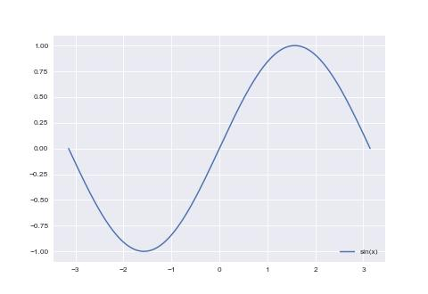

## 散点图

```py
import numpy as np
import matplotlib.pyplot as plt
plt.style.use('seaborn-v0_8-darkgrid')

x = np.linspace(-np.pi, np.pi, 16)
y = np.sin(x)

# s: 散点大小, 默认 20
# c: 颜色
# alpha: 透明度
plt.scatter(x, y, s=50, c='#FF0000', alpha=0.5)
plt.show()
```

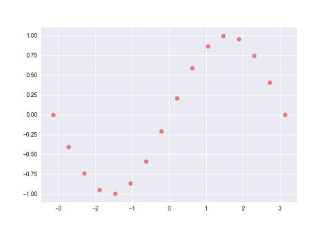

**样式**

```py
import numpy as np
import matplotlib.pyplot as plt
plt.style.use('seaborn-v0_8-darkgrid')

x = np.linspace(-np.pi, np.pi, 16)
y = np.sin(x)

plt.scatter(x, y, s=50, c='#FF0000', marker='+', alpha=0.5)
plt.show()
```

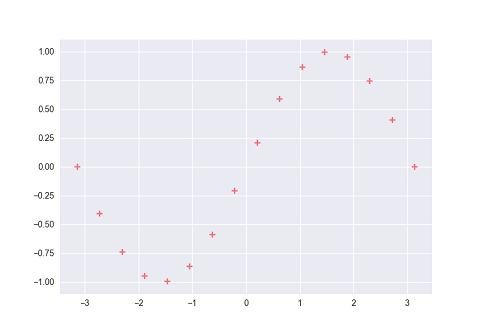

**三维坐标**

```py
import matplotlib.pyplot as plt
from mpl_toolkits.mplot3d import Axes3D
import numpy as np
plt.style.use('seaborn-v0_8-darkgrid')

p = plt.subplot(projection='3d')

x = np.linspace(-np.pi, np.pi, 16)
y = np.sin(x)
z = np.linspace(-np.pi, np.pi, 16)

p.scatter(x, y, z, s=50, c='#FF0000', alpha=0.5)
p.set_zlabel('Z')
p.set_ylabel('Y')
p.set_xlabel('X')
plt.show()
```


## 柱状图

```py
import numpy as np
import matplotlib.pyplot as plt
plt.style.use('seaborn-v0_8-darkgrid')

X = np.arange(5) + 1
Y = np.array([0.5, 0.67, 0.71, 0.56, 0.8])


plt.bar(X, Y, tick_label=['I', 'II', 'III', 'IV', 'V'])
# 在柱状图上标记 y 轴大小
for x, y in zip(X, Y):
    plt.text(x, y, f'{y:.2}', ha='center', va='bottom')

plt.show()
```

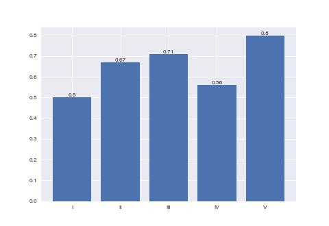

**柱状图柱子的颜色**

plt.bar 函数的 color 参数可以设置颜色; color 可以接受一个颜色, 也可以接受一个颜色数组

```py
plt.bar(X, Y, tick_label=['I', 'II', 'III', 'IV', 'V'], color=['pink', 'purple'])
```

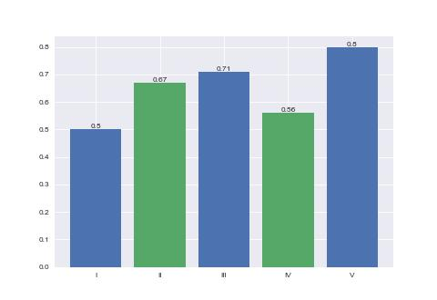

**填充**

plt.bar 函数的 hatch 参数可以填充样式, 可取值为: `/`, `\`, `|`, `-`, `+`, `x`, `o`, `O`, `.`, `*`

```py
plt.bar(X, Y, tick_label=['I', 'II', 'III', 'IV', 'V'], hatch='/')
```

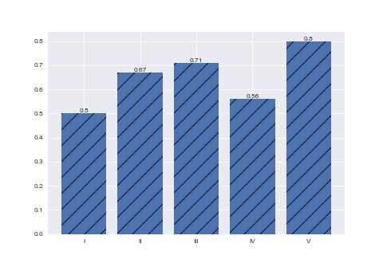

**柱状图堆叠**

使用 bottom 参数堆叠柱状图

```py
import numpy as np
import matplotlib.pyplot as plt
plt.style.use('seaborn-v0_8-darkgrid')

X = np.arange(5) + 1
Y1 = np.array([0.5, 0.67, 0.71, 0.56, 0.8])
Y2 = np.random.random(5)

plt.bar(X, Y1, tick_label=['I', 'II', 'III', 'IV', 'V'], label='Y1')
plt.bar(X, Y2, bottom=Y1, label='Y2')

plt.legend()
plt.show()
```

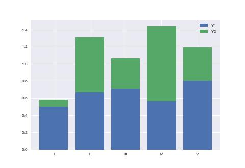

**柱状图并列**

设置柱状图的 bar_width 实现柱状图并列

```py
import numpy as np
import matplotlib.pyplot as plt
plt.style.use('seaborn-v0_8-darkgrid')

bar_width = 0.8 / 2

X1 = np.arange(5) + 1
Y1 = np.random.random(5)
X2 = X1 + bar_width
Y2 = np.random.random(5)

plt.bar(X1, Y1, bar_width)
plt.bar(X2, Y2, bar_width)
plt.xticks(X1+bar_width / 2, ['I', 'II', 'III', 'IV', 'V'])
plt.show()
```

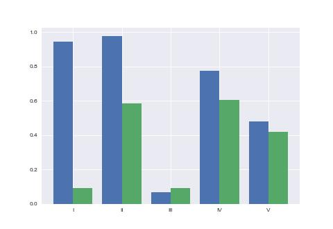

**条状图**

条状图与柱状图基本类似. 经常用于对候选人进行计票.

```py
import numpy as np
import matplotlib.pyplot as plt
plt.style.use('seaborn-v0_8-darkgrid')

X = np.arange(5) + 1
Y = np.random.random(5)

p = plt.subplot()
p.barh(X, Y)
p.set_yticks(X)
p.set_yticklabels(['I', 'II', 'III', 'IV', 'V'])

plt.show()
```

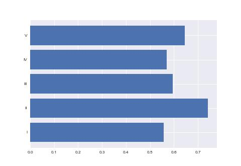

## 饼图

**饼图**

```py
import matplotlib.pyplot as plt
plt.style.use('seaborn-v0_8-darkgrid')

X = [15, 30, 45, 10]
labels = 'I', 'II', 'III', 'IV'

plt.pie(X, labels=labels, autopct='%1.1f%%', startangle=90)
plt.show()
```

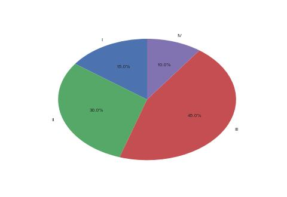

**饼图实现为正圆**

```py
import matplotlib.pyplot as plt
plt.style.use('seaborn-v0_8-darkgrid')

X = [15, 30, 45, 10]
labels = 'I', 'II', 'III', 'IV'

plt.pie(X, labels=labels, autopct='%1.1f%%', startangle=90)
# 设置 x 轴与 y 轴相等
plt.axis('equal')
plt.show()
```

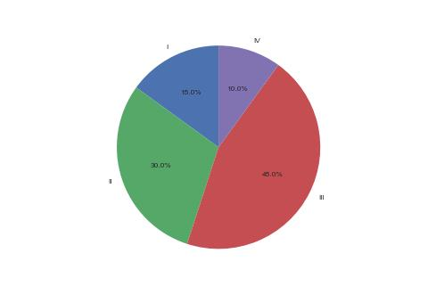

**饼图部分强调**

```py
import matplotlib.pyplot as plt
plt.style.use('seaborn-v0_8-darkgrid')

X = [15, 30, 45, 10]
labels = 'I', 'II', 'III', 'IV'
explode = [0, 0.1, 0, 0]

# explode 参数可以强调数据
plt.pie(X, explode=explode, labels=labels, autopct='%1.1f%%', startangle=90)
plt.axis('equal')
plt.show()
```

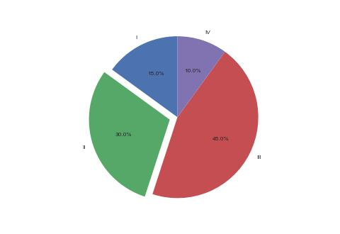

## 涂鸦

这一小节记录一些较为特殊的作图方式.

**Secp256k1 椭圆曲线**

定义: y² = x³ + 7

```py
import matplotlib.pyplot as plt
import numpy as np

plt.style.use('seaborn-v0_8-darkgrid')
plt.figure(figsize=(4.8, 2.7))
plt.xticks(fontsize=8)
plt.yticks(fontsize=8)

y, x = np.ogrid[-5:5:100j, -5:5:100j]
plt.contour(x.ravel(), y.ravel(), y**2 - x**3 - 7, [0], colors='blue', alpha=0.5)
plt.show()
```

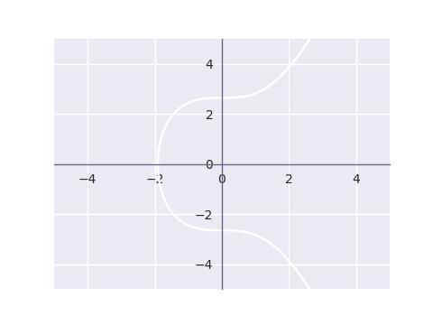

**爱德华兹曲线**

定义: x² + y² = 1 - 30 * x² * y²

```py
import matplotlib.pyplot as plt
import numpy as np

plt.style.use('seaborn-v0_8-darkgrid')
plt.figure(figsize=(4.8, 2.7))
plt.xticks(fontsize=8)
plt.yticks(fontsize=8)

y, x = np.ogrid[-2:2:100j, -2:2:100j]
plt.contour(x.ravel(), y.ravel(),  y**2 + x**2 + 30*x**2 * y**2 - 1, [0], colors='blue', alpha=0.5)
plt.show()
```


**扭曲爱德华兹曲线**

定义: 8 * x² + y² = 1 + 4 * x² * y²

```py
import matplotlib.pyplot as plt
import numpy as np

plt.style.use('seaborn-v0_8-darkgrid')
plt.figure(figsize=(4.8, 2.7))
plt.xticks(fontsize=8)
plt.yticks(fontsize=8)

y, x = np.ogrid[-5:5:100j, -2:2:100j]
plt.contour(x.ravel(), y.ravel(),  y**2 + 8*x**2 - 4*x**2 * y**2 - 1, [0], colors='blue', alpha=0.5)
plt.show()
```


**蒙哥马利曲线**

定义: 0.25 * y² = x³ + 2.5 * x² + x

```py
import matplotlib.pyplot as plt
import numpy as np

plt.style.use('seaborn-v0_8-darkgrid')
plt.figure(figsize=(4.8, 2.7))
plt.xticks(fontsize=8)
plt.yticks(fontsize=8)

y, x = np.ogrid[-5:5:100j, -2:2:100j]
plt.contour(x.ravel(), y.ravel(),  0.25*y**2 - x**3 - 2.5*x**2 - x, [0], colors='blue', alpha=0.5)
plt.show()
```


