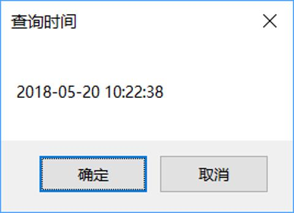

# Pyhton/Windows 编程

这篇文章很早就准备写了, 但是一直拖着... 故事的起因是我在 Windows 下 `rm -rf` 了自己的用户目录, 因此在该起事件后就研究起来如何 rm 的时候把文件放入回收站而不是直接删除, Windows 提供了 C++ 版本的 api 来实现这一需求, 但作为一个懒人我并不想玩 C++, 所以, 用 Python 吧.

## 概览

在 Windows 平台下, Python 通过 ctypes 可以很容易的与 Windows API 进行交互. 如下的代码将在桌面创建一个 MessageBoxW, 并在通知的内容中显示当前时间.

```py
import ctypes
import datetime

c = datetime.datetime.now().strftime('%Y-%m-%d %H:%M:%S')
ctypes.windll.user32.MessageBoxW(0, c, '查询时间', 1)
```



MessageBoxW 的 C++ 接口文档位于 [https://msdn.microsoft.com/en-us/library/windows/desktop/ms645505(v=vs.85).aspx](https://msdn.microsoft.com/en-us/library/windows/desktop/ms645505(v=vs.85).aspx), 如文档所见, 我们可以很方便的修改包括标题, 正文, 按钮和 icon 等在内的几乎所有内容. 与上述 Python 代码等效的 C++ 代码如下所示:

```c++
#include <windows.h>
#pragma comment (lib, "User32.lib")

int WinMain(
    HINSTANCE hInstance,
    HINSTANCE hPrevInstance,
    LPSTR lpCmdLine,
    int nCmdShow
){
    MessageBoxW(NULL, (LPCWSTR)L"2018-05-20 10:22:38", (LPCWSTR)L"查询时间", MB_OKCANCEL);
    return 0;
}
```

## 如何删除文件至回收站

现在要实现稍微复杂一点的编程: 删除文件至回收站. 查阅 MSDN 找到如下文档: [https://msdn.microsoft.com/en-us/library/windows/desktop/bb762164(v=vs.85).aspx](https://msdn.microsoft.com/en-us/library/windows/desktop/bb762164(v=vs.85).aspx), 发现正好可以满足需求.

SHFileOperation 函数的说明是 "Copies, moves, renames, or deletes a file system object."

与使用 rm 或 os.remove 等删除命令/函数不同, 该函数经过操作系统的封装, 他会在删除文件时询问你"是否真的删除该文件"或在复制文件时提醒你"文件已存在, 是否覆盖", 大部分情况下, 你可以将他等价为你在 Windows 的文件系统里执行某一操作, 就像你在手动操作一样.

```c++
int SHFileOperation(
  _Inout_ LPSHFILEOPSTRUCT lpFileOp
);
```

很好! 我们已经知道该调用哪个函数了. 但现在遇到了一个新的问题, SHFileOperation 的参数 lpFileOp 既不是我们熟知的整形, 也不是字符串, 而是一个名为 LPSHFILEOPSTRUCT 的结构体:

```c++
typedef struct _SHFILEOPSTRUCT {
  HWND         hwnd;
  UINT         wFunc;
  PCZZTSTR     pFrom;
  PCZZTSTR     pTo;
  FILEOP_FLAGS fFlags;
  BOOL         fAnyOperationsAborted;
  LPVOID       hNameMappings;
  PCTSTR       lpszProgressTitle;
} SHFILEOPSTRUCT, *LPSHFILEOPSTRUCT;
```

为了在 Python 中调用该函数, 我们必须实现 LPSHFILEOPSTRUCT 在 Python 中的映射. 定义一个类并继承 ctypes.Structure, 然后为其添加 \_fields\_ 字段, 字段内部是成员名与类型的元组.

```py
import ctypes
import ctypes.wintypes


class LPSHFILEOPSTRUCT(ctypes.Structure):

    _fields_ = [
        ('hwnd', ctypes.wintypes.HWND),
        ('wFunc', ctypes.wintypes.UINT),
        ('pFrom', ctypes.wintypes.PCHAR),
        ('pTo', ctypes.wintypes.PCHAR),
        ('fFlags', ctypes.wintypes.INT),
        ('fAnyOperationsAborted', ctypes.wintypes.BOOL),
        ('hNameMappings', ctypes.wintypes.LPVOID),
        ('lpszProgressTitle', ctypes.wintypes.PCHAR)
    ]


FO_DELETE = 3

FOF_SILENT = 4
FOF_NOCONFIRMATION = 16
FOF_ALLOWUNDO = 64
FOF_NOCONFIRMMKDIR = 512
FOF_NOERRORUI = 1024
FOF_NO_UI = FOF_SILENT | FOF_NOCONFIRMATION | FOF_NOERRORUI | FOF_NOCONFIRMMKDIR


def rm(p):
    r = ctypes.windll.shell32.SHFileOperation(LPSHFILEOPSTRUCT(
        hwnd=0,
        wFunc=FO_DELETE,
        pFrom=ctypes.create_string_buffer(p.encode()),
        fFlags=FOF_ALLOWUNDO | FOF_NO_UI
    ))
    if r:
        raise Exception(r)
```

完成了! 调用 rm 函数即可删除文件至回收站. 注意上面的代码, 我为 LPSHFILEOPSTRUCT 的 fFlags 设置了几个标签, 以实现静默删除文件和删除文件夹至回收站.
