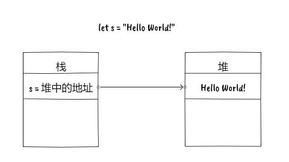

# Rust/所有权

今天我们将讨论所有权, 这是 Rust 这门编程语言的核心概念, Rust 最引以为豪的内存安全就建立在所有权之上. 你必须了解到这节课要讲的内容是多么的重要. 这方面的内容非常庞大, 但我此时只会从最基础的概念讲起. 因为这不会让你产生"这好难啊"的感觉, 有趣和简单一直是我的宗旨, 那么我们开始吧.

所有的编程语言都存在某种管理内存的机制, 拿 C 语言来说, 这种机制是 malloc 和 free. 这意味着开发者要手动管理内存. 对于编程高手而言, 这是一种拥有无限可能性的技术, 但对于大多数普通人而言, 它是一个 Bug 制造机器. 一些语言采用了垃圾回收技术来管理内存, 也就是说开发者可以只申请内存而不用手动去释放内存, 然后, 垃圾回收器, 也就是 GC, 会自动检测某块内存是否已经不再被使用, 如果是的话, 那么释放这块内存. 但是因为 GC 的存在导致程序性能天生的下降, 还有就是 GC 对程序运行带来的不确定性, 任何使用 GC 的语言几乎不可能用来编写底层程序. 我们这里说的底层是指贴近硬件的软件应用, 例如操作系统和硬件驱动.

在生活中, 如果有两种合理但不同的方法时, 你应该总是研究两者的结合, 看看能否找到两全其美的方法. 我们称这种组合为杂合(hybrid). 例如, 为什么只吃巧克力或简单的坚果, 而不是将两者结合起来, 成为一块可爱的坚果巧克力呢?

Rust 采用了一种中间方案, 它兼具 GC 的易用性和安全性, 同时又有极高的性能.

在开始之前, 我们先来回顾一下堆和栈的区别. 栈是一种先进先出的数据结构, 栈内的每个元素都有固定的大小, 通常是你机器 CPU 的位宽. 例如, 如果你现在在使用 64 位机器, 那么你机器上运行的任何程序的栈的宽度就是 64 位, 正好是一个寄存器的大小. 另一方面, 如果我们要放置某个对象, 例如一个字符串, 由于字符串的长度是不固定的, 因此无法被放置在栈中. 此时我们必须使用堆, 而当我们想要在堆上分配一个对象, 我们向操作系统请求给定的内存数量, 操作系统会在可用堆中找到一个空闲位置, 然后讲标记设置为已占用, 并返回指向该存储位置的指针, 因此堆的组织性较差, 它比栈要慢, 但很多时候它是唯一的处理这些动态结构的方法. 下图展示了一个字符是如何存储在内存中的: 变量 s 保存在栈中, 其值是一个指向堆的地址, 堆中则保存了字符串的具体内容.



我们要谈谈关于所有权的实际规则, Rust 中每个值都绑定有一个变量, 称为该值的所有者. 每个值只有一个所有者, 而且每个值都有它的作用域. 一旦当这个值离开作用域, 这个值占用的内存将被回收. 我们来看一个例子, 下面的代码中, value1 可以被正常打印, 但 value2 则会编译失败. 因为 value2 的作用域只局限在大括号内, 程序找不到 value2 了.

```rs
fn main() {
    let value1 = 1;
    println!("{}", value1);

    {
        let value2 = 1;
    }
    println!("{}", value2);
}
```

我们回到字符串的例子中. 我们编写如下的代码, 你必须关注 `let s2 = s1` 这行代码, 因为我们此时将字符串绑定到了另一个变量中. 发动你的大脑猜一猜, 下面的代码能被编译吗?

```rs
fn main() {
    let s1 = String::from("any string");
    let s2 = s1;
    println!("{}", s1);
}
```

你也许已经有答案了, 但别急, 我们大喊一声变! 我们让上面的代码换一种写法. 你可以看到我先声明了变量 s2 但未赋值, 然后创造了一个新的作用域, 在作用域内初始化了字符串 s1, 然后赋值给 s2.

```rs
fn main() {
    let s2: String;
    {
        let s1 = String::from("any string");
        s2 = s1;
        println!("{}", s1);
    }
}
```

这个时候, 我有一个大胆的想法, 我们也许可以例用反证法来证明上述代码是否能被编译. 我们回忆一下 Rust 的规则: 当一个变量的生命周期结束时, 它将被自动销毁. 同时大多数变量的生命周期与它的作用域是相同的. 如果上面的 println 可以正常打印 s1, 那说明 s1 依然拥有堆内的数据, 那么在离开作用域时, 堆内的数据将被销毁, 所以, s2 保存了什么数据呢?

有一个专有名词来指代上面的事情, 叫做所有权移动. 字符串的实际内容, 也就是 "any string", 它实际存在堆中, 然后变量 s1 保存的是堆内的地址. 我们将 s1 赋值给 s2, 通常情况下, 是让 s2 指向 "any string", 而不是将 "any string" 在堆内重新复制一份, 因为这个操作很昂贵. 但你不能让 s2 指向这块内存的同时也让 s1 指向这块内存, 因为这样会让 Rust 的内存回收策略失效. 所有权, 生命周期, 作用域, 内存安全等等概念, 构成了 Rust 中一个伟大的逻辑闭环.
