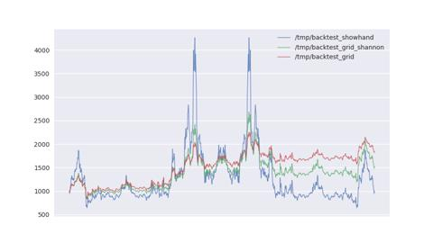

# 圣杯/网格交易

在今年春, 我经历了很长一段时间的低谷期. 这段时间我在阅读社会学与经济学的书籍, 随着阅读量的提升, 我愈发清醒的意识到, 劳动根本无法致富, 甚至连维持个人生存都很困难--多劳多得, 不劳不得的矛盾点在于没有任何人可以一直劳动, 机器总有维修乃至报废的那一天. 同时, 我也无法依靠在尚能劳动时存钱以度过丧失劳动力之后的时光, 因为通胀的存在--通胀是比税收更可怕的东西, 因为它收割的是存量而不是增量.

我要获取劳动之外的收入. 我的见识非常浅薄, 当这个想法冒出在大脑时, 我所能想到的唯一一条路便是币圈. 我不喜欢股市, 那里是既得利益者的地方. 我希望可以在币圈获取较为稳定的收益, 虽然早已经知道这极端困难.

决定走上量化交易这条路前, 我看了不少书, 包括《海龟交易法则》《通向财富自由之路》等书. 在对市场有一些基本认识之后, 就冲向了币圈. 这的确很冲动, 亏损本金固然令人恐惧, 但不面对它便无法战胜它.

很幸运的是, 仅仅通过几周时间我就找到了一个可以稳定获益的交易系统: 网格交易. 到编写本篇文章为止, 该交易系统已经在火币上实盘运行了半年之久. 我会告诉你为什么它能稳定获益, 以及为什么我不再使用它. 请注意, 《圣杯》系列文章不会告诉你我目前正在采用的交易系统策略, 只有我确认不再使用的交易系统, 我才可能会将之公开. 但这不意味着我公开的系统是无效的, 它只是在交易风格, 资金量或收益率等方面不再适合我罢了.

## 香农网格

网格交易法的思路来源于信息论之父--香农. 上世纪四十年代的某一天, 香农在黑板上给大家演示: 任何一个价位买进资金的 50%, 也就是说资金数量与股票市值比例为 1 比 1. 股票价格上涨一定幅度就卖出一部分股票, 保持剩余的资金数量与剩余股票市值比例为 1 比 1；反之股票价格下跌一定幅度, 就用剩余资金买进一部分股票, 保持剩余的资金数量与剩余股票市值比例为 1 比 1. 用这个办法来对付股票价格的随机走势, 长期交易是盈利的.

以上这种交易方式被称作香农网格. 但不幸的是, 它现在已经无法在股市中生效, 即使在币圈中效果也比较一般. 其原因是因为收益率过低: 如果在股市中使用该交易系统, 年化收益甚至不如指数基金. 即使在 24 小时交易的比特币大赌场, 年化收益也不到 15%, 如果算上比特币本身价格的上涨, 该系统甚至是亏本的. 年化 15% 的历史回测结果看似是很高的数字, 是的, 如果你活得足够长(这对我很难).

## 固定市值网格

越是底层的人, 越应该拥抱风险, 因为已经没有更多可以失去的了. 香农网格的优势在于交易系统可以永远运行下去, 风险极低, 盈亏同源, 风险低意味着收益低. 我们可以通过一定的技术调整, 来获取更高的收益和风险. 我将这种网格称为固定市值网格.

固定市值网格的核心策略是: 保持比特币持仓的市值永远为一个固定值. 例如现在有 1000 美刀, 那么将其中 500 美刀用于购买比特币, 并且在后续市场中永远保持比特币持仓的市值为 500 美刀. 比特币每出现 2% 的涨跌交易系统就平衡一次仓位, 由于 `500 * 0.98^50 * 1.02^51 = 500`, 因此每一对买入/卖出的收益是万分之四的市值也即 0.2 美刀.

在一个震荡市场, 这大概能为我带来年化 40% 的收益.

## 历史回测

选取 eos/usdt 交易对在 2020 年 01 月 08 日到 2021 年 08 年 29 日之间的分钟级别历史数据, 为了测试网格系统在震荡市的收益，历史数据做了一次轴对称以保证回测开始和结束时币价相等. 分别计算梭哈, 香农网格与固定市值网格的收益. 本金投入 1000 美刀, 每 2% 的价格变动调仓一次.

可以看到在收益率方面, 固定市值网格 > 香农网格 > 梭哈.

## 利润加仓

在使用固定市值网格系统时, 我经常面临一个问题: 当币价快速上涨时, 由于系统不断卖出币而导致手里的美刀越来越多. 因此可以在适当的时机选择加仓, 即随着手里剩余的美刀变多而不断将固定市值向上调整. 早期的手法是当美刀与比特币市值的比值超过 0.4 时就择机加仓, 能保证较高的资金利用率, 但遇上大跌行情容易用完美刀导致不得不停止系统, 后期改为每日固定加仓千分之一, 这种方式可以避免牛市早期快速用完资金, 也保证了熊市底部有美刀可以加仓.

## 风险

所有网格交易方法都面临巨大的回撤风险. 在 2021 年 05 月 19 日后, 固定市值网格系统回撤达到了惊人的 60%, 我靠着微薄的月收入艰难度过了这段时间, 但随着我的资金量扩大, 我很确信我无法再承受一次这样的回撤. 用一句话总结: 总能小赚, 偶尔破产.
