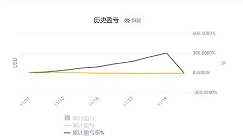

# 圣杯/马丁格尔爆仓之路

没错, 我爆仓了.

在大约一周之前, 我开始使用 100 刀资金做马丁格尔策略, 终于在今晨睁眼后发现资金在夜里两点十五分爆仓了. 在爆仓之前, 我的合约账户余额是 421 刀: 也就是马丁格尔策略在一周时间为我带来了 321% 的利润. 这次爆仓并未给我带来真正的损失, 因为我在本金翻倍后就已经将本金撤离了.

马丁格尔是一个强大的策略, 在爆仓之前, 资金曲线几乎是一条直线往上走, 我从没见过这么完美的曲线. 但是马丁格尔的最终归宿就是爆仓, 因此在实践这种策略之前我早就将爆仓当作一个可接受的选项.

## 马丁格尔

马丁格尔是一种古老的赌场策略. 在一个押大小的游戏中, 我们以一单位赌注开始, 在每次赔钱后, 将赌注加倍, 这样在任何一次赢钱后, 我们将获得一单位的收益, 并重新开始上述循环. 马丁格尔的优点和诱惑力是它的胜率非常高, 在大多数情况下你总能获利. 然而在一连串的损失发生时, 赌注规模会增加得非常快速, 例如连续输 10 次, 那么下一次的赌注将是 1024 单位. 所以很可能在赌赢之前, 就先破产了. 同时为了避免资金雄厚的赌徒成功地运用此一策略, 所有赌场都对最大赌注设限.

马丁格尔有许多兄弟: 例如股市中散户常用的摊平持仓成本, 或者金字塔补仓法, 它们本质都是马丁格尔策略. 它们的共同点是: 当市场朝着不利的方向发展时, 游戏参与者总是投入更多成本来赌市场将会回头.

## 爆仓之路

我在 50 倍杠杆的 ETH/BUSD 合约交易中应用马丁策略. 策略初始卖出 0.002 手 ETH, 然后在持仓成本价下方 0.999x 处挂 0.002 手买入单, 持仓成本价上方 1.002x 处挂 0.002 手卖出单. 如果买入单成交, 则伺机再开单; 如果卖出单成交, 那么下一轮就会在持仓成本价下方 0.999x 处挂 0.004 手买入单, 在最后成交价上方 1.002 处挂 0.004 手卖出单.

策略运行的很好(在爆仓之前).
