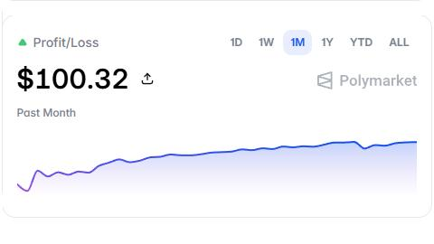

# 圣杯/Polymarket 时间价值衰减策略

最近自己琢磨出一个模糊的概念, 感觉有利可图, 然后搜索了一下, 发现这个概念其实早就存在, 就是期权定价中的 θ, 即时间价值衰减. 这个概念在期权定价中非常重要, 因为期权的价值不仅取决于标的资产的价格, 还取决于时间. 随着时间的推移, 期权的时间价值会逐渐衰减, 这就是 θ 的作用.

我们不谈期权, 因为其实我自己从来没有真正接触过期权, 但是我们可以把这个概念应用到 polymarket 上的预测市场.

举一个简单的例子, polymarket 上有一个关于 "五月份比特币价格是否会超过 90,000 美元" 的市场. 如果现在是五月初, 那么这个市场的时间价值就比较高, 因为还有一个月的时间. 但是如果现在是五月份的最后一天, 那么这个市场的时间价值就非常低了, 因为马上就要到期了. 纯粹讲概念可能比较干, 我们假设整个五月比特币的价格都是 85,000 美元, 从来不波动, 那么我们购买一张 Yes 的期权, 在五月初的时候可能值 0.50 美元, 但是到了五月底, 这个期权的价值可能就只剩下 0.01 美元了, 因为时间价值已经衰减了.

|   日期   | 合约价格 |                       描述                       |
| -------- | -------- | ------------------------------------------------ |
| 五月初   | 0.50     | 未来 30 天只要有一天价格超过 90,000 美元就能获利 |
| 五月中旬 | 0.25     | 未来 15 天只要有一天价格超过 90,000 美元就能获利 |
| 五月底   | 0.01     | 小老弟, 剩余时间太短了, 机会渺茫                 |

合约中包含的时间价值会随着时间的推移而逐渐减少, 这就是 θ 的作用.

Polymarket 上的预测市场也会受到时间价值衰减的影响, 因此在交易时需要考虑这一点. 如果你购买了一个合约的 Yes, 那么随着时间的推移, 这个合约的价值可能会逐渐减少, 即使标的事件的概率没有发生变化.

相反, 如果你购买了一个合约的 No, 那么随着时间的推移, 这个合约的价值可能会逐渐增加, 因为时间价值对 No 的影响是相反的.

下面是我实盘一个月的收益图, 在这个月内任何合约我都只买 No. 可以明显看到, 我在月初的时候收益率较高, 到月末的时候收益率逐渐降低了.

这里涉及一个概念叫做时间价值的非线性衰减. 它是这样的: 期权的时间价值随到期日临近并非均匀减少, 而是呈现"前期缓慢, 中期加速, 后期迅速归零"的特征. 在期权生命周期的前段时间里, 时间价值的流逝速度较慢, 中期开始加速, 到期前几天则迅速归零. 因此反过来对于我的 No 来说, 在月初月中的时候收益率较高, 到月末的时候收益率逐渐降低了.

其实在期权市场中这个策略已经很成熟了, 就是卖出期权, 因为卖出期权可以赚取时间价值的衰减.

在预测市场中, 卖出合约其实就是通过买入 No, 来实现类似的效果. 这是我第一次在 polymarket 上有当月正收益, 虽然收益率不高, 但是感觉这个策略是有潜力的, 希望可以依靠这个策略在 polymarket 上长期盈利.

写于 2026-05-27.
