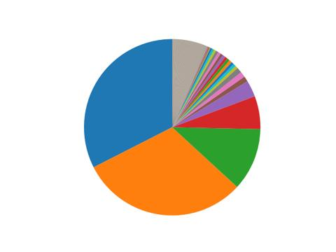

# Solana/经济系统/创世块(二)

我们使用下面的代码汇总一下创世块中所有账号的余额, 得到 sol 在创世块中的初始发行总额是 500,000,000 sol.

```py
import json
import pathlib
import pxsol

genesis = json.loads(pathlib.Path('genesis.json').read_text())
accounts = genesis['accounts']

lamports = sum([e['account']['lamports'] for e in accounts])
print(lamports / pxsol.denomination.sol) # 500000000.0
```

之后, 我们通过 [solscan.io](https://solscan.io/) 查询当日 sol 的总供应量. 得知截至 2025 年 9 月 2 日, sol 的总供应量为 608757550 枚(包含流通供应量 540915225 枚以及非流通供应量). 也就是说, 在经历 5.5 年的运营之后, 市面上流通的绝大部分 sol (500000000 / 540915225 = 92.4%) 仍然都来自创世块. 根据这个信息我们可以至少得到两个有用的分析:

- 现在流通中的 sol 几乎都来自创世块 431 个账号的卖出.
- 通胀率极低, 根据公式 `(540915225 / 500000000) ** (1 / 5.5)` 计算得到真实年通胀率为 1.44%.

Solana 社区中有一些批评认为 solana 的初始分发中代币分配较为集中, 早期投资者和团队持有了绝大部分份额. 我们使用代码来验证一下这个说法是否属实.

```py
import json
import pathlib

genesis = json.loads(pathlib.Path('genesis.json').read_text())
accounts = genesis['accounts']
accounts.sort(key=lambda x: -x['account']['lamports'])

lamports_total = sum([e['account']['lamports'] for e in accounts])
lamports_top10 = sum([e['account']['lamports'] for e in accounts[:10]])
lamports_top20 = sum([e['account']['lamports'] for e in accounts[:20]])
lamports_top50 = sum([e['account']['lamports'] for e in accounts[:50]])

print(lamports_top10 / lamports_total) # 0.87
print(lamports_top20 / lamports_total) # 0.92
print(lamports_top50 / lamports_total) # 0.94
```

得到分析结果如下:

- 创世块中的前 10 个地址占有了 87% 的总初始分发额.
- 创世块中的前 20 个地址占有了 92% 的总初始分发额.
- 创世块中的前 50 个地址占有了 94% 的总初始分发额.

看起来社区中的批评还是比较中肯的. 这里给出前 10 地址的浏览器链接. 我们相信这些地址应当大多数来自现实世界中的风险投资机构和 solana 基金会/开发者团队, 但本文无意真的去分析这些账户的现实主体, 因此在文章中仅仅简单列出.

- <https://solscan.io/account/APnSR52EC1eH676m7qTBHUJ1nrGpHYpV7XKPxgRDD8gX>
- <https://solscan.io/account/13LeFbG6m2EP1fqCj9k66fcXsoTHMMtgr7c78AivUrYD>
- <https://solscan.io/account/GK2zqSsXLA2rwVZk347RYhh6jJpRsCA69FjLW93ZGi3B>
- <https://solscan.io/account/8HVqyX9jebh31Q9Hp8t5sMVJs665979ZeEr3eCfzitUe>
- <https://solscan.io/account/HbZ5FfmKWNHC7uwk6TF1hVi6TCs7dtYfdjEcuPGgzFAg>
- <https://solscan.io/account/14FUT96s9swbmH7ZjpDvfEDywnAYy9zaNhv4xvezySGu>
- <https://solscan.io/account/9huDUZfxoJ7wGMTffUE7vh1xePqef7gyrLJu9NApncqA>
- <https://solscan.io/account/C7C8odR8oashR5Feyrq2tJKaXL18id1dSj2zbkDGL2C2>
- <https://solscan.io/account/AYgECURrvuX6GtFe4tX7aAj87Xc5r5Znx96ntNk1nCv>
- <https://solscan.io/account/AogcwQ1ubM76EPMhSD5cw1ES4W5econvQCFmBL6nTW1>

最后绘制一个饼图来直观显示创世块中各地址的份额比例.

```py
import json
import matplotlib.pyplot as plt
import pathlib

plt.style.use('seaborn-v0_8-darkgrid')
plt.figure(figsize=(4.8, 2.7))

genesis = json.loads(pathlib.Path('genesis.json').read_text())
accounts = genesis['accounts']
accounts.sort(key=lambda x: -x['account']['lamports'])

x = [e['account']['lamports'] for e in accounts]

plt.pie(x)
plt.axis('equal')
plt.show()
```



注意上图中灰色的区域是排名在后的几百个账户的叠加显示, 并非代表一个账户.
