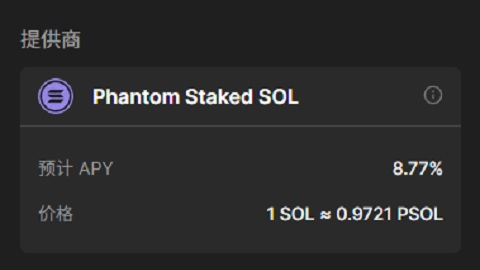

# Solana/经济系统/质押

对于无力独自承担验证者节点运行成本的用户, solana 提供了质押机制, 为持币者提供获取通胀收入的机会.

## 什么是质押

所谓质押, 本质上是一种权益委托. 由于运行验证者节点对普通用户来说难度较高, 许多用户会选择将手中的 sol 委托给某个验证者. 验证者获得通胀奖励后, 会根据用户所持有的"权益证明"将奖励分发给用户.

## 技术实现

如前所述, 验证者只需记录用户权益并分配奖励, 因此并没有"官方"的质押程序. 不同验证者可以自行开发质押程序, 并采用不同的底层技术实现.

一种最直观的做法是, 用户将 sol 存入某个链上程序, 程序记录用户的账户地址和存入的 sol. 当验证者获得奖励后, 根据链上数据按比例将奖励转账给用户. 这种方式效率较低, 但在区块链早期的矿池中曾被广泛采用. 另一个问题是转账需要消耗大量手续费, 可能用户的收益还不够支付一次转账的费用.

目前主流做法是: 当用户存入 sol 时, 链上程序会发放一定数量的"权益代币". 当验证者获得通胀奖励时, 会将获得的 sol 存入链上程序的权益池, 这会使用户手中的权益代币价格上升. 当用户准备赎回质押资产时, 只需卖出手中的权益代币, 即可取回 sol 本金及利息. 用户不仅可以将权益代币卖给链上程序, 还可以转账或出售给其他用户.

## 选择质押池

Solana 支持多种钱包, 大多数钱包都支持质押功能. 常见的钱包包括:

- Phantom: 非常受欢迎的 solana 钱包, 支持质押和管理 sol 代币.
- Sollet: 一个开源的 solana 钱包.
- Solflare: 另一款常用的 solana 钱包, 支持质押和代币管理.
- ...

一般来说, 您只需使用上述钱包, 即可在主界面找到质押入口. 下图为 phantom 钱包的质押页面, 显示预期年化收益率为 8.77%. 但作者对该数据有所疑问, 因为目前 solana 的名义通胀率约为 4.3%, 全网质押率约 80%, 理论上质押者能获得的最大通胀收益率为 5.375%. 即使加上 phantom 的额外奖励(如手续费, 优先手续费和交易重排序奖励, 即 MEV), 粗略估算最高也只能达到 6%~7%, 很难达到 8.77%.

> MEV(最大可提取价值)是指矿工, 验证者或其他区块链参与者通过重新排序, 包含或排除区块内交易, 从而在区块奖励和交易费用之外获得的额外利润. 最初称为"矿工可提取价值"(Miner Extractable Value), 随着其在不同区块链生态系统中的广泛应用, 演变为"最大可提取价值".

事实上, 我查阅了目前几个最大质押池的收益率, 发现大多数都在 6%~7% 左右. 截至 2025 年 9 月 1 日, 部分大池数据如下:

- [Binance](https://www.binance.com/de/solana-staking): 约 5.88%
- [Jito](https://jito.network/): 约 6.73%
- [Jpool](https://jpool.one/): 约 9%, 该池表现远超平均值
- [Marinade Finance](https://marinade.finance/): 约 7.04%
- [Phantom](https://phantom.app/): 约 8.77%
- [Solblaze](https://stake.solblaze.org/app/): 约 7.02%
- ... ...

目前我尚未找到 phantom 钱包超出常规的收益率的合理解释, 有机会会尝试详细分析 8.77% 这一数字, 但目前还是专注于本文内容.

## 分散风险

为降低风险, 建议将 sol 分散质押到多个验证者池. 这不仅可以减少单一验证者节点出现问题时的风险, 还能通过不同池的奖励最小化收益波动.

请注意, 您质押资产的安全性完全取决于验证者提供的质押程序. 质押程序可能存在漏洞, 甚至被恶意植入后门, 因此选择有良好声誉和高透明度的验证者非常重要.

如果您对 solana 质押感兴趣, 建议先小规模试水, 逐步积累经验, 再逐步扩大质押规模. 在区块链网络中, 谨慎行事总是明智的.
