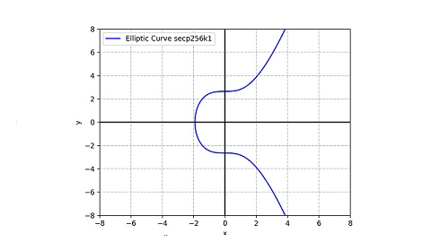

# Solana/私钥, 公钥与地址/私钥的密码学解释(二)

在我们深入探讨 solana 的私钥之前, 首先需要了解一种称为"公私钥密码学"的技术. 这是一种被广泛应用于现代信息安全领域的核心技术, 也是 solana 安全运行的基础. 公私钥密码学, 也被称为"非对称加密", 是一种基于数学算法的加密方法. 其核心在于使用一对密钥: 公钥和私钥.

**公钥**

- 公钥是可以公开使用的密钥, 它的主要作用是加密数据或验证签名.
- 有了公钥, 其他人可以安全地加密信息或对你的数据进行认证.

**私钥**

- 私钥是只有你一个人知道的密钥, 它的主要作用是解密信息或创建签名.
- 如果别人用你的公钥加密的数据, 只有你才能用你的私钥来解开并读取内容.

公私钥密码学的数学基础可以追溯到 20 世纪 70 年代. 最早的尝试之一是 diffie 和 hellman 在 1976 年提出的 "关键密钥交换协议", 但当时并没有广泛应用于实际系统. 随后, rsa 加密算法在 1977 年由 ron rivest, adi shamir 和 len adleman 提出, 成为公私钥密码学的经典方案. 该方案基于数论中的大质数分解难题, 被认为是安全的加密方法之一. 椭圆曲线密码学则是 rsa 的一种替代方案, 其优势在于使用更短的密钥长度即可达到相同的安全水平, 它的数学基础是椭圆曲线离散对数问题.

得益于比特币的发展, 比特币所采用的 secp256k1 椭圆曲线以及 ecdsa 签名算法在全球变得广为人知, 并产生了非常巨大的影响: 包括 ethereum, ckb 等众多区块链项目在内, 都采用了和比特币相同的密码学算法. 但 solana 在这方面有点不一样, 它采用的是一种新型的椭圆曲线数字签名算法, 其曲线名称 ed25519, 签名算法为 eddsa. 要理解这方面的改变, 我们需要先了解 secp256k1 椭圆曲线的劣势, 而要理解它的劣势, 我们需要首先了解它是如何工作的.

因此, 我们将首先跳脱到 solana 之外, 我们将首先聚焦在比特币采用的 secp256k1 + ecdsa 密码学算法上. 提示:

| 区块链 | 椭圆曲线  | 签名算法 |
| ------ | --------- | -------- |
| 比特币 | secp256k1 | ecdsa    |
| solana | ed25519   | eddsa    |

## 比特币标准曲线

Secp256k1 是比特币采用的标准椭圆曲线, 基于 koblitz 曲线(y² = x³ + ax + b). 其参数与美国安全局推荐使用的 p256 类似, 但存在细微修改. 其表达式为

```txt
y² = x³ + 7
```

在实数域下, 它的图像是一个上下对称的曲线.



> 您只需要知道 P-256 是另一类被广泛使用的椭圆曲线, secp256k1 与其的区别只有参数不同.

在椭圆曲线的计算中使用的数字不是我们常规认知中的数字, 而是一种在数论中称为"有限域"的数字. "有限域"的前提是"域", "域"的前身是"环", 而要了解"环", 又要求我们首先理解"群". 这些都是代数学里的基本结构, 但对非数学专业的普通人来说还是挺抽象的.

**群**

数学里面的群(G, group)是由集合和二元运算(用符号 + 表示)构成的, 符合以下四个群公理的数学结构. 群公理的四个性质如下:

0. 加法封闭性: 对于群中的任意两个元素进行运算后, 结果仍然属于该群.
0. 加法结合律: 群中的运算满足结合律, 即对于群中的任意三个元素进行运算, 先计算前两个元素的运算结果, 然后再与第三个元素进行运算, 结果应该与先计算后两个元素的运算结果再与第三个元素进行运算的结果相同.
0. 加法单位元: 群中存在一个特殊的元素, 称为单位元, 对于群中的任意元素 a, 运算 a 与单位元的结果等于元素 a 本身, 即 a + e = e + a = a, 其中 e 表示单位元素.
0. 加法逆元素: 群中的每个元素都有一个逆元素, 对于群中的任意元素 a, 存在一个元素 b, 使得 a + b = b + a = e, 其中 e 表示单位元.

如果我们添加第五条要求:

0. 加法交换律: a + b = b + a.

那么这个群就是**阿贝尔群**或**交换群**.

例: 整数集 Z 是一个阿贝尔群. 自然数集 N 不是一个群, 因为它不满足第四条群公理.

一个有限群 G 的元素个数称为群的阶(order). 一个群元素 P 的阶为最小的整数 k 使得 kP = O(k 个 P 进行群运算, O 为单位元)称为 P 的阶. P 的阶一定整除群的阶. 如果一个元素 P 的阶等于群的阶, 则 P 是 G 的一个生成元, 且 G = {P, 2P, ...} 是一个循环群(cyclic group).

**环**

环(Z, ring)在群的基础上多定义了一个群运算 ×(乘法).

0. 乘法封闭性: 对于环中的任意两个元素进行乘法运算后, 结果仍然属于该环.
0. 乘法结合律: 环中的乘法运算满足结合律, 即对于环中的任意三个元素进行乘法运算, 先计算前两个元素的乘法结果, 然后再与第三个元素进行乘法运算, 结果应该与先计算后两个元素的乘法结果再与第三个元素进行乘法运算的结果相同.
0. 乘法分配律: 环中的乘法运算对于加法运算满足左分配律和右分配律, 即对于环中的任意三个元素 a, b, c, 有 a * (b + c) = a * b + a * c 和 (b + c) * a = b * a + c * a.

**域**

域(F, Field)是一种代数结构, 由一个集合和两个二元运算(加法和乘法)组成. 域满足环的所有条件, 并且具有以下额外性质:

0. 乘法单位元: 域中存在一个特殊的元素, 称为乘法单位元素, 对于域中的任意元素 a, 乘法 a 与乘法单位元素的结果等于元素 a 本身, 即 a * 1 = 1 * a = a, 其中 1 表示乘法单位元素.
0. 乘法逆元素: 域中的每个非零元素都有一个乘法逆元素, 对于域中的任意非零元素 a, 存在一个元素 b, 使得 a * b = b * a = 1, 其中 1 表示乘法单位元素.

例: 整数集 Z 构成一个环但不构成域. 有理数集, 实数集和复数集均构成域.

**有限域**

有限域(finite field)或伽罗瓦域是包含有限个元素的域. 与其他域一样, 有限域是进行加减乘除运算都有定义并且满足特定规则的集合. 有限域最常见的例子是当 p 为素数时, 整数对 p 取模.

例: 当素数 p 为 23 时, 求以下素数有限域算式的值.

- 12 + 20
- 8 * 9
- 1 / 8

答:

- 12 + 20 = 32 % 23 = 9
- 8 * 9 = 72 % 23 = 3
- 由于 3 * 8 = 24 % 23 = 1, 因此 1 / 8 = 3

下面我们使用 python 代码实现一个素数有限域. 客观来讲, 它十分类似我们日常生活中使用的整数, 但区别在于我们需要对所有计算结果进行取模. 下面的代码拷贝自 [pabtc](https://github.com/mohanson/pabtc) 项目, 您可以使用 `pip install pabtc` 来获取这份代码.

```py
import typing


class Fp:
    # Galois field. In mathematics, a finite field or Galois field is a field that contains a finite number of elements.
    # As with any field, a finite field is a set on which the operations of multiplication, addition, subtraction and
    # division are defined and satisfy certain basic rules.
    #
    # https://www.cs.miami.edu/home/burt/learning/Csc609.142/ecdsa-cert.pdf
    # Don Johnson, Alfred Menezes and Scott Vanstone, The Elliptic Curve Digital Signature Algorithm (ECDSA)
    # 3.1 The Finite Field Fp

    p = 0

    def __init__(self, x: int) -> None:
        self.x = x % self.p

    def __repr__(self) -> str:
        return f'Fp(0x{self.x:064x})'

    def __eq__(self, data: typing.Self) -> bool:
        assert self.p == data.p
        return self.x == data.x

    def __add__(self, data: typing.Self) -> typing.Self:
        assert self.p == data.p
        return self.__class__(self.x + data.x)

    def __sub__(self, data: typing.Self) -> typing.Self:
        assert self.p == data.p
        return self.__class__(self.x - data.x)

    def __mul__(self, data: typing.Self) -> typing.Self:
        assert self.p == data.p
        return self.__class__(self.x * data.x)

    def __truediv__(self, data: typing.Self) -> typing.Self:
        return self * data ** -1

    def __pow__(self, data: int) -> typing.Self:
        return self.__class__(pow(self.x, data, self.p))

    def __pos__(self) -> typing.Self:
        return self.__class__(self.x)

    def __neg__(self) -> typing.Self:
        return self.__class__(self.p - self.x)

    @classmethod
    def nil(cls) -> typing.Self:
        return cls(0)

    @classmethod
    def one(cls) -> typing.Self:
        return cls(1)
```

使用方式如下.

```py
Fp.p = 23
assert Fp(12) + Fp(20) == Fp(9)
assert Fp(8) * Fp(9) == Fp(3)
assert Fp(8) ** -1 == Fp(3)
```

您可能注意到了, 有限域的除法是一个特殊情况. 当我们试图求 `a / b` 时, 我们实际上需要求的是 `a * b⁻¹`. 根据费马小定理(Fermat's little theorem), bᵖ⁻¹ = 1 (mod p), 因此有 b * bᵖ⁻²  = 1 (mod p), 因此 b⁻¹ = bᵖ⁻².

我们已经了解了素数有限域里的四则运算. 这真是太棒了! 因为椭圆曲线密码学实际上就是一种基于素数有限域进行计算的技术. 对于椭圆曲线本身, 它表示为一类方程:

```txt
y² = x³ + ax + b
```

其中, x, y, a, b 都位于一个素数有限域中. 对于比特币密码学算法 secp256k1 而言, 该素数等于

```py
# Equals to 2**256 - 2**32 - 2**9 - 2**8 - 2**7 - 2**6 - 2**4 - 1
P = 0xfffffffffffffffffffffffffffffffffffffffffffffffffffffffefffffc2f
```

我们继续使用 python 来实现 secp256k1 方程:

```py
# Prime of finite field.
P = 0xfffffffffffffffffffffffffffffffffffffffffffffffffffffffefffffc2f

class Fq(Fp):
    p = P

A = Fq(0)
B = Fq(7)


class Pt:

    def __init__(self, x: Fq, y: Fq) -> None:
        if x != Fq(0) or y != Fq(0):
            assert y ** 2 == x ** 3 + A * x + B
        self.x = x
        self.y = y
```

例: 有如下 (x, y), 请判断其是否位于 secp256k1 曲线上.

```py
import pabtc

x = pabtc.secp256k1.Fq(0xc6047f9441ed7d6d3045406e95c07cd85c778e4b8cef3ca7abac09b95c709ee5)
y = pabtc.secp256k1.Fq(0x1ae168fea63dc339a3c58419466ceaeef7f632653266d0e1236431a950cfe52a)
```

答:

```py
assert y ** 2 == x ** 3 + A * x + B
```

因此 (x, y) 位于 secp256k1 上.

仅仅知道一个点是否位于椭圆曲线上还远远不够, 我们需要让椭圆曲线上的点构成一个加法群. 为了完成这个目的, 规定椭圆曲线上给定两个不同的点 p 和 q, 其加法 r = p + q, 规则如下:

- 当 p == -q 时, p(x₁, y₁) + q(x₂, y₂) = r(x₃, y₃), r 被称为单位元, 其中

```txt
x₃ = 0
y₃ = 0
```

- 当 p == +q 时, p(x₁, y₁) + q(x₂, y₂) = r(x₃, y₃), 其中

```txt
x₃ = ((3 * x₁² + a) / (2 * y₁))² - x * x₁
y₃ = ((3 * x₁² + a) / (2 * y₁)) * (x₁ - x₃) - y₁
```

- 当 p != ±q 时, p(x₁, y₁) + q(x₂, y₂) = r(x₃, y₃), 其中

```txt
x₃ = ((y₂ - y₁) / (x₂ - x₁))² - x₁ - x₂
y₃ = ((y₂ - y₁) / (x₂ - x₁)) * (x₁ - x₃) - y₁
```

在定义了加法之后, 我们可以定义标量乘法. 给定一个点 p 以及标量 k, 则 p * k 数值上等于 k 个 p 相加的和. 椭圆曲线上的乘法可以分解为一系列的 double 和 add 操作. 例如, 我们要运算 151 * p, 直观上我们会认为要进行 150 次点相加运算, 但可以进行优化. 151 可以表示为二进制格式 10010111:

```txt
151 = 1 * 2⁷ + 0 * 2⁶ + 0 * 2⁵ + 1 * 2⁴ + 0 * 2³ + 1 * 2² + 1 * 2¹ + 1 * 2⁰
```

我们从 10010111 的最低比特位开始, 如果为 1, 则结果加 p; 如果为 0, 令 p = 2p. 相关 python 代码如下所示:

```py
def bits(n):
    # Generates the binary digits of n, starting from the least significant bit.
    while n:
        yield n & 1
        n >>= 1

def double_and_add(n, x):
    # Returns the result of n * x, computed using the double and add algorithm.
    result = 0
    addend = x
    for bit in bits(n):
        if bit == 1:
            result += addend
        addend *= 2
    return result
```

最后, 我们人为规定一个特殊点, 叫做生成点 g, 椭圆曲线上的任意点都可以表示为 g 与一个标量 k 的乘积.

```py
G = Pt(
    Fq(0x79be667ef9dcbbac55a06295ce870b07029bfcdb2dce28d959f2815b16f81798),
    Fq(0x483ada7726a3c4655da4fbfc0e1108a8fd17b448a68554199c47d08ffb10d4b8),
)
```

椭圆曲线上的点是有限个数的, 这个数量被称作椭圆曲线的阶. 标量 k 的取值必须小于这个数字, 对于 secp256k1 来说, 这个值为

```py
# The order n of G.
N = 0xfffffffffffffffffffffffffffffffebaaedce6af48a03bbfd25e8cd0364141
```

上面这个标量 k 就是所谓的 secp256k1 私钥, 而生成点与 k 的乘积, 即 g * k 表示 secp256k1 公钥. 从私钥计算公钥是十分容易的, 而想从公钥计算私钥是相当困难的.

最终, 我们得到完整的 secp256k1 代码如下.

```py
# Prime of finite field.
P = 0xfffffffffffffffffffffffffffffffffffffffffffffffffffffffefffffc2f
# The order n of G.
N = 0xfffffffffffffffffffffffffffffffebaaedce6af48a03bbfd25e8cd0364141


class Fq(Fp):

    p = P

    def __repr__(self) -> str:
        return f'Fq(0x{self.x:064x})'


class Fr(Fp):

    p = N

    def __repr__(self) -> str:
        return f'Fr(0x{self.x:064x})'


A = Fq(0)
B = Fq(7)


class Pt:

    def __init__(self, x: Fq, y: Fq) -> None:
        if x != Fq(0) or y != Fq(0):
            assert y ** 2 == x ** 3 + A * x + B
        self.x = x
        self.y = y

    def __repr__(self) -> str:
        return f'Pt({self.x}, {self.y})'

    def __eq__(self, data: typing.Self) -> bool:
        return all([
            self.x == data.x,
            self.y == data.y,
        ])

    def __add__(self, data: typing.Self) -> typing.Self:
        # https://www.cs.miami.edu/home/burt/learning/Csc609.142/ecdsa-cert.pdf
        # Don Johnson, Alfred Menezes and Scott Vanstone, The Elliptic Curve Digital Signature Algorithm (ECDSA)
        # 4.1 Elliptic Curves Over Fp
        x1, x2 = self.x, data.x
        y1, y2 = self.y, data.y
        if x1 == Fq(0) and y1 == Fq(0):
            return data
        if x2 == Fq(0) and y2 == Fq(0):
            return self
        if x1 == x2 and y1 == +y2:
            sk = (x1 * x1 + x1 * x1 + x1 * x1 + A) / (y1 + y1)
            x3 = sk * sk - x1 - x2
            y3 = sk * (x1 - x3) - y1
            return Pt(x3, y3)
        if x1 == x2 and y1 == -y2:
            return I
        sk = (y2 - y1) / (x2 - x1)
        x3 = sk * sk - x1 - x2
        y3 = sk * (x1 - x3) - y1
        return Pt(x3, y3)

    def __sub__(self, data: typing.Self) -> typing.Self:
        return self + data.__neg__()

    def __mul__(self, k: Fr) -> typing.Self:
        # Point multiplication: Double-and-add
        # https://en.wikipedia.org/wiki/Elliptic_curve_point_multiplication
        n = k.x
        result = I
        addend = self
        while n:
            b = n & 1
            if b == 1:
                result += addend
            addend = addend + addend
            n = n >> 1
        return result

    def __truediv__(self, k: Fr) -> typing.Self:
        return self.__mul__(k ** -1)

    def __pos__(self) -> typing.Self:
        return Pt(self.x, +self.y)

    def __neg__(self) -> typing.Self:
        return Pt(self.x, -self.y)


# Identity element
I = Pt(
    Fq(0),
    Fq(0),
)
# Generator point
G = Pt(
    Fq(0x79be667ef9dcbbac55a06295ce870b07029bfcdb2dce28d959f2815b16f81798),
    Fq(0x483ada7726a3c4655da4fbfc0e1108a8fd17b448a68554199c47d08ffb10d4b8),
)
```

作为本小节的结束, 我将对还在听课的同学布置最后一道课堂作业.

例: 已知比特币私钥为 0x5f6717883bef25f45a129c11fcac1567d74bda5a9ad4cbffc8203c0da2a1473c, 求公钥.

答:

```py
import pabtc

prikey = pabtc.secp256k1.Fr(0x5f6717883bef25f45a129c11fcac1567d74bda5a9ad4cbffc8203c0da2a1473c)
pubkey = pabtc.secp256k1.G * prikey
assert(pubkey.x.x == 0xfb95541bf75e809625f860758a1bc38ac3c1cf120d899096194b94a5e700e891)
assert(pubkey.y.x == 0xc7b6277d32c52266ab94af215556316e31a9acde79a8b39643c6887544fdf58c)
```

## 比特币签名与验签

在数字化世界中, 如何在不泄露密钥的前提下验证他人身份, 一直是加密学领域的终极难题. 传统的口令和证书系统虽然安全, 但易受破解; 而公私钥体系则凭借强大的数学基础, 为数字信任提供了新的可能. 基于椭圆曲线 secp256k1 的 ecdsa 签名算法不仅能够证明信息的完整性, 更重要的是能够确保发送该信息的是身份持有者.

其签名和验证的过程包括以下几个步骤:

**签名**

0. 使用哈希函数(例如 sha256)对信息进行哈希处理, 得到信息摘要 m.
0. 从 [1, n-1] 范围内选择一个随机整数 k.
0. 计算点 g * k 并将结果标记为 R. R 的 x 坐标记为 r. 如果 r 等于 0, 则为 k 选择不同的值并重复该过程.
0. 计算 s = k⁻¹(m + r * prikey) mod n 的值, 其中 k⁻¹ 是 k mod n 的乘法逆元. 如果 s 等于 0, 则为 k 选择不同的值并重复该过程.
0. 消息的数字签名由 (r, s) 对组成.

**验证**

0. 使用相同的哈希函数对收到的信息进行哈希处理, 得到信息摘要 m.
0. 检查签名值 r 和 s 是否在 [1, n-1] 范围内. 如果不在, 则签名无效.
0. 计算值 a = m * s⁻¹ mod n 和 b = r * s⁻¹ mod n, 其中 s⁻¹ 是 s mod n 的乘法逆元.
0. 计算点 R = g * a + pubkey * b. 如果 R 等于无穷远处的点, 则签名无效.
0. 如果 R 的 x 坐标等于 r, 则签名有效, 否则无效.

我们实现代码如下:

```py
import itertools
import random
import typing
import pabtc.secp256k1


def sign(prikey: pabtc.secp256k1.Fr, m: pabtc.secp256k1.Fr) -> typing.Tuple[pabtc.secp256k1.Fr, pabtc.secp256k1.Fr, int]:
    # https://www.secg.org/sec1-v2.pdf
    # 4.1.3 Signing Operation
    for _ in itertools.repeat(0):
        k = pabtc.secp256k1.Fr(random.randint(0, pabtc.secp256k1.N - 1))
        R = pabtc.secp256k1.G * k
        r = pabtc.secp256k1.Fr(R.x.x)
        if r.x == 0:
            continue
        s = (m + prikey * r) / k
        if s.x == 0:
            continue
        v = 0
        if R.y.x & 1 == 1:
            v |= 1
        if R.x.x >= pabtc.secp256k1.N:
            v |= 2
        return r, s, v


def verify(pubkey: pabtc.secp256k1.Pt, m: pabtc.secp256k1.Fr, r: pabtc.secp256k1.Fr, s: pabtc.secp256k1.Fr) -> bool:
    # https://www.secg.org/sec1-v2.pdf
    # 4.1.4 Verifying Operation
    a = m / s
    b = r / s
    R = pabtc.secp256k1.G * a + pubkey * b
    assert R != pabtc.secp256k1.I
    return r == pabtc.secp256k1.Fr(R.x.x)


def pubkey(m: pabtc.secp256k1.Fr, r: pabtc.secp256k1.Fr, s: pabtc.secp256k1.Fr, v: int) -> pabtc.secp256k1.Pt:
    # https://www.secg.org/sec1-v2.pdf
    # 4.1.6 Public Key Recovery Operation
    assert v in [0, 1, 2, 3]
    if v & 2 == 0:
        x = pabtc.secp256k1.Fq(r.x)
    else:
        x = pabtc.secp256k1.Fq(r.x + pabtc.secp256k1.N)
    z = x * x * x + pabtc.secp256k1.A * x + pabtc.secp256k1.B
    y = z ** ((pabtc.secp256k1.P + 1) // 4)
    if v & 1 != y.x & 1:
        y = -y
    R = pabtc.secp256k1.Pt(x, y)
    return (R * s - pabtc.secp256k1.G * m) / r
```

例: 有消息 0x72a963cdfb01bc37cd283106875ff1f07f02bc9ad6121b75c3d17629df128d4e, 请使用私钥 0x01 对其进行签名和验签.

答:

```py
import pabtc

prikey = pabtc.secp256k1.Fr(1)
pubkey = pabtc.secp256k1.G * prikey
m = pabtc.secp256k1.Fr(0x72a963cdfb01bc37cd283106875ff1f07f02bc9ad6121b75c3d17629df128d4e)

r, s, _ = pabtc.ecdsa.sign(prikey, m)
assert pabtc.ecdsa.verify(pubkey, m, r, s)
```

再次提醒! 上文中所有出现的代码都公布在 github 上, 这样您可以随时查看, 参考和使用. 如果您有任何问题或需要进一步的帮助, 请随时告诉我!

- secp256k1: <https://github.com/mohanson/pabtc/blob/master/pabtc/secp256k1.py>
- ecdsa: <https://github.com/mohanson/pabtc/blob/master/pabtc/ecdsa.py>
