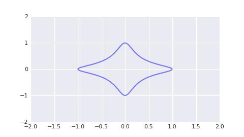
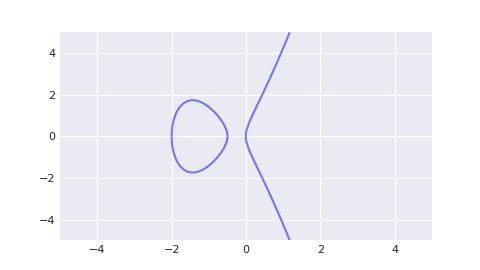

# Solana/私钥, 公钥与地址/私钥的密码学解释(六)

Ed25519 是近些年来最火热的 secp256k1 替换品. 它的发展离不开一个意外. 25519 系列曲线自 2005 年发表以来, 在工业界原本一直处于无人问津的存在, 但转折发生在 2013 年, 斯诺登曝光[棱镜计划](https://en.wikipedia.org/wiki/PRISM)后, 人们发现美国安全局力推的 p-256 曲线可能存在算法后门. 在此之后, 工业界开始尝试使用 25519 系列曲线来代替 p-256 系列曲线.

> Secp256k1 曲线属于类 p-256 曲线, 相较原版只有参数有少量修改.

目前来看, Ed25519 曲线的推广和应用无疑是十分成功的. 传统 web2 产品, 例如 github 和 binance, 都支持 ed25519 作为其 api 权限验证算法. 新兴的 web3 产品, 例如 solana, 也采用 ed25519 作为其核心签名算法.

## Ed25519 曲线

Ed25519 是一类**扭曲爱德华兹曲线**(ax² + y² = 1 + d * x² * y²), 其表达式为

```txt
-x² + y² = 1 - (121665 / 121666) * x² * y²
```

它和 secp256k1 一样基于素数域, 但其采用的素数 p 为 `2²⁵⁵ - 19`. 如果将该素数以 16 进制表示, 会发现其以 `ed` 结尾, 同时该椭圆曲线的阶的 16 进制表示同样以 `ed` 结尾. 因此 ed25519 既包含了作者爱德华兹的名字, 也隐含了该曲线的素数域和阶, 不得不说作者真是个取名小天才. 我等若是有作者一半的资质, 就不必为取变量名而烦恼了.

所谓扭曲爱德华兹曲线, 是指在**爱德华兹曲线**(x² + y² = 1 + d * x² * y²)上增加了常数项 a, 会因此"扭曲"了爱德华兹曲线. 原版的爱德华兹曲线是个非常漂亮的二元二次曲线, 例如当 d = -30 时, 爱德华兹曲线图形如下所示.



由于 ed25519 曲线的图形十分的不直观, 因此我们以 a = 8, d = 4 时的扭曲爱德华兹曲线做为替代图例, 其图形如下所示.


爱德华兹曲线是一种另类的椭圆曲线. 它在形式上简化了椭圆曲线上的点的加法运算, 使得实现更容易且计算效率更高.

所有扭曲爱德华兹曲线都与蒙哥马利曲线(b * y² = x³ + a * x² + x)双向有理等价, ed25519 对应的蒙哥马利曲线称作 curve25519, 其表达式如下. 其图像同样非常不直观, 因此此处我们给出 a = 2.5, b=0.25 的替代图像.

```txt
y² = x³ + 486662 * x² + x
```



对于这些不同的椭圆曲线类型, 您可以这么理解: 椭圆曲线的一般形式是 y² = x³ + ax + b, 在 1985 年由科布利茨和米勒分别独立提出. 在 1987 年, 蒙哥馬利证明了蒙哥马利曲线与椭圆曲线的一般形式双向有理等价, 因此蒙哥马利曲线也被称作椭圆曲线的蒙哥马利表示. 之后在 2005 年, 爱德华兹证明了扭曲爱德华兹曲线与蒙哥馬利曲线双向有理等价, 因此扭曲爱德华兹曲线也被称作椭圆曲线的扭曲爱德华兹表示.

例: 请判断下面的点是否位于 ed25519 上.

- `x = 0x1122e705f69819df8042c3a34d5294668f25830f41e9b585b2aa6b05ef4cc7e2`
- `y = 0x2a619802432fe95214ac6fed9d01dd149d197f1202e8c2698caab03831b8f2ee`

答: ed25519 与 secp256k1 的代码实现非常类似, 您可以在 [pxsol.ed25519](https://github.com/mohanson/pxsol/blob/master/pxsol/ed25519.py) 中找到它的源码. 或者使用 `pip install pxsol` 安装完整的 solana 包.

```py
import pxsol

x = pxsol.ed25519.Fq(0x1122e705f69819df8042c3a34d5294668f25830f41e9b585b2aa6b05ef4cc7e2)
y = pxsol.ed25519.Fq(0x2a619802432fe95214ac6fed9d01dd149d197f1202e8c2698caab03831b8f2ee)

assert pxsol.ed25519.A * x * x + y * y == pxsol.ed25519.Fq(1) + pxsol.ed25519.D * x * x * y * y
```

## Ed25519 点的加法

与 secp256k1 曲线类似, Ed25519 上的点可以构成一个加法群. 规定 ed25519 上给定两个不同的点 p 和 q, 其加法 r = p + q, 规则如下:

```txt
x₃ = (x₁ * y₂ + x₂ * y₁) / (1 + d * x₁ * x₂ * y₁ * y₂)
y₃ = (y₁ * y₂ - a * x₁ * x₂) / (1 - d * x₁ * x₂ * y₁ * y₂)
```

代码实现如下:

```py
A = -Fq(1)
D = -Fq(121665) / Fq(121666)

class Pt:

    def __init__(self, x: Fq, y: Fq) -> None:
        assert A * x * x + y * y == Fq(1) + D * x * x * y * y
        self.x = x
        self.y = y

    def __add__(self, data: typing.Self) -> typing.Self:
        # https://datatracker.ietf.org/doc/html/rfc8032#ref-CURVE25519
        # Points on the curve form a group under addition, (x3, y3) = (x1, y1) + (x2, y2), with the formulas
        #           x1 * y2 + x2 * y1                y1 * y2 - a * x1 * x2
        # x3 = --------------------------,   y3 = ---------------------------
        #       1 + d * x1 * x2 * y1 * y2          1 - d * x1 * x2 * y1 * y2
        x1, x2 = self.x, data.x
        y1, y2 = self.y, data.y
        x3 = (x1 * y2 + x2 * y1) / (Fq(1) + D * x1 * x2 * y1 * y2)
        y3 = (y1 * y2 - A * x1 * x2) / (Fq(1) - D * x1 * x2 * y1 * y2)
        return Pt(x3, y3)
```

我们对比 secp256k1 的加法, 会发现 ed25519 上的加法算法是大幅简化的: 我们不需要额外的逻辑代码来判断 p 是否等于 ±q. 对于计算机而言, 每增加一个分支判断都会大幅度拖累 cpu 的运算速度, 因此 ed25519 曲线上的加法算法相比 secp256k1 是非常高效的.

## Ed25519 点的标量乘法

在拥有加法后我们就能实现标量乘法, 这里不再赘述.

## Ed25519 生成元

我们人为规定一个特殊点, 叫做生成点 g, 椭圆曲线上的任意点都可以表示为 g 与一个标量 k 的乘积.

```py
G = Pt(
    Fq(0x216936d3cd6e53fec0a4e231fdd6dc5c692cc7609525a7b2c9562d608f25d51a),
    Fq(0x6666666666666666666666666666666666666666666666666666666666666658),
)
```

例: 计算 g * 42 的值.

答:

```py
import pxsol

p = pxsol.ed25519.G * pxsol.ed25519.Fr(42)

assert p.x == pxsol.ed25519.Fq(0x5dbe6cc3ccfe19f056f503fd5895e4ca00385a5f109126914b52446017318069)
assert p.y == pxsol.ed25519.Fq(0x4237066783c4352092fdf0de4df92cae7343f40939f32b3e195c834e99321ace)
```
