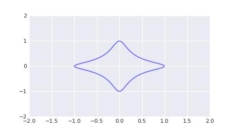
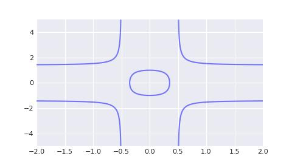
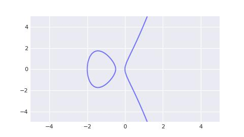

# Solana/私钥, 公钥与地址/私钥的密码学解释(下篇)

Ed25519 是近些年来最火热的 secp256k1 替换品. 它的发展离不开一个意外. 25519 系列曲线自 2005 年发表以来, 在工业界原本一直处于无人问津的存在, 但转折发生在 2013 年, 斯诺登曝光棱镜计划后, 人们发现美国安全局力推的 p256 曲线(secp256k1 属于 p256 曲线系列, 但参数较原版有改动)可能存在算法后门. 在此之后, 工业界开始尝试使用 25519 系列曲线来代替 p256 系列曲线.

> Ed25519 的作者名叫 Harold Edwards, 他使用自己的名字命名了 25519 系列曲线, Edwards Curve, 巧合的是斯诺登的全名叫做 Edward Joseph Snowden.

目前来看, Ed25519 曲线的推广和应用无疑是十分成功的:

- Github. 目前仅允许使用非对称加密算法验证仓库的 push 权限, ed25519 在它支持列表之中.
- Solana. 本书的主要教学对象, 使用 ed25519 为交易签名和验签.
- 币安. 您在申请币安 api 权限的时候会发现币安提供了多种加密签名算法, 而 ed25519 就是其中之一.

## Ed25519

Ed25519 是一类**扭曲爱德华兹曲线**(ax² + y² = 1 + d * x² * y²), 其表达式为

```txt
-x² + y² = 1 - (121665 / 121666) * x² * y²
```

它和 secp256k1 一样基于素数域, 但其采用的素数 p 为 `2²⁵⁵ - 19`. 如果将该素数以 16 进制表示, 会发现其以 `ed` 结尾. 因此 ed25519 既包含了作者 Harold Edwards 的名字, 也包含了素数 p, 不得不说作者真是个取名小天才. 我等若是有作者一半的资质, 就不必为取变量名而烦恼了.

所谓扭曲爱德华兹曲线, 是指在**爱德华兹曲线**(x² + y² = 1 + d * x² * y²)上增加了常数项 a, 会因此"扭曲"了爱德华兹曲线. 原版的爱德华兹曲线是个非常漂亮的二元二次曲线, 例如当 d = -30 时, 爱德华兹曲线图形如下所示.



由于 ed25519 曲线的图形十分的不直观, 因此我们以 a = 8, d = 4 时的扭曲爱德华兹曲线做为替代图例, 其图形如下所示.



爱德华兹曲线是一种另类的椭圆曲线. 它在形式上简化了椭圆曲线上的点的加法运算, 使得实现更容易且计算效率更高.

所有扭曲爱德华兹曲线都与蒙哥马利曲线(b * y² = x³ + a * x² + x)双向有理等价, ed25519 对应的蒙哥马利曲线称作 curve25519, 其表达式如下. 其图像同样非常不直观, 因此此处我们给出 a = 2.5, b=0.25 的替代图像.

```txt
y² = x³ + 486662 * x² + x
```



对于这些不同的椭圆曲线类型, 您可以这么理解: 椭圆曲线的一般形式是 y² = x³ + ax + b, 在 1985 年由科布利茨和米勒分别独立提出. 在 1987 年, 蒙哥馬利证明了蒙哥马利曲线与椭圆曲线的一般形式双向有理等价, 因此蒙哥马利曲线也被称作椭圆曲线的蒙哥马利表示. 之后在 2005 年, 爱德华兹证明了扭曲爱德华兹曲线与蒙哥馬利曲线双向有理等价, 因此扭曲爱德华兹曲线也被称作椭圆曲线的扭曲爱德华兹表示.

例: 请判断下面的点是否位于 ed25519 上.

- `x = 0x1122e705f69819df8042c3a34d5294668f25830f41e9b585b2aa6b05ef4cc7e2`
- `y = 0x2a619802432fe95214ac6fed9d01dd149d197f1202e8c2698caab03831b8f2ee`

答: 这道题好难呀, 我应该怎么办呢? 但所谓的学生, 就是在遇到困难的时候要及时寻找帮助吧! 在我偷偷私信老师后, 老师告诉我**他已经写了一个 ed25519 的曲线实现**, 只需要敲入 `pip install pxsol` 就能获得 ed25519 的代码, 老师真的是太温柔了呢!

```py
import pxsol

x = pxsol.ed25519.Fq(0x1122e705f69819df8042c3a34d5294668f25830f41e9b585b2aa6b05ef4cc7e2)
y = pxsol.ed25519.Fq(0x2a619802432fe95214ac6fed9d01dd149d197f1202e8c2698caab03831b8f2ee)

assert pxsol.ed25519.A * x * x + y * y == pxsol.ed25519.Fq(1) + pxsol.ed25519.D * x * x * y * y
```

## Ed25519 上的加法

与 secp256k1 曲线类似, 我们需要让 ed25519 上的点构成一个加法群. 规定 ed25519 上给定两个不同的点 p 和 q, 其加法 r = p + q, 规则如下:

```txt
x₃ = (x₁ * y₂ + x₂ * y₁) / (1 + d * x₁ * x₂ * y₁ * y₂)
y₃ = (y₁ * y₂ - a * x₁ * x₂) / (1 - d * x₁ * x₂ * y₁ * y₂)
```

代码实现如下.

```py
A = -Fq(1)
D = -Fq(121665) / Fq(121666)

class Pt:

    def __init__(self, x: Fq, y: Fq) -> None:
        assert A * x * x + y * y == Fq(1) + D * x * x * y * y
        self.x = x
        self.y = y

    def __add__(self, data: typing.Self) -> typing.Self:
        # https://datatracker.ietf.org/doc/html/rfc8032#ref-CURVE25519
        # Points on the curve form a group under addition, (x3, y3) = (x1, y1) + (x2, y2), with the formulas
        #           x1 * y2 + x2 * y1                y1 * y2 - a * x1 * x2
        # x3 = --------------------------,   y3 = ---------------------------
        #       1 + d * x1 * x2 * y1 * y2          1 - d * x1 * x2 * y1 * y2
        x1, x2 = self.x, data.x
        y1, y2 = self.y, data.y
        x3 = (x1 * y2 + x2 * y1) / (Fq(1) + D * x1 * x2 * y1 * y2)
        y3 = (y1 * y2 - A * x1 * x2) / (Fq(1) - D * x1 * x2 * y1 * y2)
        return Pt(x3, y3)
```

如果我们对比 secp256k1 的加法, 会发现 ed25519 上的加法算法是大幅简化的: 我们不需要额外的逻辑代码来判断 p 是否等于 ±q. 对于计算机而言, 每增加一个分支判断都会大幅度拖累 cpu 的运算速度, 因此 ed25519 曲线上的加法算法相比 secp256k1 是非常高效的.

与 secp256k1 相似, 在拥有加法后就能实现标量乘法, 这里不再赘述. 最后规定其生成点 g 为如下点.

```py
G = Pt(
    Fq(0x216936d3cd6e53fec0a4e231fdd6dc5c692cc7609525a7b2c9562d608f25d51a),
    Fq(0x6666666666666666666666666666666666666666666666666666666666666658),
)
```

例: 计算 g * 42 的值.

答:

```py
import pxsol

p = pxsol.ed25519.G * pxsol.ed25519.Fr(42)

assert p.x == pxsol.ed25519.Fq(0x5dbe6cc3ccfe19f056f503fd5895e4ca00385a5f109126914b52446017318069)
assert p.y == pxsol.ed25519.Fq(0x4237066783c4352092fdf0de4df92cae7343f40939f32b3e195c834e99321ace)
```

## Ed25519 签名系统

**点的编码**

在 ed25519 中, 我们需要使用到一种特殊的曲线上的点的编码算法. 直观上将, 曲线上的一个点由 x 和 y 两个值组成, 且 x 和 y 都
在 0 <= x,y < p 范围内, 因此我们需要使用 64 个字节来表示它. 但有办法将空间压缩到 32 个字节, 具体方法如下:

0. 由于 y < p, 因此 y 的最高有效位始终为 0.
0. 将 x 的最低有效位复制到 y 的最高有效位上, 并将结果以小端序编码为 32 个字节.

在这种编码方式下, 我们能得知 y 的具体数值以及 x 的奇偶性. 代码实现如下.

```py
def pt_encode(pt: pxsol.ed25519.Pt) -> bytearray:
    # A curve point (x,y), with coordinates in the range 0 <= x,y < p, is coded as follows. First, encode the
    # y-coordinate as a little-endian string of 32 octets. The most significant bit of the final octet is always zero.
    # To form the encoding of the point, copy the least significant bit of the x-coordinate to the most significant bit
    # of the final octet.
    # See https://datatracker.ietf.org/doc/html/rfc8032#section-5.1.2
    n = pt.y.x | ((pt.x.x & 1) << 255)
    return bytearray(n.to_bytes(32, 'little'))
```

**点的解码**

点的解码是点的编码的逆运算. 步骤如下:

0. 首先, 将 32 字节数组解释为小端表示的整数. 此数字的第 255 位是 x 坐标的最低有效位, 表示了 x 值的奇偶性. 只需清除此位即可恢复 y 坐标. 如果结果值 >= p, 则解码失败.
0. 要恢复 x 坐标, 意味着曲线方程 x² = (y² - 1) / (d * y² + 1) 成立. 令 u = y² - 1, v = d * y² + 1, 计算它的候选根 x = (u / v)^((p + 3) / 8).
0. 现在有三种情况:
    1. 如果 x * x == u / v, 不做处理.
    2. 如果 x * x == u / v * -1, 则令 x = x * 2^((p - 1) / 4).
    3. 解码失败, 点不在曲线上.
0. 最后, 确定 x 的奇偶性. 如果奇偶性不一致, 则令 x = -x.

代码实现如下

```py
def pt_decode(pt: bytearray) -> pxsol.ed25519.Pt:
    # Decoding a point, given as a 32-octet string, is a little more complicated.
    # See https://datatracker.ietf.org/doc/html/rfc8032#section-5.1.3
    #
    # First, interpret the string as an integer in little-endian representation. Bit 255 of this number is the least
    # significant bit of the x-coordinate and denote this value x_0. The y-coordinate is recovered simply by clearing
    # this bit. If the resulting value is >= p, decoding fails.
    uint = int.from_bytes(pt, 'little')
    bit0 = uint >> 255
    yint = uint & ((1 << 255) - 1)
    assert yint < pxsol.ed25519.P
    # To recover the x-coordinate, the curve equation implies x^2 = (y^2 - 1) / (d y^2 + 1) (mod p). The denominator is
    # always non-zero mod p.
    y = pxsol.ed25519.Fq(yint)
    u = y * y - pxsol.ed25519.Fq(1)
    v = pxsol.ed25519.D * y * y + pxsol.ed25519.Fq(1)
    w = u / v
    # To compute the square root of (u/v), the first step is to compute the candidate root x = (u/v)^((p+3)/8).
    x = w ** ((pxsol.ed25519.P + 3) // 8)
    # Again, there are three cases:
    # 1. If v x^2 = +u (mod p), x is a square root.
    # 2. If v x^2 = -u (mod p), set x <-- x * 2^((p-1)/4), which is a square root.
    # 3. Otherwise, no square root exists for modulo p, and decoding fails.
    if x*x != w:
        x = x * pxsol.ed25519.Fq(2) ** ((pxsol.ed25519.P - 1) // 4)
        assert x*x == w
    # Finally, use the x_0 bit to select the right square root. If x = 0, and x_0 = 1, decoding fails. Otherwise, if
    # x_0 != x mod 2, set x <-- p - x.  Return the decoded point (x,y).
    assert x != pxsol.ed25519.Fq(0) or not bit0
    if x.x & 1 != bit0:
        x = -x
    return pxsol.ed25519.Pt(x, y)
```

**私钥**

如前所述, Ed25519 的私钥是一个 32 字节的随机数, 通常通过安全的随机数生成器产生. 私钥是用户身份的核心, 需严格保密. 在 Ed25519 的实现中, 私钥并非用于直接签名, 而是通过哈希函数(sha-512)扩展为 64 字节的种子, 其中一部分作为标量用于生成公钥, 另一部分作为签名时的秘密标量. 这种设计增强了私钥的安全性, 防止因直接使用原始私钥而暴露风险.

私钥生成简单, 但其安全性依赖于随机数的质量. 如果随机数可预测, 攻击者可能通过暴力破解或伪造签名来威胁系统. 因此, 使用密码学安全的随机数生成器(如 /dev/urandom 或硬件随机数生成器)是生成私钥的关键.

```py
import secrets

prikey = bytearray(secrets.token_bytes(32))
```

**公钥**

Ed25519 的公钥的长度同样是 32 字节. 32 字节公钥通过以下步骤生成.

0. 使用 sha-512 对 32 字节私钥进行哈希处理, 生成 64 个字节的哈希结果. 只有前 32 个字节用于生成公钥.
0. 清除第一个字节的最低三位, 清除最后一个八位字节的最高位, 并设置最后一个字节的第二高位.
0. 将上述数据解释为小端序整数, 形成秘密标量 a. 执行标量乘法 g * s 并记为 A.
0. 公钥是点 A 的**点的编码**.

```py
def pubkey(prikey: bytearray) -> bytearray:
    assert len(prikey) == 32
    h = hash(prikey)
    a = int.from_bytes(h[:32], 'little')
    a &= (1 << 254) - 8
    a |= (1 << 254)
    a = pxsol.ed25519.Fr(a)
    return pt_encode(pxsol.ed25519.G * a)
```

Ed25519 的公钥生成过程是单向的: 从私钥可以快速计算出公钥, 但从公钥无法反推出私钥, 这种不可逆性是椭圆曲线离散对数问题的核心保障. 公钥的作用是公开身份, 任何人都可以使用公钥来验证签名. 由于 Ed25519 的设计高效, 公钥生成和使用都非常快速, 非常适用于高性能场景.

**签名**

签名是 Ed25519 的核心功能, 用于证明消息的真实性和完整性. 签名过程的输入是私钥(一个 32 字节的数组)和任意大小的消息 m, 签名过程如下:

0. 使用 sha-512 对私钥(32 字节)进行哈希计算. 按照前一节的描述, 从哈希的前半部分构造秘密标量 a, 以及对应的公钥 pubkey. 将哈希摘要的后半部分记为 prefix.
0. 计算 sha-512(prefix + m), 其中 m 是待签名的消息. 将得到的 64 字节哈希解释为一个小端序整数 r.
0. 计算点 g * r, 并对结果进行点的编码, 记为 digest.
0. 计算 sha-512(digest + pubkey + m),  并将得到的 64 字节摘要解释为一个小端序整数 h.
0. 计算 s = r + a * h.
0. 将 digest(32字节)和 s 的小端序编码(32字节; 最后一个字节的最高三位始终为零)连接起来, 形成签名.

```py
def sign(prikey: bytearray, m: bytearray) -> bytearray:
    # The inputs to the signing procedure is the private key, a 32-octet string, and a message M of arbitrary size.
    # See https://datatracker.ietf.org/doc/html/rfc8032#section-5.1.6
    assert len(prikey) == 32
    h = hash(prikey)
    a = int.from_bytes(h[:32], 'little')
    a &= (1 << 254) - 8
    a |= (1 << 254)
    a = pxsol.ed25519.Fr(a)
    A = pxsol.ed25519.G * a
    pubkey = pt_encode(A)
    prefix = h[32:]
    r = pxsol.ed25519.Fr(int.from_bytes(hash(prefix + m), 'little'))
    R = pxsol.ed25519.G * r
    digest = pt_encode(R)
    h = pxsol.ed25519.Fr(int.from_bytes(hash(digest + pubkey + m), 'little'))
    s = r + a * h
    return digest + bytearray(s.x.to_bytes(32, 'little'))
```


**验签**

验签是验证签名的过程, 用于确认消息未被篡改且确实由持有对应私钥的人签署. Ed25519 的验签需要消息 m, 签名 v 和公钥 pubkey, 步骤如下:

0. 先将签名 v 拆分为两个 32 字节数组. 将前半部分记为 digest, 解码为点 r, 将后半部分解码为整数 s. 将公钥 pubkey 解码为点 a. 如果任何解码失败(包括 s 超出范围), 则签名无效.
0. 计算 sha-512(digest + pubkey + m), 并将 64 位字节摘要解释为小端整数 h.
0. 检查是否满足群方程 g * s == r + a * h

```py
def verify(pubkey: bytearray, m: bytearray, g: bytearray) -> bool:
    # Verify a signature on a message using public key.
    # See https://datatracker.ietf.org/doc/html/rfc8032#section-5.1.7
    assert len(pubkey) == 32
    assert len(g) == 64
    A = pt_decode(pubkey)
    digest = g[:32]
    R = pt_decode(digest)
    s = pxsol.ed25519.Fr(int.from_bytes(g[32:], 'little'))
    h = pxsol.ed25519.Fr(int.from_bytes(hash(digest + pubkey + m), 'little'))
    return pxsol.ed25519.G * s == R + A * h
```
