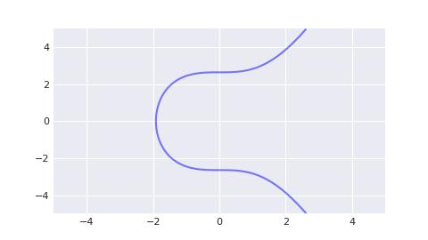

# Solana/私钥, 公钥与地址/私钥的密码学解释(三)

Secp256k1 是比特币采用的标准椭圆曲线, 基于 koblitz 曲线(y² = x³ + ax + b). 其参数与美国安全局推荐使用的 p-256 类似, 但存在细微修改. 其表达式为

```txt
y² = x³ + 7
```

在实数域下, 它的图像是一个上下对称的曲线.



> P-256 是另一类被广泛使用的椭圆曲线, secp256k1 与其的区别只有参数不同.

## Secp256k1 曲线

Secp256k1 实际上是一种基于素数有限域进行计算的技术. 该素数等于:

```py
# Equals to 2**256 - 2**32 - 2**9 - 2**8 - 2**7 - 2**6 - 2**4 - 1
P = 0xfffffffffffffffffffffffffffffffffffffffffffffffffffffffefffffc2f
```

我们可以使用 python 来实现 secp256k1 的方程.

```py
# Prime of finite field.
P = 0xfffffffffffffffffffffffffffffffffffffffffffffffffffffffefffffc2f

class Fq(Fp):
    p = P

A = Fq(0)
B = Fq(7)


class Pt:

    def __init__(self, x: Fq, y: Fq) -> None:
        if x != Fq(0) or y != Fq(0):
            assert y ** 2 == x ** 3 + A * x + B
        self.x = x
        self.y = y
```

例: 有如下 (x, y), 请判断其是否位于 secp256k1 曲线上.

```py
import pabtc

x = pabtc.secp256k1.Fq(0xc6047f9441ed7d6d3045406e95c07cd85c778e4b8cef3ca7abac09b95c709ee5)
y = pabtc.secp256k1.Fq(0x1ae168fea63dc339a3c58419466ceaeef7f632653266d0e1236431a950cfe52a)
```

答:

```py
assert y ** 2 == x ** 3 + A * x + B
```

## Secp256k1 点的加法

椭圆曲线上的点可以构成一个加法群. 规定椭圆曲线上给定两个不同的点 p 和 q, 其加法 r = p + q, 规则如下:

- 当 p == -q 时, p(x₁, y₁) + q(x₂, y₂) = r(x₃, y₃), r 被称为单位元, 其中

```txt
x₃ = 0
y₃ = 0
```

- 当 p == +q 时, p(x₁, y₁) + q(x₂, y₂) = r(x₃, y₃), 其中

```txt
x₃ = ((3 * x₁² + a) / (2 * y₁))² - x * x₁
y₃ = ((3 * x₁² + a) / (2 * y₁)) * (x₁ - x₃) - y₁
```

- 当 p != ±q 时, p(x₁, y₁) + q(x₂, y₂) = r(x₃, y₃), 其中

```txt
x₃ = ((y₂ - y₁) / (x₂ - x₁))² - x₁ - x₂
y₃ = ((y₂ - y₁) / (x₂ - x₁)) * (x₁ - x₃) - y₁
```

## Secp256k1 点的标量乘法

在定义了加法之后, 我们可以定义标量乘法. 给定一个点 p 以及标量 k, 则 p * k 数值上等于 k 个 p 相加的和. 椭圆曲线上的乘法可以分解为一系列的 double 和 add 操作. 例如, 我们要运算 151 * p, 直观上我们会认为要进行 150 次点相加运算, 但可以进行优化. 151 可以表示为二进制格式 10010111:

```txt
151 = 1 * 2⁷ + 0 * 2⁶ + 0 * 2⁵ + 1 * 2⁴ + 0 * 2³ + 1 * 2² + 1 * 2¹ + 1 * 2⁰
```

规定初始结果为 0. 我们从 10010111 的最低比特位开始, 如果为 1, 则结果加 p; 如果为 0, 令 p = 2p. 相关 python 代码如下所示:

```py
def bits(n):
    # Generates the binary digits of n, starting from the least significant bit.
    while n:
        yield n & 1
        n >>= 1

def double_and_add(n, x):
    # Returns the result of n * x, computed using the double and add algorithm.
    result = 0
    addend = x
    for bit in bits(n):
        if bit == 1:
            result += addend
        addend *= 2
    return result
```

## Secp256k1 生成元

我们人为规定一个特殊点, 叫做生成点 g, 椭圆曲线上的任意点都可以表示为 g 与一个标量 k 的乘积.

```py
G = Pt(
    Fq(0x79be667ef9dcbbac55a06295ce870b07029bfcdb2dce28d959f2815b16f81798),
    Fq(0x483ada7726a3c4655da4fbfc0e1108a8fd17b448a68554199c47d08ffb10d4b8),
)
```

## Secp256k1 的阶

椭圆曲线上的点是有限个数的, 这个数量被称作椭圆曲线的阶. 标量 k 的取值必须小于这个数字, 对于 secp256k1 来说, 这个值为

```py
# The order n of G.
N = 0xfffffffffffffffffffffffffffffffebaaedce6af48a03bbfd25e8cd0364141
```

## Secp256k1 完整代码

最终, 我们得到完整的 secp256k1 代码如下. 您可以在 [pabtc.secp256k1](https://github.com/mohanson/pabtc/blob/master/pabtc/secp256k1.py) 中找到这份代码.

```py
# Prime of finite field.
P = 0xfffffffffffffffffffffffffffffffffffffffffffffffffffffffefffffc2f
# The order n of G.
N = 0xfffffffffffffffffffffffffffffffebaaedce6af48a03bbfd25e8cd0364141


class Fq(Fp):

    p = P


class Fr(Fp):

    p = N


A = Fq(0)
B = Fq(7)


class Pt:

    def __init__(self, x: Fq, y: Fq) -> None:
        if x != Fq(0) or y != Fq(0):
            assert y ** 2 == x ** 3 + A * x + B
        self.x = x
        self.y = y

    def __add__(self, data: typing.Self) -> typing.Self:
        # https://www.cs.miami.edu/home/burt/learning/Csc609.142/ecdsa-cert.pdf
        # Don Johnson, Alfred Menezes and Scott Vanstone, The Elliptic Curve Digital Signature Algorithm (ECDSA)
        # 4.1 Elliptic Curves Over Fp
        x1, x2 = self.x, data.x
        y1, y2 = self.y, data.y
        if x1 == Fq(0) and y1 == Fq(0):
            return data
        if x2 == Fq(0) and y2 == Fq(0):
            return self
        if x1 == x2 and y1 == +y2:
            sk = (x1 * x1 + x1 * x1 + x1 * x1 + A) / (y1 + y1)
            x3 = sk * sk - x1 - x2
            y3 = sk * (x1 - x3) - y1
            return Pt(x3, y3)
        if x1 == x2 and y1 == -y2:
            return I
        sk = (y2 - y1) / (x2 - x1)
        x3 = sk * sk - x1 - x2
        y3 = sk * (x1 - x3) - y1
        return Pt(x3, y3)

    def __eq__(self, data: typing.Self) -> bool:
        return all([
            self.x == data.x,
            self.y == data.y,
        ])

    def __mul__(self, k: Fr) -> typing.Self:
        # Point multiplication: Double-and-add
        # https://en.wikipedia.org/wiki/Elliptic_curve_point_multiplication
        n = k.x
        result = I
        addend = self
        while n:
            b = n & 1
            if b == 1:
                result += addend
            addend = addend + addend
            n = n >> 1
        return result

    def __neg__(self) -> typing.Self:
        return Pt(self.x, -self.y)

    def __repr__(self) -> str:
        return json.dumps(self.json())

    def __sub__(self, data: typing.Self) -> typing.Self:
        return self + data.__neg__()

    def __truediv__(self, k: Fr) -> typing.Self:
        return self.__mul__(k ** -1)

    def __pos__(self) -> typing.Self:
        return Pt(self.x, +self.y)

    def json(self) -> typing.Self:
        return {
            'x': self.x.json(),
            'y': self.y.json(),
        }


# Identity element
I = Pt(
    Fq(0),
    Fq(0),
)
# Generator point
G = Pt(
    Fq(0x79be667ef9dcbbac55a06295ce870b07029bfcdb2dce28d959f2815b16f81798),
    Fq(0x483ada7726a3c4655da4fbfc0e1108a8fd17b448a68554199c47d08ffb10d4b8),
)
```

标量 k 就是所谓的 secp256k1 私钥, 而生成点与 k 的乘积, 即 g * k 表示 secp256k1 公钥. 从私钥计算公钥是十分容易的, 而想从公钥计算私钥是相当困难的.

## 习题

例: 已知比特币私钥为 0x5f6717883bef25f45a129c11fcac1567d74bda5a9ad4cbffc8203c0da2a1473c, 求公钥.

答:

```py
import pabtc

prikey = pabtc.secp256k1.Fr(0x5f6717883bef25f45a129c11fcac1567d74bda5a9ad4cbffc8203c0da2a1473c)
pubkey = pabtc.secp256k1.G * prikey
assert(pubkey.x.x == 0xfb95541bf75e809625f860758a1bc38ac3c1cf120d899096194b94a5e700e891)
assert(pubkey.y.x == 0xc7b6277d32c52266ab94af215556316e31a9acde79a8b39643c6887544fdf58c)
```
