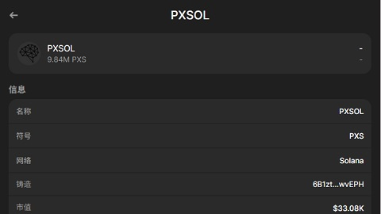

# Solana/在主网发行您的代币/在主网发行您的代币

与在本地网络发行代币的步骤类似, 我们使用以下的代码将代币发行在主网上. 记得切换网络使用 `pxsol.config.current = pxsol.config.mainnet`.

```py
import pxsol

# Switch to mainnet.
pxsol.config.current = pxsol.config.mainnet

you = pxsol.wallet.Wallet(pxsol.core.PriKey.base58_decode('Put your private key here'))
spl = you.spl_create(9, {
    'metadata': {
        'name': 'PXSOL',
        'symbol': 'PXS',
        'uri': 'https://raw.githubusercontent.com/mohanson/pxsol/refs/heads/master/res/pxs.json',
    }
})
print(spl) # 6B1ztFd9wSm3J5zD5vmMNEKg2r85M41wZMUW7wXwvEPH
```

您可以在[浏览器](https://explorer.solana.com/address/6B1ztFd9wSm3J5zD5vmMNEKg2r85M41wZMUW7wXwvEPH)里浏览我刚刚新发行的 pxs 代币.


在发行代币后可以为自己铸造一些初始代币, 例如一亿枚.

```py
import pxsol

pxsol.config.current = pxsol.config.mainnet
you = pxsol.wallet.Wallet(pxsol.core.PriKey.base58_decode('Put your private key here'))
spl = pxsol.core.PubKey.base58_decode('6B1ztFd9wSm3J5zD5vmMNEKg2r85M41wZMUW7wXwvEPH')
you.spl_mint(spl, you, 100000000 * 10 ** 9)
```

完成上述步骤后, 您可以通过钱包工具导入您的代币, 验证代币是否已经生效. 打开钱包, 查看您的代币是否正确显示吧!


