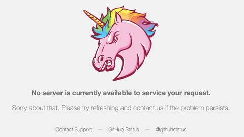

# Solana/在主网发行您的代币/从测试网到主网的迁移

经过数日的奋战, 我们的泰铢币, 泡泡币, 猫猫币以及乌龟币们终于在本地网络上稳定运行, 增发和交易等功能都一切顺利. 现在, 是时候考虑在主网上正式发布您的代币了!

从本地网络到主网, 通常来说我们只需要换一个 url. 这个过程看起来简单, 实际上一点也不复杂.

## 常用环境对比

在 solana 上, 我们常见的环境有三种:

|     网络     |             特点             |          用途          |
| ------------ | ---------------------------- | ---------------------- |
| Localnet     | 本地节点, 速度最快           | 单机测试, 开发初期验证 |
| Devnet       | 公共测试网, 稳定性好         | 合约测试, 代币实验     |
| Mainnet Beta | 主网, 所有真实资产运行的地方 | 真金白银就在这里       |

在 pxsol 里, 使用下面的代码来切换以上三种环境.

```py
import pxsol

pxsol.config.current = pxsol.config.develop # Localnet, 默认
pxsol.config.current = pxsol.config.testnet # Devnet
pxsol.config.current = pxsol.config.mainnet # Mainnet Beta
```

虽然它们的接口基本一致, 但有几个关键差异, 必须留意.

- 本地节点和公共测试网的 sol 是免费的, 但主网上的 sol 是有价值的. 您需要使用真金白银去购买 sol.
- 有许多黑帽和白帽盯着您的合约: 测试时漏掉的权限问题, 到了主网就是真 rug 事故.
- 节点速率限制: 主网节点普遍对 rpc 请求有更高限制, 频繁调用可能导致 ip 被 ban.

## 预估费用

发布一个完整的代币系统, 通常涉及以下操作:

|          操作          |      费用 (约估)      |
| ---------------------- | --------------------- |
| 创建 mint 账户         | 0.002 sol 左右        |
| 创建 metadata 账户     | 0.01 sol 左右(存储多) |
| 创建初始 token account | 0.002 sol 左右        |
| 初始化池子(如 raydium) | 0.01 sol ~ 0.05 sol   |
| 空投合约部署           | 0.5 个 sol 以上       |

所以准备至少 1 sol 预算是基本线. 在 2025 年 7 月, 这约等于 200 美元.

## 速率限制

在主网上发送高频交易请求时, rpc 限速可能是您最大的障碍. Pxsol 默认使用公共 rpc, 其拥有较高的速率限制, 因此您可能会发现当把 pxsol 配置为主网后, 其性能会严重下降: 但这并不是 pxsol 的问题, 而是 pxsol 在规避公共 rpc 的速率限制.

您可以通过以下代码, 自定义 rpc 请求的地址以及每次 rpc 请求后的冷却时间.

```py
import pxsol

pxsol.config.current = pxsol.config.mainnet
pxsol.config.current.rpc.cooldown = 1
pxsol.config.current.rpc.url = 'https://api.mainnet-beta.solana.com'
```

您也可以使用一些付费的节点, 例如 helius 或者 triton one 这种由服务提供商提供的节点, 或者直接搭建自己的主网 fullnode, 成本较高但完全自由.

## 图片与元数据托管建议

没人希望自己的代币图标指向一个 404. 主网运行时, 元数据托管尤其重要. 推荐的做法是使用 arweave 或 ipfs 储存图像, 也可以使用 github, 但使用 github 时偶尔会失效.

> 您成功召唤了 github 独角兽!


