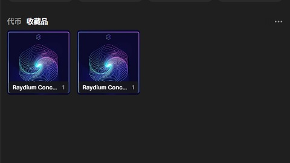
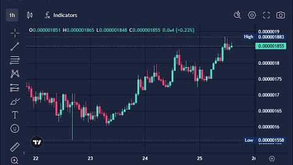

# Solana/在主网发行您的代币/上架去中心化交易所

在区块链世界里, 去中心化交易所(dex)是一种无需信任中介, 直接进行交易的场所. 在传统的中心化交易所(如 binance, coinbase)中, 所有交易都通过交易所的中央服务器进行撮合, 交易所负责资产的保管和转账. 然而, 这样的中心化交易存在信任风险, 一旦交易所被攻击或发生运营问题, 用户的资金就可能遭受损失.

去中心化交易所则不同, 它们基于区块链技术, 通过智能合约和自动做市商算法, 使用户可以在无需中介的情况下直接交易代币. 用户的资金不再存储在中心化平台上, 而是由区块链上的智能合约管理.

在 solana 生态下, [raydium](https://raydium.io/) 是其中最受欢迎的 dex 之一. 本小节会带您一步步了解如何将您的代币上架到 raydium, 并为其提供流动性.

## 将代币上架到 raydium

为了让用户能够交易您的代币, 您首先需要为其创建一个交易池. 交易池是由两种代币组成的流动性池, raydium 采用自动做市商模型来提供流动性.

上一小节我们已经在主网部署了一个 pxs 代币, 现在我准备让它和 sol 进行交易, 因此我需要为这两个代币创建一个池子. 在网页上的操作步骤十分简单:

0. 打开 <https://raydium.io/liquidity-pools/>
0. 点击右上角 create 按钮.
0. 选择 pxs 代币与 sol 代币, 设置交易费率.
0. 设置 pxs 代币的初始价格.
0. 完成!

由于我为自己的代币提供了流动性, raydium 会为我发放 lp token, 这些代币代表我在流动性池中的份额. 您应当妥善保管这些 lp token, 当您试图撤出流动性时需要提供这些 lp token 以取回您的资金.

## 在 raydium 上交易 pxs

一旦流动性池创建完毕, 用户就可以通过 raydium 进行交易. Raydium 使用自动做市商模型, 在没有传统订单簿的情况下通过池子进行代币交换. 用户可以通过 raydium 的界面选择代币对, 输入想要交易的数量, 并通过一个简单的 swap 操作完成交易.

您可以通过[此链接](https://raydium.io/swap/?inputMint=6B1ztFd9wSm3J5zD5vmMNEKg2r85M41wZMUW7wXwvEPH&outputMint=sol)交易 pxs. 我为 pxs 创建了一个很小的交易池, 您可以在此交易池中随意买卖 pxs. 由于流动性较小, 交易可能会产生较大的滑点, 导致交易价格不如预期.

在后续章节中, 我会实现一个关于 pxs 代币的空投合约. 您可以领取免费的 pxs 空投并在此池子中卖出以换取 sol.

敬请期待.
