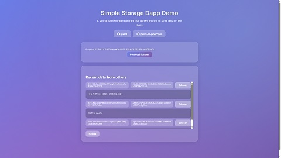

# Solana/更多开发者工具/web3.js 快速上手

我们开发了一个简单的 dapp, 演示如何使用 `solana/web3.js` 为我们的 on-chain program 提供前端交互功能. 你可以参考并扩展到自己的项目中. 本文使用的例子是使用 react + vite 的前端, 连接 phantom 钱包, 并通过上节课介绍的基于 pinocchio 的数据存储程序来读写 pda 数据.

项目地址仍然位于 <https://github.com/mohanson/pxsol-ss-pinocchio>.

为了方便读者们学习, 我已经将该项目部署到 solana 主网上, 程序地址是 `9RctzLPHP58wrnoGCbb5FpFKbmQb6f53i5PsebQZSaQL`, 你可以直接使用该程序进行测试.

> 在部署程序时作者因为失误发生了数次错误, 总共花费了大约 1.5 sol 的手续费才完成了部署, 也就是大约 300 美元, 请大家未来在操作主网时务必小心谨慎, 避免不必要的损失.

## 作者的碎碎念

我本身并非前端工程师, 对前端的了解仅仅限于能做出一个简单的 demo, 但我觉得 web3.js 的学习曲线并不陡峭, 只要你有一定的前端基础, 并且了解 solana 的基本概念, 就能很快上手.

另外现在的 ai 非常强大, 我在写本文的前端代码时大量使用了 github copilot 和 chatgpt, 这些工具能极大地提高开发效率, 但也会带来一些问题, 例如生成的代码可能并不完全正确, 需要你有一定的判断能力来辨别和修正错误. 所以我建议大家在学习和使用这些工具时, 不要完全依赖它们, 而是要结合自己的理解和经验.

在此处我只介绍最核心的代码片段, 以及一些需要注意的点. 如果你想了解完整的代码, 请参考项目源码.

## 建立连接

```ts
import { Connection, PublicKey } from '@solana/web3.js'

export const PROGRAM_ID = new PublicKey('9RctzLPHP58wrnoGCbb5FpFKbmQb6f53i5PsebQZSaQL')
export const RPC_ENDPOINT = import.meta.env.VITE_SOLANA_RPC
  || 'https://api.mainnet-beta.solana.com'

export const connection = new Connection(RPC_ENDPOINT, 'confirmed')
```

## 连接浏览器里的 phantom 钱包

```ts
import type { Transaction } from '@solana/web3.js'

type PhantomProvider = {
  isPhantom?: boolean
  publicKey?: PublicKey
  connect(opts?: { onlyIfTrusted?: boolean }): Promise<{ publicKey: PublicKey }>
  disconnect(): Promise<void>
  signTransaction(tx: Transaction): Promise<Transaction>
}

declare global { interface Window { solana?: PhantomProvider } }

export async function connectPhantom(): Promise<PublicKey> {
  if (!window.solana?.isPhantom) throw new Error('Phantom not found')
  return (await window.solana.connect()).publicKey
}
```

## 派生程序扩展账户

前端需保持和链上程序相同的派生种子:

```ts
import { PublicKey } from '@solana/web3.js'

export async function deriveDataPda(user: PublicKey): Promise<[PublicKey, number]> {
  return PublicKey.findProgramAddress([user.toBuffer()], PROGRAM_ID)
}
```

## 读取账户数据

```ts
import { Connection, PublicKey } from '@solana/web3.js'

export async function fetchUserData(conn: Connection, user: PublicKey): Promise<Uint8Array | null> {
  const [pda] = await deriveDataPda(user)
  const info = await conn.getAccountInfo(pda, { commitment: 'confirmed' })
  return info ? info.data : null
}

export function decodeUtf8(data: Uint8Array | null): string {
  return data ? new TextDecoder().decode(data) : ''
}
```

## 构造写入指令

```ts
import { TransactionInstruction, PublicKey, SystemProgram } from '@solana/web3.js'

export async function buildWriteIx(user: PublicKey, payload: Uint8Array): Promise<TransactionInstruction> {
  const [pda] = await deriveDataPda(user)
  return new TransactionInstruction({
    programId: PROGRAM_ID,
    keys: [
      { pubkey: user, isSigner: true, isWritable: true },
      { pubkey: pda, isSigner: false, isWritable: true },
      { pubkey: SystemProgram.programId, isSigner: false, isWritable: false },
    ],
    data: payload,
  })
}
```

备注: 若你项目里需要 `Buffer`, 可使用 `data: Buffer.from(payload)`, 并 `import { Buffer } from 'buffer'`.

## 发送交易并确认

```ts
import { Connection, Transaction, TransactionInstruction, PublicKey } from '@solana/web3.js'

type PhantomProvider = { signTransaction(tx: Transaction): Promise<Transaction> }

export async function sendAndConfirm(
  conn: Connection,
  user: PublicKey,
  ix: TransactionInstruction,
  wallet: PhantomProvider,
) {
  const tx = new Transaction().add(ix)
  tx.feePayer = user
  const { blockhash, lastValidBlockHeight } = await conn.getLatestBlockhash('finalized')
  tx.recentBlockhash = blockhash

  const signed = await wallet.signTransaction(tx)
  const sig = await conn.sendRawTransaction(signed.serialize(), { preflightCommitment: 'finalized' })
  await conn.confirmTransaction({ signature: sig, blockhash, lastValidBlockHeight }, 'finalized')
  return sig
}
```

## 运行

您可以在本地运行该前端项目:

```sh
$ npm run dev
# Open http://localhost:5173
# Connect Phantom wallet and save/load data.
```

或者直接访问我们部署好的线上版本: <https://pxsol-ss-pinocchio.vercel.app/>.

首先点击 connect 连接钱包, 然后在输入框中输入任意字符串, 点击 save 保存到链上, 再刷新页面, 即可读取刚才保存的数据.


